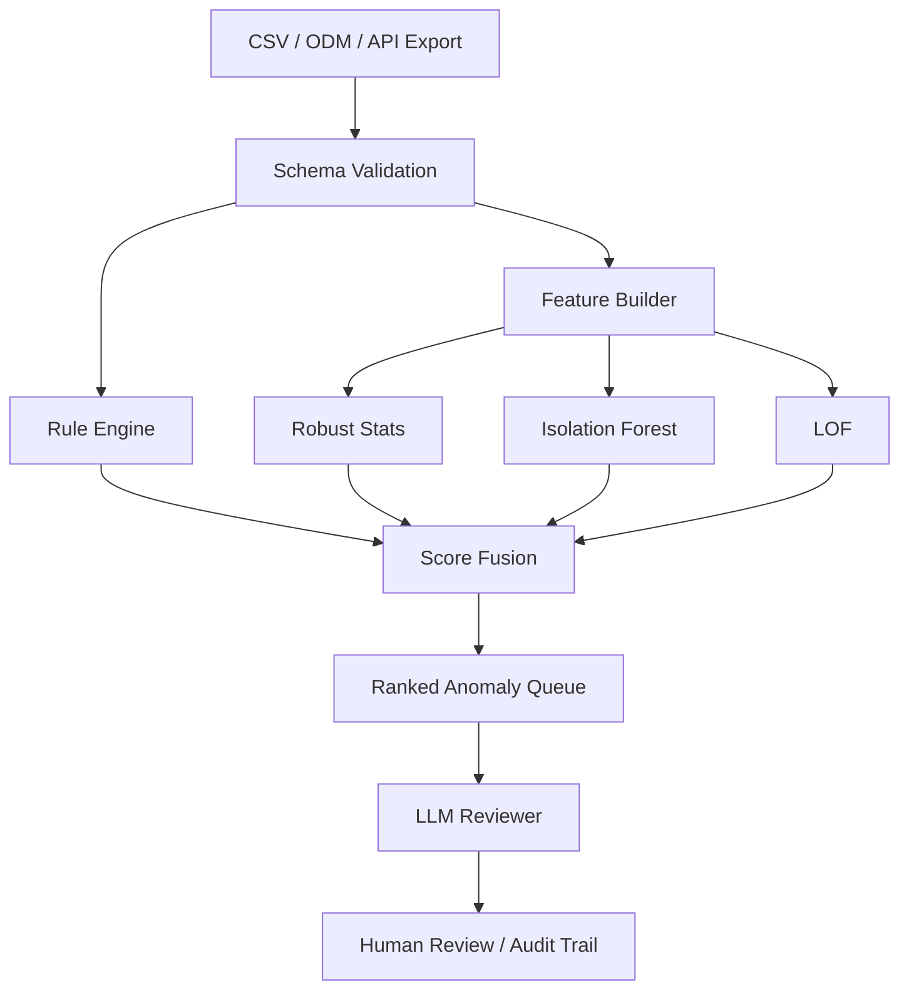

# EDC/RWD Anomaly Detection Skill

> 注: ディレクトリ名は依頼文に合わせて `anomaly-detection` としています。Python package 名は import 可能性を優先し `anomaly_detection` です。

EDC/eCRF export、RWD/eSource 由来データ、監査証跡、query log、site-level risk indicator を対象に、**ルールベース + robust statistics + Isolation Forest + LOF + LLM review** を組み合わせて異常・外れ値候補を優先順位付けするAIエージェントSkillです。

## 想定ユースケース

- EDC export CSVの必須欠損、重複、時系列矛盾、範囲外値、施設差、分布ドリフトの検出
- RBQM / Central Monitoring / Data Quality Review のレビューキュー作成
- CDISC ODM / SDTM / ADaM / OMOP / FHIR へのマッピング前後の品質確認
- 監査証跡、変更頻度、query残存、lock/freeze状態を含む provenance anomaly の検出

## 初期推奨構成



## セットアップ

### Ubuntu 24.04 LTS / macOS

```bash
cd Repos/.agent/anomaly-detection
python3 -m venv .venv
source .venv/bin/activate
python -m pip install -U pip
python -m pip install -e '.[dev]'
pytest
```

### Windows 11 PowerShell

```powershell
cd Repos\.agent\anomaly-detection
py -3 -m venv .venv
.\.venv\Scripts\Activate.ps1
python -m pip install -U pip
python -m pip install -e ".[dev]"
pytest
```

## 最小実行例

```bash
python scripts/generate_synth.py --output data/synthetic_edc.csv --n 500
python scripts/infer.py --input data/synthetic_edc.csv --output outputs/anomaly_results.jsonl
```

## 主要ファイル

```text
Repos/.agent/anomaly-detection/
├── .github/workflows/ci.yml
├── configs/
├── data/
├── deploy/
├── docs/
├── patches/
├── scripts/
├── src/anomaly_detection/
├── tests/
├── README.md
├── skill.yaml
├── pyproject.toml
└── Makefile
```

## 設計原則

1. **異常確定ではなくレビュー優先順位付け**を行う。
2. ルール違反、モデルスコア、説明、監査証跡を分離して保存する。
3. reviewer feedback は pseudo-label として保管し、後段の教師ありモデルに接続する。
4. PHI/PII をログに出さない。record_id は原則 surrogate key とする。
5. モデル version、config hash、input schema version、実行時刻を audit trail として残す。

## 注意

- 本Skillは規制判断を自動化するものではありません。ICH E6(R3), FDA RBM, EMA RWD DQF, 21 CFR Part 11 等の実務要件に沿って、人間レビューを支援する目的で使います。
- 深層学習モデルは拡張候補として設計していますが、初期実装は監査説明性と再現性を優先し、scikit-learn中心です。
