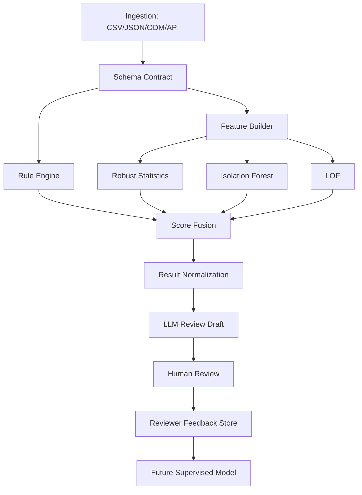

# Architecture

## Components

| Component | Responsibility |
|---|---|
| `schemas.py` | Pydantic request/response contracts |
| `rules.py` | Deterministic EDC/RWD checks |
| `features.py` | Numeric/categorical preprocessing and robust MAD scores |
| `detectors.py` | Isolation Forest / LOF wrapper |
| `pipeline.py` | Multi-stage score fusion and result ranking |
| `api.py` | Optional FastAPI interface |
| `audit.py` | Config hash and execution metadata |

## Score Fusion

\[
S_i = w_r R_i + w_m M_i + w_f F_i + w_l L_i
\]

where:

- \(R_i\): deterministic rule score
- \(M_i\): robust MAD score
- \(F_i\): Isolation Forest normalized anomaly score
- \(L_i\): LOF normalized anomaly score

Default weights are defined in `configs/default.yaml`.
