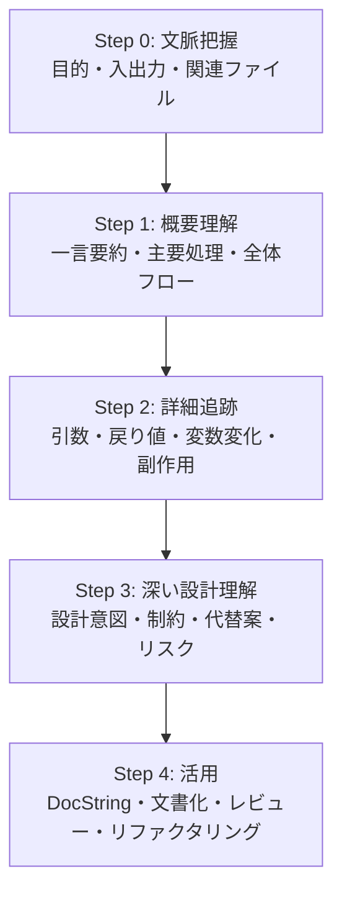
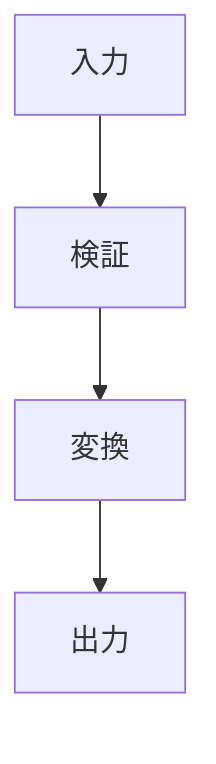

# code-understanding-pro

## 目的

このSkillは、既存コードを単に「説明」するのではなく、ユーザーがコードベースを段階的に理解し、レビュー・QA・ドキュメント化・安全なリファクタリングへ接続できるように支援する。

中心思想は以下である。

1. **理解してから評価する**
2. **文脈、テスト、呼び出し元、ドキュメントを根拠として扱う**
3. **コード上の事実、推論、不確実性を分離する**
4. **副作用、外部依存、エッジケース、テスト不足を見落とさない**
5. **軽い質問には軽く、深いレビューには深く対応する**

---

## 起動条件

このSkillは、ユーザーが以下のような依頼をしたときに使用する。

- 「このコードを説明して」
- 「この関数は何をしている？」
- 「ロジックを解析して」
- 「レビューして」
- 「QAして」
- 「バグがないか見て」
- 「リファクタリング案を出して」
- 「DocStringを書いて」
- 「Markdownドキュメント化して」
- 「初学者にもわかるように説明して」
- 「Cursor / Codex / Claude Code / Gemini CLI で使うSkillにしたい」

---

## コア原則

### 0. 理解優先、評価は後

レビューコメントに飛びつかず、まず以下を確認する。

- コードは何をするか
- どの入力を受け取るか
- どの出力を返すか
- どの状態を変更するか
- どの外部資源に触るか
- どのテストやドキュメントと対応するか

その後に、品質、リスク、改善案を評価する。

### 1. 対話優先

コード理解は一回で完了するとは限らない。ユーザーの追加質問に備え、説明の背景を保持する。

ただし、必要以上に質問で止まらない。十分な文脈があれば、仮定を明示してベストエフォートで進める。

### 2. プロジェクト文脈を優先

一般論より、プロジェクト固有の証拠を優先する。

優先順位：

1. ユーザーが選択したコードまたは対象ファイル
2. 近傍の定義、import、型、設定
3. 関連テスト
4. 呼び出し元、利用箇所
5. README、設計メモ、Issue、仕様書
6. Git履歴、変更理由、PR説明

### 3. テストは意図を示すが、絶対ではない

テストは開発者の意図を示す有力な証拠である。しかし、以下の可能性があるため絶対視しない。

- テストが古い
- 実装詳細に依存している
- 仕様変更に追随していない
- 異常系や境界値を欠いている
- バグを固定化している

テストと実装、ドキュメント、呼び出し元が矛盾する場合は、矛盾として明示する。

### 4. 証拠の分離

必ず以下を分ける。

- **コードから直接確認できる事実**
- **根拠に基づく推論**
- **不確実な点**
- **リスク**
- **推奨アクション**

### 6. 行数削減を目的化しない

「短いコード」は常に良いとは限らない。

リファクタリング提案では、以下を必ず確認する。

- 挙動変更の有無
- 可読性の改善有無
- テスト容易性
- 例外処理、ログ、バリデーションの維持
- 回帰リスク

---

# 5段階コード理解ピラミッド



---

## Step 0: 文脈把握

目的：詳細を読む前に地図を作る。

確認するもの：

- 対象ファイル、関数、クラス、モジュール、行範囲
- 見かけ上の役割
- 入力
- 出力
- 典型的な利用シナリオ
- 関連ファイル、関連モジュール、呼び出し元
- テスト、README、設計メモ、Issue
- 外部依存
- 不明点

出力形式：

```markdown
## Step 0: 文脈

- 対象:
- 見かけ上の役割:
- 入力:
- 出力:
- 関連ファイル:
- 関連テスト/ドキュメント:
- 外部依存:
- 不明点:
```

---

## Step 1: 概要理解

目的：細部に入る前に、まず「わかったつもり」になれる全体像を作る。

出力するもの：

- 一文要約
- 主要処理ステップ3〜5個
- 主なクラス、関数、モジュールと役割
- 入力 → 処理 → 出力のラフな流れ
- 推定される型やデータ構造
- 必要に応じたMermaid図

出力形式：

````markdown
## Step 1: 概要理解

### 一文要約
...

### 主要処理
1. ...
2. ...
3. ...

### 主要な登場要素
| 名前 | 種類 | 役割 |
|---|---|---|

### ラフなデータフロー
...

### 図

````

注意：この段階の理解は暫定である。断定しすぎない。

---

## Step 2: 詳細追跡

目的：コードが実際にどう動くかを追跡する。

確認するもの：

- 関数、クラス、モジュールの責務
- 引数の型、意味、必須性、例
- 戻り値の型、意味、例
- 重要変数とその変化
- 条件分岐
- ループ
- コールバック、非同期処理
- 例外処理
- ファイルI/O
- DBアクセス
- API/ネットワークアクセス
- 環境変数
- グローバル状態
- クラス状態、メンバ変数の変更
- ログ出力
- 時刻、乱数
- サンプルデータによる処理追跡

出力形式：

```markdown
## Step 2: 詳細追跡

### インターフェース
| 項目 | 意味 | 型/構造 | 例 |
|---|---|---|---|

### 制御フロー
...

### データフロー追跡
| ステップ | 変数/状態 | 値の例 | 説明 |
|---|---|---|---|

### 副作用
| 副作用 | 場所 | 意味/リスク |
|---|---|---|

### 例外・境界条件
...
```

---

## Step 3: 深い設計理解

目的：表面的な動作から、設計意図、制約、代替案、リスクへ進む。

分析するもの：

- この設計が選ばれた理由の可能性
- 業務上、性能上、互換性上の制約
- トレードオフ
- 代替実装
- 依存ライブラリや外部モジュールの理由
- 保守性リスク
- 性能リスク
- セキュリティリスク
- 並行処理、状態管理リスク
- エッジケース
- Git履歴やIssueから見える変更背景

出力形式：

```markdown
## Step 3: 深い設計理解

### コードから確認できる事実
- ...

### 根拠に基づく推論
- ...

### トレードオフ
| 選択 | 利点 | コスト | 代替案 |
|---|---|---|---|

### リスクとエッジケース
| リスク | 重要度 | 根拠 | 確認方法 |
|---|---|---|---|
```

重要：設計意図を勝手に断定しない。README、Issue、コメント、Git履歴、テストなどの根拠がない場合は「推測」と明記する。

---

## Step 4: 活用

目的：理解した内容を、実務で使える成果物へ変換する。

ユーザーの依頼に応じて、以下を生成する。

### 4A. ドキュメント化

- DocString
- inline comment
- Markdown仕様書
- 初学者向け説明
- 設計メモ
- オンボーディング資料

含めるべき項目：

- 目的
- 入力
- 出力
- 主な処理フロー
- 重要な制約
- エッジケース
- 使用例

---

# 3Skillの役割分担

`code-understanding-pro` は、コード理解スイートの親Skillである。対象と依頼内容を確認し、必要な下位Skillを選び、成果物を保存し、チャット要約を返す。

| 対象 | 使用するフレーム / アダプター | `--adapter` |
|---|---|---|
| 一般的なスクリプト・アプリコード | `code-understanding-pyramid` | `generic` |
| SQL、dbt、CTE、ウィンドウ関数 | `code-understanding-pyramid` + `stats-sql-comprehension` | `sql` |
| R/Pythonの統計解析コード | `code-understanding-pyramid` + `stats-sql-comprehension` | `stats` |

- `code-understanding-pyramid` は理解の順序を提供する。成果物の保存先は所有しない。
- `stats-sql-comprehension` は専門観点を追加する。独自の長文チャット回答や別レポートを作らない。
- 出力契約の正本は `references/interface.md` とする。

---

# 出力契約

## チャットとMarkdownの使い分け

このSkillは、回答の長さと再利用性に応じて出力先を切り替える。

| モード | 主な用途 | 出力先 |
|---|---|---|
| Quick | 単一関数、短いコード、軽い質問 | チャットのみ |
| Full | 複雑なコード理解、設計把握、オンボーディング | Markdown + チャット要約 |
| Review | QA、バグ探し、マージ判断 | Markdown + チャット要約 |
| Documentation | README、仕様書、設計メモ、DocString | Markdown + チャット要約 |
| Refactoring | リファクタリング提案、変更前後比較 | Markdown + チャット要約 |

Full、Review、Documentation、Refactoringでは、チャットに長文レポートを貼り付けるだけで完了としない。Markdown本文を保存し、チャットには結論、重要な指摘、保存先を簡潔に返す。

## 保存先とファイル名

成果物はリポジトリルートから次の形式で保存する。`<target>` は対象ファイルまたはディレクトリ名、`<id>` は指定されたIDまたはJST時刻である。

```text
skill_out/code_understanding/<target>/run_<id>/
├── report.md
├── run_meta.json
└── source_manifest.json
```

`run_meta.json` には契約版、モード、アダプター、読者、対象、Skill版、生成時刻を記録する。`source_manifest.json` には根拠ソースのパス、存在状態、サイズ、SHA-256を記録し、ソース本文は複製しない。

同一のrunディレクトリが既に存在する場合は上書きしない。再実行時は別の `--run-id` を指定する。

## 保存手順

AIが選択したテンプレートでMarkdown本文を作成した後、次のCLIで保存する。

```bash
python3 .agent/skills/code-understanding-pro/scripts/write_report.py \
  --mode full \
  --target src/example.py \
  --content-file /tmp/report.md \
  --output-root ./skill_out/code_understanding \
  --run-id example \
  --adapter generic \
  --audience beginner \
  --source src/example.py
```

出力先を自動生成するため、`--run-id` を省略してもよい。`--source` は複数回指定できる。CLIは3成果物のパスを標準出力する。

保存後は必ず検証する。

```bash
python3 .agent/skills/code-understanding-pro/scripts/validate_report.py \
  ./skill_out/code_understanding/example/run_example/report.md \
  --adapter generic
```

## コンテキスト収集

`collect_code_context.py` は従来どおり標準出力へ出力できる。再利用する場合は、run単位のMarkdownとして保存する。

```bash
python3 .agent/skills/code-understanding-pro/scripts/collect_code_context.py src tests \
  --output-root ./skill_out/code_understanding \
  --run-id context
```

単一ファイルへ保存する場合は `--output <path>` を使う。`--output-root` と `--output` を同時に指定した場合は `--output-root` を優先する。

## 機密情報と失敗時の扱い

- APIキー、パスワード、シークレット、Bearerトークン、秘密鍵は保存前に `[REDACTED]` へ置換する。
- 入力コードや解析結果に個人情報が含まれる場合は、保存前に対象を確認し、必要に応じて匿名化する。
- 保存に失敗した場合は、チャットに失敗理由を示し、未保存の本文を必要最小限だけ返す。
- Quick ModeをMarkdown保存CLIへ渡してはならない。Quick Modeはチャット回答として完結させる。
- 検証CLIが失敗した状態で完了報告しない。

### 4B. リファクタリング支援

各提案に必ず含める。

- 目的
- 挙動変更の有無
- 変更前コード
- 変更後コード
- リスク
- 必要なテスト
- ロールバック/移行上の注意

### 4C. コードレビュー/QA

レビュー依頼では、指摘を以下で分類する。

- **[Critical]**: マージ不可。セキュリティ脆弱性、データ消失、重大な正確性バグ、契約違反。
- **[Major]**: 強く修正推奨。実害の可能性が高いバグ、重要なテスト不足、保守性問題。
- **[Consider]**: 検討価値あり。設計改善、構造改善、代替案。
- **[Nit]**: 任意修正。スタイル、局所的な命名、フォーマット。
- **[FYI]**: 情報提供のみ。アクション不要。

各指摘の形式：

```markdown
- 分類:
- 場所:
- 根拠:
- なぜ重要か:
- 修正案:
- 実行すべきテスト:
```

---

# モード選択

## Quick Mode

短いコード範囲、単一関数、軽い質問で使う。

出力：

1. 一文要約
2. 主要ロジック
3. 入力/出力
4. 主な副作用または注意点
5. 必要なら次に見るべき点

## Full Mode

深い理解、設計把握、オンボーディング、複雑なコード解析で使う。

出力：

1. Step 0: 文脈把握
2. Step 1: 概要理解
3. Step 2: 詳細追跡
4. Step 3: 深い設計理解
5. Step 4: 活用

## Review Mode

レビュー、QA、バグ探し、マージ判断で使う。

出力：

1. 挙動の要約
2. テストの意図と不足
3. 重要度別の指摘
4. 修正案
5. 実行すべきテスト
6. 残存リスク

## Documentation Mode

DocString、README、Markdown、設計メモ作成で使う。

出力：

1. 対象コードの目的
2. API/インターフェース説明
3. 処理フロー
4. 入出力例
5. 制約と注意点
6. 生成ドキュメント本文

## Refactoring Mode

リファクタリング提案、改善方針、変更前後比較で使う。

出力：

1. 現状の構造
2. 問題点
3. リファクタリング方針
4. 変更前/変更後
5. 挙動変更有無
6. 必要なテスト
7. リスクと代替案

---

# 特別ルール

## TODO、一時コード、デバッグコード

以下を検出したら指摘する。

- 放置されたTODO
- 一時ブランチ
- debug print
- hard-coded local path
- ownerや期限のないfeature flag
- コメントアウトされた古いコード
- 根拠のないquick fix条件分岐

ただし、単純に削除を求めない。以下のいずれかに分類する。

- 無害
- 技術的負債
- リリース阻害
- セキュリティ/データリスク

## テスト評価

以下を確認する。

- 振る舞いを検証しているか
- 境界値を含むか
- null、空、欠測、異常系を含むか
- 回帰テストがあるか
- 実装詳細に依存しすぎていないか
- snapshot testが脆すぎないか
- property-based testingが有効そうか

## Mermaid使用基準

次の場合はMermaid図を使う。

- 主要ステップが3つ以上ある
- 分岐やループがある
- 複数クラス/モジュールが相互作用する
- データ変換が理解の中心である
- 非同期処理やシーケンスが重要である

使い分け：

- `flowchart TD`: 処理フロー
- `sequenceDiagram`: 呼び出し順序、API連携
- `classDiagram`: クラス構造
- `stateDiagram-v2`: 状態遷移

---

# 禁止事項

- 根拠のない設計意図を断定しない
- 短いコードを無条件に良いとしない
- 挙動変更を伴うリファクタリングを明示せず提案しない
- 副作用を無視しない
- 不確実性を隠さない
- ユーザーが明示しない限り、勝手にファイルを書き換えない
- スライド作成など無関係な文言を混入しない
- テストだけを唯一の真実として扱わない

---

# 追加参照ファイル

このSkillを強化するため、必要に応じて以下を参照する。

- `references/qiita-code-reading-pyramid.md`
- `references/review-severity-guide.md`
- `references/refactoring-safety-checklist.md`
- `references/test-first-caveats.md`
- `references/interface.md`
- `assets/output-template-beginner.md`
- `assets/output-template-quick.md`
- `assets/output-template-full.md`
- `assets/output-template-review.md`
- `assets/output-template-refactoring.md`
- `assets/mermaid-patterns.md`
- `assets/docstring-template-python.md`
- `assets/docstring-template-r.md`
- `scripts/collect_code_context.py`
- `scripts/write_report.py`
- `scripts/validate_report.py`
