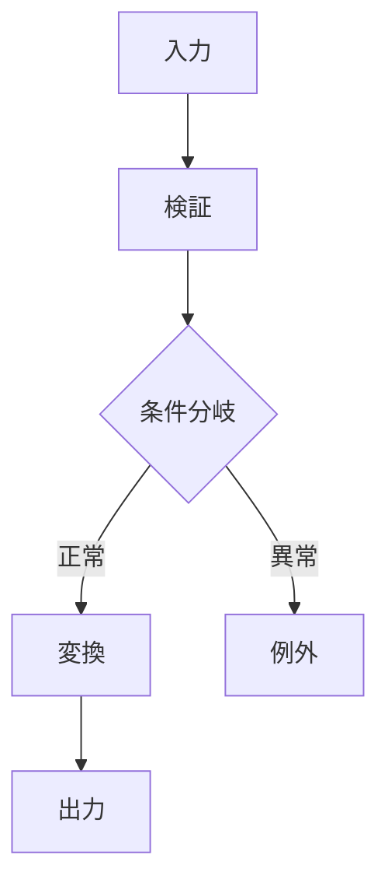
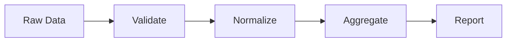
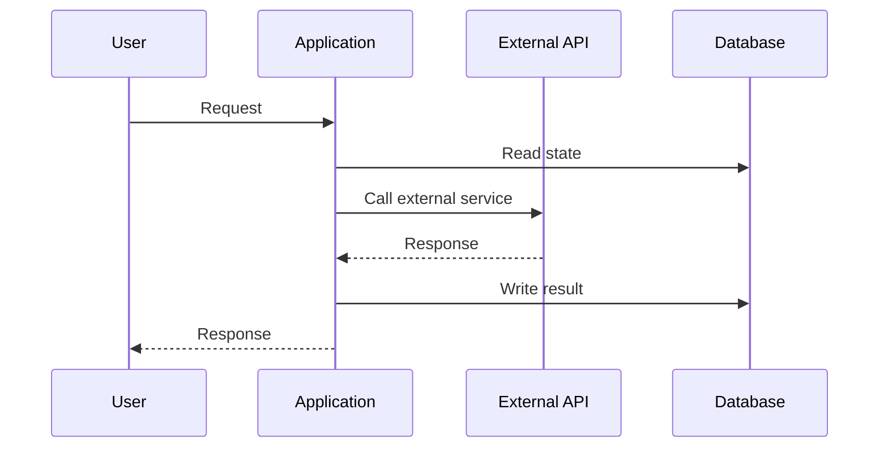
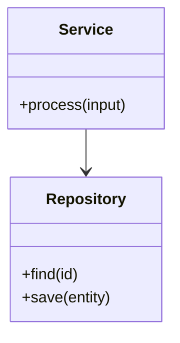
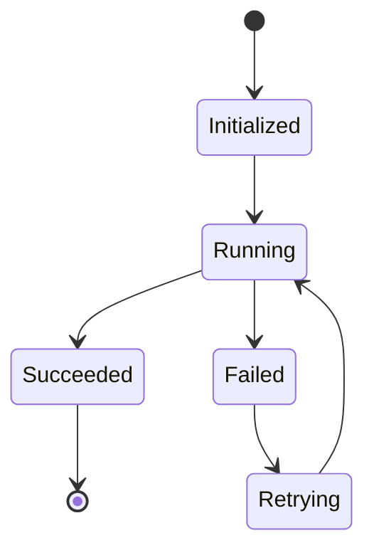

# Mermaidパターン集

## 処理フロー

```mermaid
flowchart TD
    A[入力] --> B[検証]
    B --> C{条件分岐}
    C -->|正常| D[変換]
    C -->|異常| E[例外]
    D --> F[出力]
```

## データパイプライン

```mermaid
flowchart LR
    A[Raw Data] --> B[Validate]
    B --> C[Normalize]
    C --> D[Aggregate]
    D --> E[Report]
```

## API連携

```mermaid
sequenceDiagram
    participant U as User
    participant A as Application
    participant API as External API
    participant DB as Database
    U->>A: Request
    A->>DB: Read state
    A->>API: Call external service
    API-->>A: Response
    A->>DB: Write result
    A-->>U: Response
```

## クラス構造

```mermaid
classDiagram
    class Service {
        +process(input)
    }
    class Repository {
        +find(id)
        +save(entity)
    }
    Service --> Repository
```

## 状態遷移

```mermaid
stateDiagram-v2
    [*] --> Initialized
    Initialized --> Running
    Running --> Succeeded
    Running --> Failed
    Failed --> Retrying
    Retrying --> Running
    Succeeded --> [*]
```
