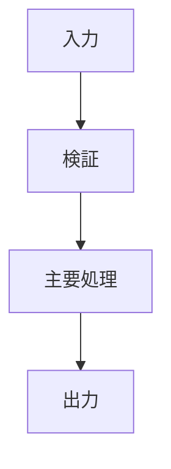

# コード理解レポート

## 結論

このコードが何を目的にし、入力をどのように出力へ変えるかを1〜3文で説明する。

## 対象と前提

- 対象:
- 言語・実行環境:
- 入力:
- 出力:
- 確認できていない点:

## 全体像

### まず押さえる3点

1.
2.
3.

### 最初に読む場所

| 順番 | ファイル・関数 | 理由 |
|---:|---|---|
| 1 |  |  |

## 処理フロー

## 詳細

### 入力例で追跡

| ステップ | 値・状態 | 初学者向け説明 |
|---:|---|---|
| 1 |  |  |

### 副作用

| 種類 | 場所 | 影響 |
|---|---|---|
|  |  |  |

## 初学者向け用語解説

| 用語 | このコードでの意味 | 一般的な意味 |
|---|---|---|
|  |  |  |

## 注意点・リスク

- 事実:
- 推論:
- 未確認:
- 次に確認するテスト:

## 根拠ファイル・行番号

- `path/to/file.py:1`
