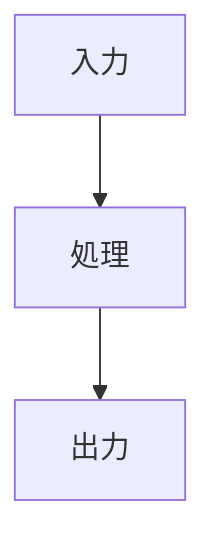

# Full Mode 出力テンプレート

保存先: `skill_out/code_understanding/<target>/run_<id>/code_understanding_report.md`

チャットには要点と保存先だけを返し、以下の本文をMarkdownファイルへ保存する。

````markdown
# コード理解レポート

## Step 0: 文脈把握
- 対象:
- 見かけ上の役割:
- 入力:
- 出力:
- 関連ファイル:
- テスト/ドキュメント:
- 不明点:

## Step 1: 概要理解

### 一文要約
...

### 主要処理
1. ...
2. ...
3. ...

### 主要な登場要素
| 名前 | 種類 | 役割 |
|---|---|---|

### データフロー


## Step 2: 詳細追跡

### インターフェース
| 項目 | 意味 | 型/構造 | 例 |
|---|---|---|---|

### 制御フロー
...

### データフロー追跡
| ステップ | 変数/状態 | 値の例 | 説明 |
|---|---|---|---|

### 副作用
| 副作用 | 場所 | 意味/リスク |
|---|---|---|

## Step 3: 深い設計理解

### コードから確認できる事実
- ...

### 根拠に基づく推論
- ...

### 不確実性
- ...

### トレードオフ
| 選択 | 利点 | コスト | 代替案 |
|---|---|---|---|

### リスク
| リスク | 重要度 | 根拠 | 確認方法 |
|---|---|---|---|

## Step 4: 活用

### ドキュメント化案
...

### リファクタリング案
...

### テスト案
...

## 提案
- ...

## 批判的立場
- ...
````
