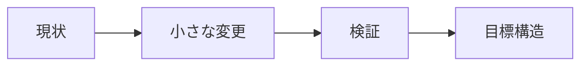

# リファクタリング提案

> 保存先: `skill_out/code_understanding/<target>/run_<id>/report.md`

## 結論

改善目的、挙動変更の有無、最優先提案を1〜3文で示す。

## 対象と前提

- 対象:
- 現在の責務:
- 維持する挙動:
- 変更可能な範囲:

## 全体像

### 現状と目標

| 観点 | 現状 | 目標 |
|---|---|---|
| 責務 |  |  |
| 依存 |  |  |
| テスト容易性 |  |  |

## 処理フロー

## 詳細

### 提案

| 優先度 | 変更 | 挙動変更 | 利点 | リスク |
|---:|---|---|---|---|
| 1 |  | なし / あり |  |  |

### 必要なテスト

| テスト | 保護する挙動 | 期待結果 |
|---|---|---|
|  |  |  |

## 初学者向け用語解説

| 用語 | 意味 |
|---|---|
| 責務 | その関数やモジュールが担当する仕事 |

## 注意点・リスク

- 回帰リスク:
- 移行・ロールバック:
- 未確認:

## 根拠ファイル・行番号

- `path/to/file.py:1`
