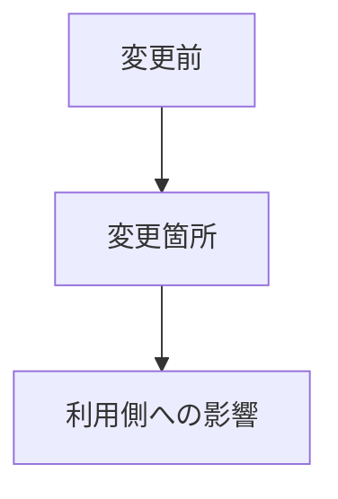

# コードレビュー結果

> 保存先: `skill_out/code_understanding/<target>/run_<id>/report.md`

## 結論

マージ判断と最重要指摘を1〜3文で示す。

## 対象と前提

- 対象:
- 差分:
- 期待される挙動:
- 実行したテスト:

## 全体像

### 変更の目的

### 影響範囲

| コンポーネント | 影響 |
|---|---|
|  |  |

## 処理フロー

## 詳細

### 指摘

| 重要度 | 場所 | 根拠 | 修正案 |
|---|---|---|---|
| Critical / Major / Consider / Nit |  |  |  |

### 追加すべきテスト

| ケース | 目的 | 期待結果 |
|---|---|---|
|  |  |  |

## 初学者向け用語解説

| 用語 | 意味 |
|---|---|
| 回帰 | 既存動作が変更によって壊れること |

## 注意点・リスク

- 残存リスク:
- 未確認:
- ロールバック:

## 根拠ファイル・行番号

- `path/to/file.py:1`
