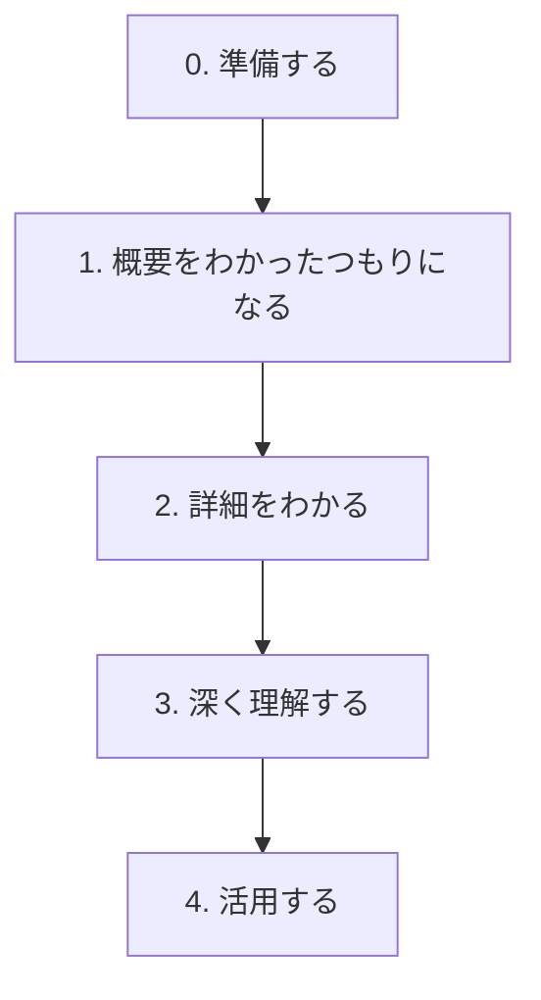

# Qiita記事ロジックの要約：コード理解ピラミッド

## 目的

コードをいきなり詳細に読むのではなく、段階的に理解する。

このSkillでは、以下の5段階を標準手順とする。

## 0. 準備する

確認対象：

- コードの目的
- 入力
- 出力
- ユースケース
- 関連モジュール
- テスト
- ドキュメント
- 呼び出し元

注意：背景が不明な場合、目的や設計意図は推測として扱う。

## 1. 概要をわかったつもりになる

出力すべきもの：

- 一文要約
- 主要処理ステップ
- 主な関数/クラス
- 入力から出力までの流れ
- Mermaid図

この段階は暫定理解であり、詳細読解で修正されうる。

## 2. 詳細をわかる

確認対象：

- 引数
- 戻り値
- 変数変化
- 条件分岐
- ループ
- 関数呼び出し
- 副作用
- DB/API/File I/O
- エラー処理
- サンプルデータでの追跡

## 3. 深く理解する

確認対象：

- 設計意図
- トレードオフ
- 代替案
- 制約
- エッジケース
- 依存関係
- 変更履歴
- 改善余地

重要：設計意図は、コメント、README、Issue、Git履歴などの根拠がなければ断定しない。

## 4. 活用する

成果物：

- DocString
- Markdownドキュメント
- 初学者向け解説
- リファクタリング案
- レビューコメント
- テスト案

## このSkillでの拡張

Qiitaロジックに加えて、実務レビュー向けに以下を追加する。

- 重要度分類: Critical / Major / Consider / Nit / FYI
- テストの意図確認
- 副作用チェック
- 挙動変更有無の明示
- 事実・推測・不確実性の分離
