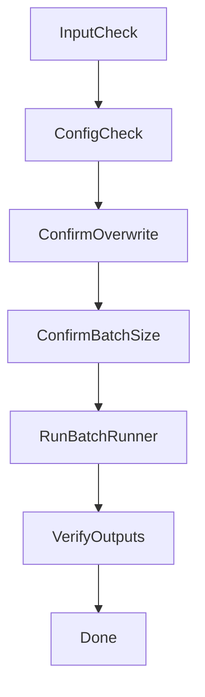

# ワークフロー

## 確認ゲート

- `--out` が既存ディレクトリなら、再生成・上書きの実行可否を確認する
- 対象設問数が多い場合（目安 50件超）、時間と生成ファイル数の増加を説明して確認する

## 完了判定

- `summary.csv` が存在する
- 各 `output_slug` 配下に `report.html` が存在する
- `summary.csv` の `status` 列に `error` が残っていない
