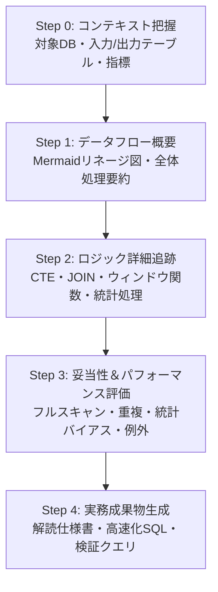

# 統計解析＆SQL高度解読スキル (stats-sql-comprehension)

## 目的

このSkillは、高度で複雑な**分析用SQL（dbtモデル, BigQuery, CTE, ウィンドウ関数）**および**統計解析コード（R, Python）**を単に「説明」するだけでなく、データフローの可視化、処理の追跡、パフォーマンスおよび統計的妥当性の評価、最適化提案までを段階的に実行します。

---

## スイート内の役割

本Skillは `code-understanding-pro` の専門アダプターである。

| 対象 | アダプター | テンプレート |
|---|---|---|
| SQL、dbt、BigQuery、CTE | `sql` | `assets/output-template-sql.md` |
| R/Python統計解析コード | `stats` | `assets/output-template-stats.md` |

- 共通理解の順序は `code-understanding-pyramid` を使う。
- 成果物は親Skillの `report.md`、`run_meta.json`、`source_manifest.json` に統合する。
- 独自の出力ディレクトリや長文チャット回答を作らない。
- 完了前に親Skillの `validate_report.py` を対応アダプターで実行する。

## SQL安全契約

- SQLは原則として読解対象であり、ユーザーの明示承認なしに実行しない。
- 実行が承認された場合も、まず読み取り専用の件数・重複・NULL・JOIN前後検証を行う。
- DB名、SQL方言、1行の粒度、JOINキーが不明な場合は推測と事実を分ける。
- PHI/PIIや認証情報をレポートへ複製しない。

---

## 起動条件

以下のような依頼を受けた際に自動的に発動・適用されます。

- 「このSQLを説明して」「クエリのロジックを解析して」
- 「dbtモデルを解読して」「複雑なCTEの流れを整理して」
- 「SQLのデータフロー（リネージ）を可視化して」
- 「SQLのパフォーマンスやコスト、ボトルネックを評価して」
- 「R/Pythonの統計解析コード・集計ロジックをレビューして」
- 「統計的処理（前処理、欠損値補完、バイアス）の妥当性を確認して」

---

## コア原則

1. **データ構造と流れを最優先する**
   単なる文字解読ではなく、テーブル・CTE間でデータがどのように変換・膨張・縮小されるかを視覚的かつ論理的に追跡します。
2. **パフォーマンス・エッジケースを明示する**
   フルスキャン、シャッフル、重複発生（JOINの多対多）、NULLハンドリング、ウィンドウ関数の範囲決定などの潜在的リスクを見落としません。
3. **統計的妥当性とバイアスの分離**
   統計解析コードにおいて、コード上の事実・統計的推論・前提条件・バイアス（選択バイアス、生存者バイアス等）を明確に分けて報告します。

---

# 5段階 統計＆SQL理解ピラミッド

---

## Step 0: データコンテキスト把握

目的：分析対象の環境とデータの入り口・出口を定義します。

確認事項：
- 対象データベース／言語（BigQuery, dbt, PostgreSQL, MySQL, R, Python）
- 入力テーブル／ソースモデル
- 出力テーブル／集計指標／ターゲットエンティティ
- 目的（分析レポート、マテリアライズドモデル、ダッシュボード用データマート等）

---

## Step 1: データフロー＆構造概要

目的：細部に入る前に、中間処理（CTE）やデータ移行の流れを可視化します。

出力内容：
- 全体処理の一文要約
- 主要CTE／中間ステップの役割一覧
- データフローリネージ図（Mermaid `flowchart TD`）

---

## Step 2: SQLロジック＆統計処理の詳細追跡

目的：ステップごとの具体的な変換・集約・計算処理を確定します。

追跡項目：
- **JOINロジック**: 結合条件、Outer/Innerの意図、行数変化の予測
- **集約・ウィンドウ関数**: `GROUP BY` 単位、`PARTITION BY`, `ORDER BY`, `ROWS BETWEEN` の適用範囲
- **データ変換**: `CASE WHEN`, NULLハンドリング (`COALESCE`, `IFNULL`), 日付・タイムゾーン処理
- **統計処理**: 前処理（外れ値除去、欠損値補完）、パラメータ推定、検定・統計量の算出式

---

## Step 3: 統計的妥当性＆パフォーマンス評価

目的：潜在的な非効率・バグ・統計的欠陥を評価します。

評価観点：
- **SQLパフォーマンス**: フルスキャンリスク、不要な `SELECT *`、シャッフル発生要因、パーティション/クラスタリングの効き
- **データ品質リスク**: JOINによる行数膨張（多対多）、NULL挿入による計算バグ、重複データの発生
- **統計的品質リスク**: 選択バイアス、生存者バイアス、多重性の問題、サンプルサイズと検出力、前提条件の欠如

---

## Step 4: 実務アウトプット生成

目的：ユーザーの目的に合わせた専門分析を、親Skillの共通 `report.md` へ返します。

専門節の形式（`assets/` 参照）：
- `assets/output-template-sql.md`: SQL解読・解説レポート
- `assets/output-template-stats.md`: 統計解析評価レポート
- `assets/mermaid-dataflow-patterns.md`: データフロー図パターン

---

## 参照ファイル

詳細なチェックリストやパターンは以下を参照してください：
- `references/sql-performance-cheatsheet.md`: SQLパフォーマンス＆アンチパターン解説
- `references/stats-validation-checklist.md`: 統計解析・パイプライン妥当性チェックリスト
