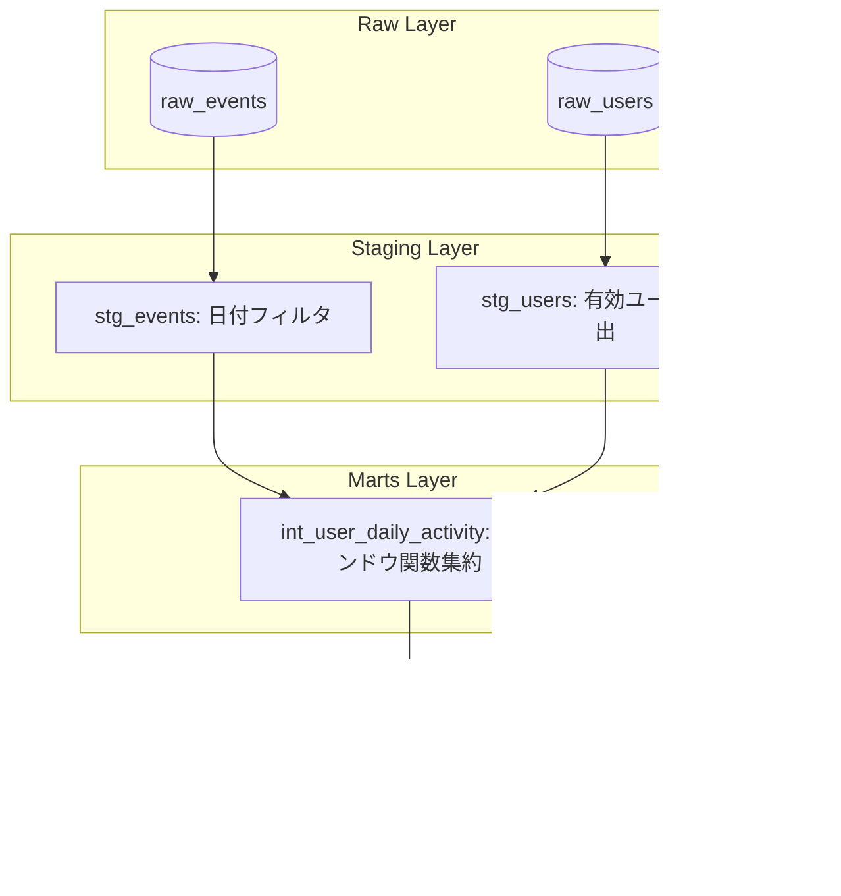
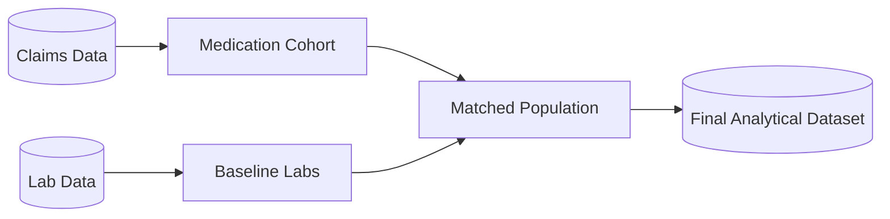

# SQLリネージ・データフロー解説パターン集

## パターン 1: 標準的なCTEフロー (抽出 -> 加工 -> 集約 -> 出力)

```mermaid
flowchart TD
    subgraph RawData [Raw Layer]
        A[(raw_events)]
        B[(raw_users)]
    end

    subgraph Staging [Staging Layer]
        A --> C[stg_events: 日付フィルタ]
        B --> D[stg_users: 有効ユーザー抽出]
    end

    subgraph Intermediate [Marts Layer]
        C --> E[int_user_daily_activity: ウィンドウ関数集約]
        D --> E
    end

    subgraph Final [Output]
        E --> F[(fct_user_monthly_summary)]
    end
```

## パターン 2: 分岐と統合フロー (マルチソース結合)

```mermaid
flowchart LR
    S1[(Claims Data)] --> C1[Medication Cohort]
    S2[(Lab Data)] --> C2[Baseline Labs]

    C1 --> M[Matched Population]
    C2 --> M

    M --> Out[(Final Analytical Dataset)]
```
