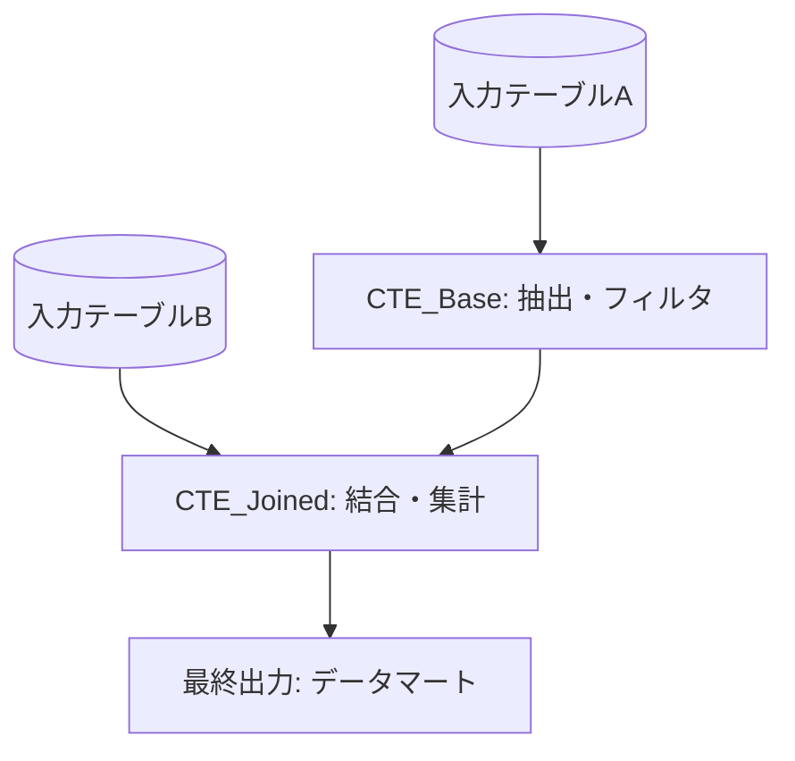

# SQL解読・評価標準レポート

## 1. 概要と目的
- **対象クエリ / モデル名**:
- **主要な目的**:
- **主な入力テーブル**:
- **出力テーブル / 指標**:

---

## 2. データフロー (Mermaid リネージ図)



---

## 3. CTE / 処理ステップ詳細解析

| ステップ名 / CTE名 | 主な役割 | 入力 -> 出力行数の変化予測 | 注目ポイント / 注意点 |
|---|---|---|---|
| `base_data` | レコードの絞り込み | 原本 -> フィルタ適用後 | 欠損値フィルタの条件 |
| `aggregated_metrics` | ウィンドウ関数と集計 | 1行/ユーザー | `PARTITION BY` の単位 |

---

## 4. パフォーマンス・品質評価

- **[CRITICAL]** 重大バグ / 行数爆発リスク
  - 例: 多対多JOINによる行数の重複
- **[PERFORMANCE]** コスト・パフォーマンス評価
  - 例: パーティションキーの非活用、フルスキャン
- **[EDGE_CASE]** NULL / 例外ハンドリング
  - 例: `COALESCE` 未適用による計算結果の NULL 化

---

## 5. 改善提案・最適化SQL

### 変更点
1. ...
2. ...

```sql
-- 最適化済みクエリ例
WITH base_data AS (
    ...
)
SELECT ...
FROM base_data;
```
