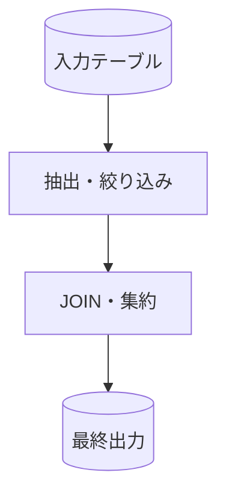

# SQL理解レポート

## 結論

このSQLが作るデータセット、1行の意味、主要なリスクを1〜3文で説明する。

## 対象と前提

- 対象SQL・dbtモデル:
- SQL方言・DB:
- 入力テーブル:
- 出力:
- 実行確認: 未実行 / 読み取り専用で確認済み

## 全体像

### まず押さえる3点

1.
2.
3.

### 読む順番

| 順番 | CTE・節 | 役割 |
|---:|---|---|
| 1 |  |  |

## 処理フロー



## 詳細

| ステップ | 入力 | 変換 | 出力 | 初学者向け説明 |
|---|---|---|---|---|
|  |  |  |  |  |

## データ粒度

- 入力の1行:
- 中間CTEの1行:
- 出力の1行:
- 主キー候補:

## テーブル・CTE一覧

| 名前 | 種類 | 粒度 | 主な役割 |
|---|---|---|---|
|  |  |  |  |

## JOINと行数変化

| JOIN | キー | 関係 | 行数変化 | 重複リスク |
|---|---|---|---|---|
|  |  | 1:1 / 1:N / N:M |  |  |

## 検証SQL

```sql
-- 件数、重複、NULL、JOIN前後の行数を確認する読み取り専用SQL
SELECT COUNT(*) FROM target_table;
```

## 初学者向け用語解説

| 用語 | このSQLでの意味 | 確認方法 |
|---|---|---|
| CTE |  |  |
| 粒度 |  |  |

## 注意点・リスク

- 正確性:
- データ品質:
- パフォーマンス:
- 未確認:
- SQLはユーザーの明示承認なしに実行しない。

## 根拠ファイル・行番号

- `path/to/query.sql:1`
