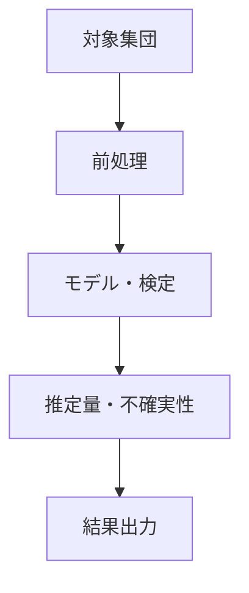

# 統計コード理解レポート

## 結論

何を推定・検定・予測するコードか、結果を解釈する前に必要な前提を1〜3文で説明する。

## 対象と前提

- 対象コード・関数:
- 言語・ライブラリ:
- 分析目的:
- 入力:
- 出力:

## 全体像

### まず押さえる3点

1.
2.
3.

### 分析の位置付け

| 項目 | 内容 |
|---|---|
| 記述 / 推定 / 検定 / 予測 |  |
| 主な推定対象 |  |

## 処理フロー



## 詳細

| ステップ | 入力 | 処理 | 出力 | 初学者向け説明 |
|---|---|---|---|---|
|  |  |  |  |  |

## 対象母集団

- 適格条件:
- 除外条件:
- 解析単位:
- 一般化可能な範囲:

## 欠測・除外

| 対象 | 処理 | 除外件数 | 結果への影響 |
|---|---|---:|---|
|  |  |  |  |

## 推定量・前提

| 推定量・検定 | 単位 | 前提 | コード上の確認箇所 |
|---|---|---|---|
|  |  |  |  |

## バイアスと妥当性

- 選択バイアス:
- 情報バイアス:
- 交絡:
- 多重性:
- 感度分析:

## 再現・検証コード

```r
# セッション情報、件数、欠測、モデル診断を再確認する
sessionInfo()
```

## 初学者向け用語解説

| 用語 | この分析での意味 | 誤解しやすい点 |
|---|---|---|
| 推定量 |  |  |
| 信頼区間 |  |  |

## 注意点・リスク

- コードから確認できる事実:
- 統計的推論:
- 未確認の前提:
- 次に行う検証:

## 根拠ファイル・行番号

- `path/to/analysis.R:1`
