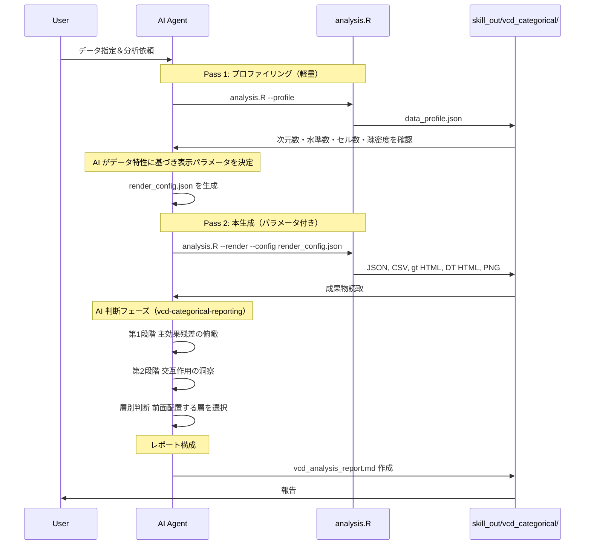

# ワークフロー（2パス方式）

## 典型的な流れ（シーケンス）

## 判断木

1. **変数は 4 個以上のクロスが必要か？**
   - はい → **本スキル範囲外**。次元削減・質問の分割・部分集合を検討。
2. **次元は 2 か 3 か？**
   - 2 → `analysis.R` の 2 変数パート。
   - 3 → 3-way 表・層別 2-way・対数線形（`glm-gnm-goodness.md`）。
3. **順序ありリッカートを統計的にフル活用したいか？**
   - はい → **`ordinal-likert-advanced.md`**。
   - いいえ → 名義として vcd・対数線形可。
4. **DB から列・件数を先に確認したいか？**
   - はい → **`mysql-table-cardinality`** でスキーマ・濃度数を確認。

## 連携

| 隣接タスク | 使うもの |
| :--- | :--- |
| MySQL の件数・カーディナリティ | `mysql-table-cardinality` |
| AI 判断レポート生成 | `vcd-categorical-reporting`（本スキルの後続） |
| R 運用の再現性 | ユーザーの `r-robust-workflow` 等 |
