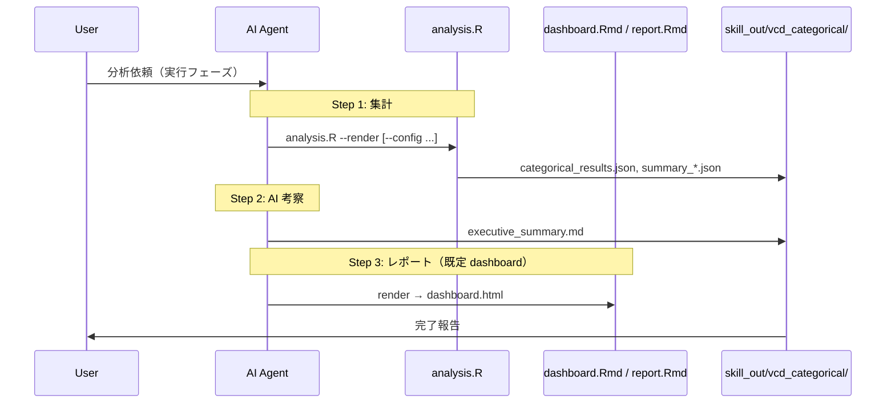

# ワークフロー（3ステップ方式）

## テンプレ選択

| テンプレ | 用途 |
| :--- | :--- |
| `dashboard.Rmd` | **既定**。モザイク・AIサマリー統合ダッシュボード |
| `report.Rmd` | 代替。gt/DT 中心のレガシー形式 |

## オプション: render_config

水準数が多い場合は Step 1 前に `--profile` で `data_profile.json` を確認し、`render_config.json` を生成して `--config` を付与する。
