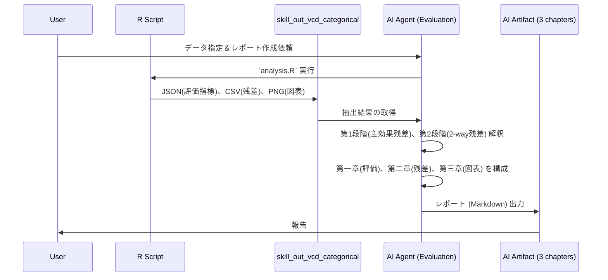

# ワークフロー

## 典型的な流れ（シーケンス）

## 判断木

1. **変数は 4 個以上のクロスが必要か？**  
   - はい → **本スキル範囲外**。次元削減・質問の分割・部分集合を検討。
2. **次元は 2 か 3 か？**  
   - 2 → `analysis.R` または `report.Rmd` の 2-way パート（`xtabs` 2 変数）。  
   - 3 → 3-way 表・層別 2-way・対数線形 `m0/m1/m2`（`glm-gnm-goodness.md`）。
3. **順序ありリッカートを統計的にフル活用したいか？**  
   - はい → **`ordinal-likert-advanced.md`**（序数回帰・polychoric 等）。  
   - いいえ（カテゴリ頻度としてよい）→ 名義／`ordered` factor として vcd・対数線形可。
4. **DB から列・件数を先に確認したいか？**  
   - はい → **`mysql-table-cardinality`** でスキーマ・濃度数を確認してから CSV 抽出。

## 連携

| 隣接タスク | 使うもの |
|------------|----------|
| MySQL の件数・カーディナリティ | `mysql-table-cardinality` |
| 個人の R 運用（再現性・セッション） | ユーザーの `r-robust-workflow` 等があれば data 取得〜ここまでの前処理に利用 |
