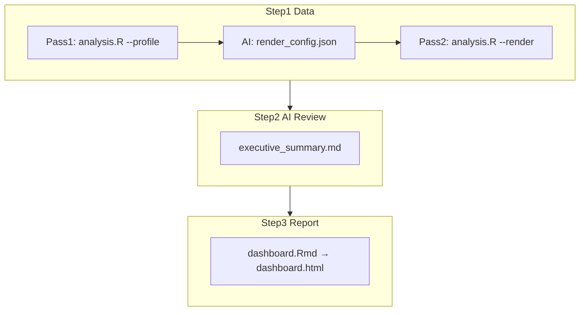
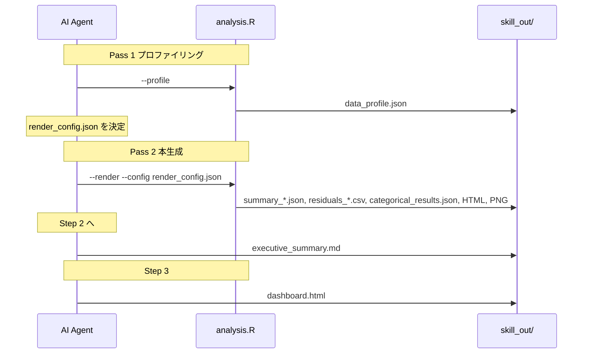

# ワークフロー（エージェント3ステップ + R 2パス）

## 全体

```mermaid
flowchart TB
  subgraph step1 [Step1 Data]
    P1[Pass1: analysis.R --profile]
    CFG[AI: render_config.json]
    P2[Pass2: analysis.R --render]
    P1 --> CFG --> P2
  end
  subgraph step2 [Step2 AI Review]
    ES[executive_summary.md]
  end
  subgraph step3 [Step3 Report]
    DB[dashboard.Rmd → dashboard.html]
  end
  step1 --> step2 --> step3
```

## Step 1 詳細（R 2パス）

```mermaid
sequenceDiagram
    participant AI as AI Agent
    participant R as analysis.R
    participant Out as skill_out/

    Note over AI,R: Pass 1 プロファイリング
    AI->>R: --profile
    R->>Out: data_profile.json

    Note over AI: render_config.json を決定
    Note over AI,R: Pass 2 本生成
    AI->>R: --render --config render_config.json
    R->>Out: summary_*.json, residuals_*.csv, categorical_results.json, HTML, PNG

    Note over AI: Step 2 へ
    AI->>Out: executive_summary.md

    Note over AI,R: Step 3
    AI->>Out: dashboard.html
```

## 非推奨

`vcd-categorical-reporting` を別スキルとして必須後続にしない。考察は本スキル Step 2 で完結する。
