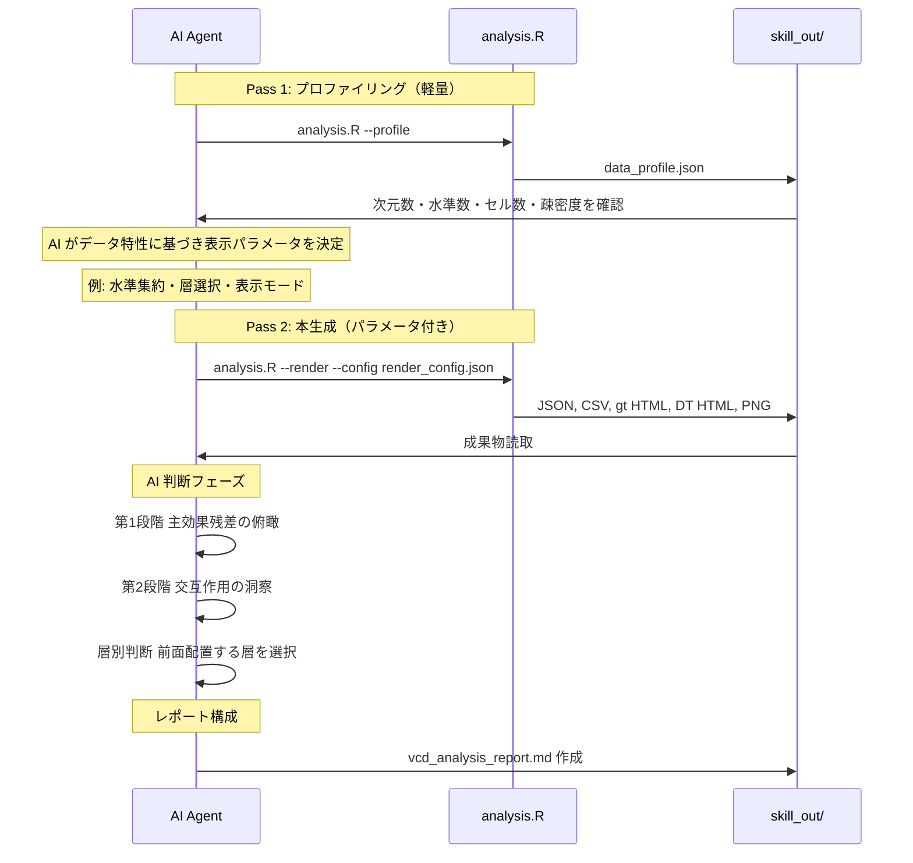

# VCD 分析ワークフロー（2パス方式）

## シーケンス図

## render_config.json の判断ガイドライン

| データ特性 | 判断ポイント | 推奨設定 |
| :--- | :--- | :--- |
| 合計セル数 > 200 | ビジーになりやすい | `collapse_below_n: 5` で低頻度セルを集約 |
| 水準数 > 8 | ラベルが潰れやすい | `max_levels_per_var: 8` で上位のみ表示 |
| 3-way で層数 > 5 | gt マトリックスが多すぎ | `strata_to_render` で2-3層に絞る |
| 疎密度(sparsity) < 0.5 | ゼロセルが多い | モデル収束に注意、注釈を追加 |
