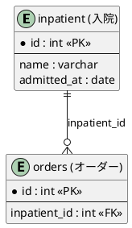

MCP MySQL で指定 DB の**全テーブル一覧**と**各テーブルのカラム一覧**（および PK/UK/FK）を取得し、テーブル英名に意味（例: inpatient → 入院）を付与した **PlantUML** の ER 図を 1 本生成する。

## 概要（動作確認）

- **DB 名を指定** → その DB の**全テーブル**のリストを取得 → 各テーブルの**カラムリスト**を取得 → それらを元に **PlantUML** で ER 図を 1 ファイル作成する。
- 特定テーブルだけに限定する場合は入力でオプション指定可能。

## トリガー

- 「〇〇 DB の ER 図を出して」「指定 DB のテーブル一覧から ER 図を作成」「MCP MySQL でスキーマを取得して ER 図にしたい」など。

## 入力

- **DB 名**（必須）。オプションで特定テーブルのみに限定可能。
- **出力ディレクトリ**（任意）。未指定時は `./skill_output/mysql-er-diagram/`。ユーザーが「ここに出力して」と指定した場合はそのパスに保存する。

## 前提

- Cursor / Antigravity で **MCP MySQL サーバーが有効**であること。未接続の場合は「MCP MySQL を有効にしてください」と案内する。接続先は環境依存のためスキルでは触れない。
- 利用する MCP ツールは次のいずれか:
  - **list_tables(dbName)**: テーブル一覧・TABLE_COMMENT・PK/UK/FK
  - **describe_tables(dbName, tableNames)**: カラム定義・キー・インデックス
  - 上記が無い場合は **execute_sql** 等で `INFORMATION_SCHEMA.TABLES` / `COLUMNS` / `KEY_COLUMN_USAGE` を実行する手順をユーザーに案内する。

## 手順

1. **テーブル一覧取得**: MCP の **list_tables(dbName)** を呼び、テーブル名・TABLE_COMMENT・PK/UK/FK を取得する。
2. **カラム詳細取得**: 必要なら **describe_tables(dbName, tableNames)** でカラム型・キーを取得する。
3. **テーブル意味の解決**:
   - DB の **TABLE_COMMENT** があればそれをラベルに使う。
   - なければ [references/table_meanings_example.md](references/table_meanings_example.md) やユーザーが渡した用語集を参照する。
   - 未指定のテーブルは英名のみでよい（意味は任意）。
4. **PlantUML 生成**:
   - [PlantUML Entity Relationship](https://plantuml.com/ja/er-diagram) の記法で図を組み立てる。
   - エンティティ: `entity "テーブル名 (意味)" as エイリアス { ... }`。カラムは `+ カラム名 : 型 <<PK>>` など。
   - リレーション: list_tables の FK から `親 ||--o{ 子 : "fk名"` 形式で記述する。
   - 出力は `@startuml` … `@enduml` のブロックとする。
5. **出力保存**: 出力ディレクトリが指定されていればそのパス、未指定なら `./skill_output/mysql-er-diagram/` に `er_<db>_MMDD_HHMM.md` を保存する。先頭に `created: YYYY-MM-DD HH:MM`（JST）、`author: AI Agent` を記載し、その下に PlantUML コードブロック（```plantuml … ```）を配置する。

## 出力例（PlantUML）



## Cursor / Antigravity の違い

- 本スキルは CLI を持たない。同じ SKILL.md を `.cursor/skills/mysql-er-diagram/` と `.agent/skills/mysql-er-diagram/` の両方に置き、Artifacts 出力パスなどのルールは共通。パス例だけ Cursor は `.cursor/skills/...`、Antigravity は `.agent/skills/...` で参照する。

## 参照

- テーブル名→意味の例: [references/table_meanings_example.md](references/table_meanings_example.md)（ユーザーが DB ごとにコピーして編集可能。無くても TABLE_COMMENT またはユーザー入力で代替可）。
