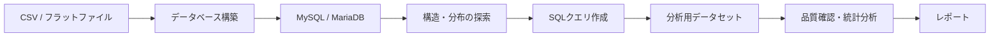

# RWD MySQL Skill Toolkit

CSVからのMySQL/MariaDB構築、データ探索、SQL作成、コード理解、異常検知、統計分析を支援する20個のAgent Skillを管理するリポジトリです。大学講座や小規模RWDプロジェクトで、初学者がAIとともに再現可能な手順と成果物を作ることを目的とします。

## はじめに

| やりたいこと | 主なスキル |
|---|---|
| CSVからデータベースを作る | `flat-file-mysql-overview` |
| データベースの構造を調べる | `mysql-er-diagram`, `mysql-table-cardinality`, `mysql-entity-matrix` |
| 自然文からSQLを作る | `mysql-create-query-support` |
| コードやSQLを初学者向けに解説する | `code-understanding-pro` |
| 抽出データの異常候補を探す | `anomaly-detection` |
| カテゴリカルデータを分析する | `vcd-pass0-consultation`, `vcd-categorical-analysis`, `vcd-bayesian-evidence-analysis` |

各 `.agent/skills/<skill-name>/SKILL.md` の手順に従います。例題は `examples/`、SQL保存規約は [sql/README.md](sql/README.md)、生成物は原則 `skill_out/` を参照してください。

## 全体ワークフロー



| 系統 | スキル | 役割 |
|---|---|---|
| 構築 | `flat-file-mysql-overview`, `flat-file-mysql-ddl-generation`, `flat-file-mysql-load-validation` | フラットファイルからデータベースを作る |
| 探索 | `mysql-er-diagram`, `mysql-table-cardinality`, `mysql-entity-matrix` | テーブル構造、値の分布、IDの所在を確認する |
| クエリ作成 | `mysql-create-query-support` | 分析目的を整理し、本番用・検証用SQLを作る |
| 理解 | `code-understanding-pro`, `code-understanding-pyramid`, `stats-sql-comprehension` | コード、SQL、統計処理を根拠付きMarkdownへ整理する |
| 分析 | `vcd-pass0-consultation`, `questionnaire-batch-analysis`, `vcd-categorical-analysis`, `vcd-bayesian-evidence-analysis`, `anomaly-detection` | データ品質、異常候補、統計的関連を分析する |
| 品質 | `security-vulnerability-check`, `grilling` | コードや設計のリスクを確認する |

## コード理解スイート

| スキル | 責務 |
|---|---|
| `code-understanding-pro` | 親Skill。対象、モード、成果物、チャット要約を管理 |
| `code-understanding-pyramid` | 文脈から活用までの5段階理解フレーム |
| `stats-sql-comprehension` | SQL・統計コード固有の検証観点を追加 |

Quick Modeはチャットのみ、その他は次の3ファイルを出力します。

```text
skill_out/code_understanding/<target>/run_<id>/
├── report.md
├── run_meta.json
└── source_manifest.json
```

詳細契約は `.agent/skills/code-understanding-pro/references/interface.md` を参照してください。

## SQL・分析資産

- SQL: `sql/drafts/<topic>/` で作成し、検証後に `sql/validated/<topic>/` へ移動
- 標準SQL成果物: `main_query.sql`, `validation_query.sql`, `query_note.md`
- VCD実行: R計算、AI要約、R Markdownダッシュボードの順に完遂
- カテゴリカル分析系5スキルの恒久正本: [agentic-evidence-analysis](https://github.com/syrius2000/agentic-evidence-analysis)
- 共通品質契約: `.agent/shared/analysis_quality_contract.md`

## リポジトリ構成

```text
├── .agent/
│   ├── skills/             # 本リポジトリで管理するスキル
│   └── shared/             # 共通契約とR/Pythonユーティリティ
├── docs/
│   ├── README.md           # ドキュメント索引と配置ルール
│   ├── Artifacts/          # 計画、実装記録、未着手メモ
│   ├── Reference/          # 手順書、解説、運用メモ
│   └── Archive/            # 完了した調査と旧計画
├── examples/               # テストデータと研修用プロンプト
├── skill_out/              # スキル実行時の生成物
├── sql/                    # 作成・検証したSQL資産
├── flat_file_mysql/        # フラットファイル関連資産
└── tests/                  # R/Pythonテスト
```

## 管理スキル一覧

| 分類 | スキル |
|---|---|
| コード理解（3） | `code-understanding-pro`, `code-understanding-pyramid`, `stats-sql-comprehension` |
| DB構築・探索（7） | `flat-file-mysql-overview`, `flat-file-mysql-ddl-generation`, `flat-file-mysql-load-validation`, `mysql-create-query-support`, `mysql-er-diagram`, `mysql-table-cardinality`, `mysql-entity-matrix` |
| 分析（5） | `vcd-pass0-consultation`, `vcd-categorical-analysis`, `vcd-categorical-reporting`（非推奨）, `vcd-bayesian-evidence-analysis`, `questionnaire-batch-analysis` |
| 品質（2） | `anomaly-detection`, `security-vulnerability-check` |
| 支援（3） | `grilling`, `teach`, `writing-great-skills` |

## スキル管理ルール

- 正本: `.agent/skills/<skill-name>/`
- 共通契約・ユーティリティ: `.agent/shared/`
- 旧規格: `.cursor/skills/` は廃止済みのため復活させない
- 同一スキルの再実行: `run_<id>/` に分離して上書きを防ぐ
- SQL成果物: スキル配下ではなく `sql/` に保存する
- VCD系スキル: 恒久的な正本は `agentic-evidence-analysis` とし、本リポジトリでは統合・実験・検証用ミラーとして扱う

## テスト

代表的なテスト:

```bash
Rscript tests/test_questionnaire_batch_smoke.R
Rscript tests/test_vcd_categorical_smoke.R
python3 -m pytest tests/test_mysql_create_query_support_assets.py
```

## ドキュメント

| ファイル | 役割 |
|---|---|
| [README.md](README.md) | 本ファイル。リポジトリの概要、利用方法、スキル一覧 |
| [AGENTS.md](AGENTS.md) | CodexやAntigravityなどのエージェント向けルール |
| [docs/README.md](docs/README.md) | `docs/` 配下の索引と、新規文書の配置ルール |
