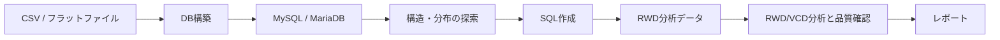

# RWD MySQL Skill Toolkit

本リポジトリは、MySQL/MariaDBを用いるRWDデータワークフローの実行・統合ハブです。CSVからのDB構築、SQL作成、RWD分析の実行、統合テストを担い、DB固有SkillとRWD実行フローの正本を管理します。

## 正本と依存関係

| 領域 | 正本・責務 |
|---|---|
| DB固有Skill・RWD実行フロー・統合テスト | このリポジトリ |
| 汎用コード理解・開発支援Skill | [Productivity-Skill](https://github.com/syrius2000/Productivity-Skill) |
| VCD・統計的エビデンス分析Skill | [agentic-evidence-analysis](https://github.com/syrius2000/agentic-evidence-analysis) |

汎用Skillはこのリポジトリでは追跡しません。コード理解や開発支援が必要な場合は、先にProductivity-Skillを導入してください。

```bash
npx skills add syrius2000/Productivity-Skill
```

`code-understanding-pro`、`code-understanding-pyramid`、`stats-sql-comprehension`、`teach`、`writing-great-skills`、`grilling`は外部の汎用Skillとして利用し、このリポジトリにローカルコピーを置きません。

## ローカル管理Skill（14件）

| 分類 | Skill | 役割 |
|---|---|---|
| DB構築・探索（7） | `flat-file-mysql-overview`、`flat-file-mysql-ddl-generation`、`flat-file-mysql-load-validation`、`mysql-create-query-support`、`mysql-er-diagram`、`mysql-table-cardinality`、`mysql-entity-matrix` | CSV/フラットファイルからのDB構築、構造探索、SQL作成 |
| RWD実行・品質（3） | `questionnaire-batch-analysis`、`anomaly-detection`、`security-vulnerability-check` | 設問バッチ分析、異常候補の検出、セキュリティ確認 |
| VCD統合ミラー（4） | `vcd-pass0-consultation`、`vcd-categorical-analysis`、`vcd-bayesian-evidence-analysis`、`vcd-categorical-reporting`（非推奨） | VCD正本との統合・実行・回帰確認 |

VCD系Skillの正本はagentic-evidence-analysisです。このリポジトリ内のVCD系はDB/RWDワークフローとの統合・検証用ミラーとして扱います。

## ワークフロー



- DB構築・SQL成果物: `sql/drafts/<topic>/` で作成し、検証後に`sql/validated/<topic>/`へ進めます。
- 標準SQL成果物: `main_query.sql`、`validation_query.sql`、`query_note.md`です。
- Skill実行成果物: 各Skillの契約に従い、原則`skill_out/`へ保存します。
- 共通品質契約・実行ユーティリティ: `.agent/shared/`を利用します。4ファイルは移動・削除しません。

## リポジトリ構成

```text
├── .agent/
│   ├── skills/             # ローカル管理Skill（14件）
│   └── shared/             # 共通契約とR/Pythonユーティリティ
├── docs/                   # 索引、計画、記録、参照資料
├── examples/               # テストデータと研修用プロンプト
├── skill_out/              # Skill実行時の生成物
├── sql/                    # 作成・検証したSQL資産
└── tests/                  # Python/R統合テスト
```

## 検証

```bash
uv run --with pytest python -m pytest \
  tests/test_mysql_create_query_support_assets.py \
  tests/test_security_report.py \
  tests/test_analysis_quality_contract_docs.py \
  tests/test_run_scope.py \
  tests/test_skill_frontmatter.py -q

Rscript tests/test_questionnaire_batch_smoke.R
Rscript tests/test_questionnaire_batch_ucbadmissions.R
Rscript tests/test_summary_csv_new_columns.R
Rscript tests/test_vcd_categorical_smoke.R
```

## ドキュメント

| ファイル | 役割 |
|---|---|
| [README.md](README.md) | リポジトリの責務、依存関係、Skill一覧 |
| [AGENTS.md](AGENTS.md) | エージェント向け運用ルール |
| [docs/README.md](docs/README.md) | `docs/`配下の索引と命名規約 |
