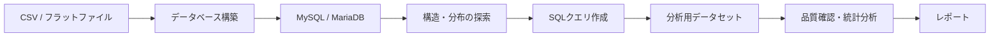

# 統合DB構築・分析スキル管理リポジトリ

このリポジトリは、CSVなどのフラットファイルからMySQL/MariaDBのデータベースを構築し、データ探索、SQLクエリ作成、分析用データセットの抽出、R/R Markdownによる分析までを支援するスキル群を管理します。

大学講座や小規模プロジェクトで、若手担当者がAIの支援を受けながら、手元のデータを分析可能な形へ整える一連の流れを学び、再現できるようにすることが目的です。

## できること

1. CSVなどのフラットファイルからデータベースを構築する
2. ER図、データ辞書、カーディナリティ、エンティティマトリックスを使って構造を把握する
3. 自然文で表した分析目的をSQLクエリへ変換する
4. 本番用SQLと検証用SQLを保存し、再利用可能な資産にする
5. 抽出データの異常候補や品質上の注意点を確認する
6. RやR Markdownなどによる統計分析・レポート作成へつなぐ

## はじめに

### 1. 利用するスキルを選ぶ

目的に対応する `.agent/skills/<skill-name>/SKILL.md` を開き、記載された手順に従います。

| やりたいこと | 主なスキル |
|---|---|
| CSVからデータベースを作る | `flat-file-mysql-overview` |
| データベースの構造を調べる | `mysql-er-diagram`, `mysql-table-cardinality`, `mysql-entity-matrix` |
| 自然文からSQLを作る | `mysql-create-query-support` |
| 抽出データの異常候補を探す | `anomaly-detection` |
| カテゴリカルデータを分析する | `vcd-pass0-consultation`, `vcd-categorical-analysis`, `vcd-bayesian-evidence-analysis` |

### 2. 例題を確認する

- テストデータ: `examples/data/`
- 研修用プロンプト: `examples/prompt/`
- SQL資産の例と保存ルール: `sql/README.md`

### 3. スキルを実行する

実行用のR、R Markdown、Pythonテンプレートは、各スキルの `templates/` または `scripts/` にあります。生成物は原則として `skill_out/` 配下へ保存します。

`questionnaire-batch-analysis` のスモークテスト例:

```bash
Rscript tests/test_questionnaire_batch_smoke.R
open tests/skill_out_smoke/q01_gender_dept/report.html
```

## 全体ワークフロー



| 系統 | スキル | 役割 |
|---|---|---|
| 構築 | `flat-file-mysql-overview`, `flat-file-mysql-ddl-generation`, `flat-file-mysql-load-validation` | フラットファイルからデータベースを作る |
| 探索 | `mysql-er-diagram`, `mysql-table-cardinality`, `mysql-entity-matrix` | テーブル構造、値の分布、IDの所在を確認する |
| クエリ作成 | `mysql-create-query-support` | 分析目的を整理し、本番用・検証用SQLを作る |
| 分析 | `vcd-pass0-consultation`, `questionnaire-batch-analysis`, `vcd-categorical-analysis`, `vcd-bayesian-evidence-analysis`, `anomaly-detection` | データ検分、異常候補の確認、統計分析、レポート作成を行う |
| 保守 | `security-vulnerability-check` | スクリプトとSQL支援機能の安全性を確認する |

## SQLクエリ作成支援

`mysql-create-query-support` は、「この条件に合う患者群を抽出したい」「このイベントを数えたい」といった自然文の相談からSQL作成を支援します。

まず分析目的を、対象集団、イベント、曝露、アウトカム、属性、期間、除外条件、データセットの粒度に分解します。次に、ER図、データ辞書、カーディナリティ、エンティティマトリックスなどを参照し、必要なテーブル、カラム、JOINキーを特定します。

既存の探索結果がない場合は、`SHOW TABLES`、`DESCRIBE <table>`、`INFORMATION_SCHEMA.COLUMNS` などでスキーマを確認してからSQLを設計します。スキーマ未確認のまま本番用SQLは作成しません。

標準成果物はリポジトリルートの `sql/` 配下へ保存します。

```text
sql/drafts/<topic>/
├── main_query.sql
├── validation_query.sql
└── query_note.md
```

検証済みのSQLは、ユーザー確認後に `sql/validated/<topic>/` へ移します。

## カテゴリカルデータ分析

RWDやEDCでは、性別、施設、治療群、イベント有無など、カテゴリで表されるデータを扱う場面が多くあります。本リポジトリでは、分析前の検分に `vcd-pass0-consultation`、頻度論的な分析に `vcd-categorical-analysis`、大標本におけるベイズ的評価に `vcd-bayesian-evidence-analysis` を利用できます。

分析は原則として、次の3段階で進めます。

1. Rによる集計・計算
2. AIによる結果の考察と要約
3. R Markdownによるダッシュボード作成

大標本では、わずかな差でもp値が小さくなりやすいため、p値だけで重要性を判断しません。Cramér's Vなどの効果量、Bayes Factor、セル単位の信号を併せて確認します。

| 指標 | 目安 | 確認する内容 |
|---|---|---|
| Evidence Score | `r² - k·log(N) > 0` | セル単位の信号が複雑さへのペナルティを上回るか |
| Bayes Factor BF₁₀ | `> 100`（目安） | 関連があるモデルをデータがどの程度支持するか |
| Cramér's V | `> 0.1`（Cohenの目安） | 関連の強さが実務上無視できない程度か |

p値は、帰無仮説のもとで観測データ以上に極端な結果が得られる確率を示す指標です。研究や業務上の重要性そのものを証明するものではなく、`p < 0.05` だけで結論を二分することも避けます。

VCD系スキルと `questionnaire-batch-analysis` の恒久的な正本は、[agentic-evidence-analysis](https://github.com/syrius2000/agentic-evidence-analysis) です。本リポジトリでは、統合・実験・検証用ミラーと周辺ドキュメントを管理します。分析品質の共通契約は `.agent/shared/analysis_quality_contract.md` を参照してください。

### 数理・統計リファレンス

| テーマ | 入口 | 用途 |
|---|---|---|
| カテゴリカル分析の基礎 | `docs/Reference/evidence-analysis/stats_categorical.md` | 期待度数、Pearson残差、Cramér's V、大標本でのp値飽和を確認する |
| ベイズ的エビデンス | `docs/Reference/evidence-analysis/stats_bayesian.md` | BF₁₀、Evidence Score、EBIC/BICペナルティの意味を確認する |
| 実務的な深掘り | `docs/Reference/evidence-analysis/advanced_analysis.md` | 効果量、セル単位エビデンス、層別の優先順位を決める |
| AIによる考察文 | `.agent/skills/vcd-categorical-analysis/references/ai-narrative-workflow.md` | 残差、効果量、層別差を過剰主張せず説明する |
| 異常検知結果の解釈 | `docs/Reference/anomaly-detection/anomaly_results_interpretation.md` | 異常検知スコア、ラベル、確認順序を理解する |

補足:

- `vcd-categorical-analysis`: 3ステップ（R 2パス → `executive_summary.md` → `dashboard.Rmd`）
- `vcd-categorical-reporting`: 非推奨（考察作成は分析スキルのStep 2へ統合済み）

## リポジトリ構成

```text
├── .agent/
│   ├── skills/             # 本リポジトリで管理するスキル
│   └── shared/             # 共通R/Pythonユーティリティ
├── docs/
│   ├── README.md           # ドキュメント索引と配置ルール
│   ├── Artifacts/          # 計画、実装記録、未着手メモ
│   ├── Reference/          # 手順書、解説、運用メモ
│   └── Archive/            # 完了した調査と旧計画
├── examples/               # テストデータと研修用プロンプト
├── skill_out/              # スキル実行時の生成物
├── sql/                    # 作成・検証したSQL資産
├── AnotherPJ/              # 補助プロジェクト
├── flat_file_mysql/        # フラットファイル関連資産
└── tests/                  # R/Pythonテスト
```

## 管理スキル一覧

スキルの新規作成、修正、レビュー、検証は `.agent/skills/<skill-name>/` を対象にします。

| スキル名 | 概要 |
|---|---|
| `flat-file-mysql-overview` | CP932形式のCSVをMySQLへ取り込む全体手順（Step 1〜3） |
| `flat-file-mysql-ddl-generation` | CSVからDDL用SQL、レコード数、重複数レポートを作る（Step 1） |
| `flat-file-mysql-load-validation` | 完成版SQLの作成、データベースへの投入、件数比較を行う（Step 2〜3） |
| `mysql-er-diagram` | データベースメタデータから辞書CSV、Draw.io XML、PlantUML形式のER図を作る |
| `mysql-table-cardinality` | 総行数とカラムごとの異なる値の数をCSV/JSON形式で出力する |
| `mysql-entity-matrix` | 指定IDが各テーブルに存在するかを `[1,0]` 形式で確認するSQLを作る |
| `mysql-create-query-support` | 自然文の分析目的から探索用SQL、本番用SQL、検証用SQL、説明文書を作る |
| `vcd-pass0-consultation` | カテゴリカル分析前にデータを検分し、分析する変数や次元を選ぶ |
| `questionnaire-batch-analysis` | 設問設定CSVを使い、複数のクロス集計と設問別HTMLレポートを一括作成する |
| `vcd-categorical-analysis` | 2元・3元の名義カテゴリを3ステップで分析し、要約とダッシュボードを作る |
| `vcd-categorical-reporting` | 非推奨。考察作成は `vcd-categorical-analysis` のStep 2へ統合済み |
| `vcd-bayesian-evidence-analysis` | 大標本の2元・3元カテゴリを3段階で分析し、ベイズ的評価とダッシュボードを作る |
| `anomaly-detection` | EDC/RWDデータの異常候補を複数手法で順位付けし、読みやすいレビュー文書を作る |
| `security-vulnerability-check` | ソースコードのSQLインジェクション、OSコマンド、パストラバーサルなどを確認する |

## スキル管理ルール

- 正本: `.agent/skills/`（本リポジトリ固有の構築・探索・クエリ作成・分析・保守スキルのみ）
- 共通ユーティリティ: `.agent/shared/`
- 旧規格: `.cursor/skills/` は廃止済みのため復活させない
- SQL成果物: スキル配下ではなく、リポジトリルートの `sql/` に保存する
- VCD系スキル: 恒久的な正本は `agentic-evidence-analysis` とし、本リポジトリでは統合・実験・検証用ミラーとして扱う

`brainstorming`、`writing-plans`、`executing-plans`、`systematic-debugging`、`verification-before-completion`、`grilling`、`find-skills` などの汎用スキルは、本リポジトリのドメイン資産ではありません。本リポジトリでは正本として管理せず、Cursorプラグインや `~/.agents/` 側で利用します。

## テスト

RによるスモークテストとPythonのpytestテストがあります。

```bash
Rscript tests/test_questionnaire_batch_smoke.R
Rscript tests/test_vcd_categorical_smoke.R
pytest tests/test_mysql_create_query_support_assets.py
```

テスト実行時の生成物例:

- `questionnaire-batch-analysis`: `tests/skill_out_smoke/`
- `vcd-categorical-analysis`: `skill_out/vcd_categorical_test/`

## ドキュメント

| ファイル | 役割 |
|---|---|
| [README.md](README.md) | 本ファイル。リポジトリの概要、利用方法、スキル一覧 |
| [AGENTS.md](AGENTS.md) | CodexやAntigravityなどのエージェント向けルール |
| [docs/README.md](docs/README.md) | `docs/` 配下の索引と、新規文書の配置ルール |
