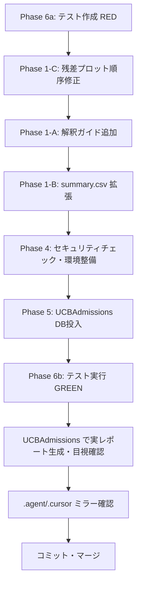

# VCD Categorical Analysis スキル改善 統合実装計画

**作成日**: 2026-03-31 22:06 JST  
**統合元**: 4つの implementation plan documents (2026-03-22〜2026-03-31)  
**対象スキル**: `vcd-categorical-analysis`, `security-vulnerability-check`  
**ブランチ**: `feature/vcd-security-skill-improve`  
**ベースコミット**: `73457b6`

---

## エグゼクティブサマリー

本ドキュメントは、vcd-categorical-analysis スキルの品質・可読性・統計的妥当性を向上させるための一連の改善活動をまとめたものです。主要な改善点は以下の3つです：

1. **残差解釈ガイドの追加** - レポートにPearson残差の意味と閾値解釈を明記
2. **残差プロット順序の修正** - ggplot2図とテーブルの整合性向上
3. **summary.csv の項目拡張** - バッチ分析時の定量評価指標追加

また、セキュリティチェックと`.gitignore`改善も含まれています。

---

## Phase 1: vcd-categorical-analysis 改善

### 1-A: report.html の内容改善

**対象ファイル**: `templates/report.Rmd` (.agent / .cursor 両方)

| # | 変更内容 | 理由 |
|---|---------|------|
| A1 | **残差解釈ガイド**セクションを追加 | Pearson 残差の意味、±1.96/±2.58 の閾値、正負の解釈を明記 |
| A2 | **分析サマリー**を拡充 | 有意セル数(\|res\|>1.96)、効果量の解釈基準、期待度数注意を追記 |
| A3 | **モデル比較解釈**を追加 | 3-way の場合のモデル間 ANOVA 結果の読み方ガイド |

#### 残差解釈ガイドの内容

追加するマークダウンセクション:

```markdown
## 残差解釈ガイド

### Pearson 残差とは
Pearson 残差は、クロス表の各セルの**観測度数**がモデル（独立性仮説等）から予測される**期待度数**からどの程度乖離しているかを標準化した指標です。

$$r_{ij} = \frac{O_{ij} - E_{ij}}{\sqrt{E_{ij}}}$$

### 閾値の目安
| 閾値 | 意味 |
|------|------|
| \|残差\| > **1.96** | 5% 水準で有意（期待より多い/少ない） |
| \|残差\| > **2.58** | 1% 水準で有意（強い乖離） |

### 正負の解釈
- **正の残差** (残差 > 0): 期待より**多い**（過剰表現）
- **負の残差** (残差 < 0): 期待より**少ない**（過少表現）
```

### 1-B: summary.csv の項目追加

**対象ファイル**: `batch_runner.R`, `report.Rmd` (questionnaire-batch-analysis)

| 新規カラム | 説明 |
|-----------|------|
| `n_significant_cells` | \|Pearson残差\| > 1.96 のセル数 |
| `n_total_cells` | クロス表のセル総数 |
| `top3_residual_cells` | 絶対値上位3セルのラベル（パイプ区切り） |
| `interpretation_flag` | "strong_association" / "weak_association" / "no_association" |
| `max_abs_pearson_res` | Pearson残差の絶対値の最大値 |
| `max_residual_cell` | 最大残差を持つセルのラベル |

### 1-C: 残差プロットの順序修正

**対象ファイル**: `templates/report.Rmd`, `questionnaire-batch-analysis/templates/report.Rmd`

**現状の問題**:
- 残差**表**: `abs_res` 降順ソート → 正しい（乖離が大きいセルを上位に表示）
- ggplot2 **図**: 同じく `abs_res` 降順ソートを使用 → **修正が必要**

**修正方針**:
- ggplot2 図は**元データのカテゴリ順**を保持する（factor level 順）
- 表は従来通り `abs_res` 降順ソートを維持
- 両者を比較しやすくする

**実装コード例**:
```r
# 残差プロット用: factor level 順を保持
residual_plot_df$cell_label_f <- factor(
  residual_plot_df$cell_label,
  levels = rev(unique(residual_plot_df$cell_label))
)

# 残差テーブル用: abs_res降順ソート
resid_tbl <- resid_tbl[order(-resid_tbl$abs_res), , drop = FALSE]
```

---

## Phase 2: 実装済みの改善（ベースライン）

### 2.1 残差プロットの可読性向上 (`ggplot2` 導入)

以前の base graphics による判読困難な Index プロットを廃止し、`ggplot2` による直感的な可視化を実装済み。

**機能**:
- セルラベルの自動折り返し (`strwrap`)
- 横軸・縦軸の反転 (`coord_flip`)
- 第1因子での色分け
- 有意水準 (±1.96) の破線表示

**適用済ファイル**: `analysis.R`, `report.Rmd`, `dependencies.md`

### 2.2 【教訓】3-way 飽和モデルの残差エラーと正しいモデル選択

> [!WARNING]
> **事象**: 3-way データ (`HairEyeColor`等) において、飽和モデル (`Freq ~ Hair * Eye * Sex`) の Pearson 残差を描画してしまい、残差がすべて 0 になるエラーが発生した。

**対策とルール**: 
飽和モデルはデータに完全に適合するため残差は常に 0 になります。残差プロットやモデル診断を行う際は、必ず**非飽和モデル（相互独立モデル `Freq ~ Hair + Eye + Sex` や、2要因交互作用モデル）**を使用する仕様に修正。

今後の統計スキルのテンプレ拡充時も、モデリングの数理的背景（自由度と残差の定義）を踏まえたコード生成を徹底します。

---

## Phase 3: 今後の改善・実装提案 (Recommendations)

### 3.1 エラーハンドリングとバリデーションの強化

- **パラメータチェック**: `report.Rmd` の冒頭で `stopifnot(length(params$vars) >= 1, length(params$vars) <= 3)` のバリデーションを実行
- **安全なパッケージ読み込み**: `pacman::p_load` を用い、パッケージのインストール・ロードを安全に一元化
- **出力先確保**: `params$output_dir` (基本は `./skill_out/vcd_categorical/`) が存在しない場合の `dir.create(..., recursive = TRUE)` の確実な実行

### 3.2 統計的機能の拡充と汎用化

- **生データ (非集約データ) への対応**: `Freq` 列（度数）が存在しないケースを検知し、`xtabs(~ vars)` による自動集約を正式機能にする
- **効果量の自動算出とフォールバック**:
  - 2-way 分析時、χ² 検定のP値だけでなく、**Cramer's V** や φ 係数といった効果量を自動計算・報告
  - 期待度数 5 未満のセルを検知した場合、自動的に **Fisherの正確検定 (Fisher's Exact Test)** の結果を併記
- **データローダーの拡張**: `load_builtin` ヘルパーを汎用化し、`datasets` パッケージだけでなく `vcd::Arthritis` や `UCBAdmissions` などの検証用データにも対応

### 3.3 出力レポートの高度化 (解釈のサポート)

- **条件付きモザイクプロット**: 3-way 分析時、全体モザイクに加えて、第3因子で層別した 2-way モザイク (`cotabplot`) を自動表示し、交互作用の解釈を容易にする
- **インライン要約テキストの自動生成**: Rmd レンダー時、統計量や最大残差のセル名を文章として自動出力するインラインチャンクを追加

### 3.4 スキル構造とパッケージ依存の明確化

- **役割の厳格化**:
  - `templates/`: ユーザーがコピー・実行するための直接的な提供物 (`analysis.R`, `report.Rmd`)
  - `references/`: エージェントが文脈を理解するためのガイド 兼 個別テクニックスニペット
- **デフォルトテーブルエンジンの確定**: HTML 出力およびパイプ構文の可読性から **`gt`** を既定の残差表パッケージとし、`kableExtra` は PDF 出力時のフォールバックとして位置づける
- **ゴミファイルの除外**: `.cursor/` や `.agent/` 内の `skill_out/` などの生成済みファイル (`.html`, `.png`) はバージョン管理から除外し、クリーンなテンプレートを維持

---

## Phase 4: セキュリティチェックおよび環境整備

### 4.1 セキュリティチェック結果

`security-vulnerability-check` スキルのガイドラインに基づき、Python/SQL等に関する静的コードの点検（マニュアルレビュー）を実施しました。

※ `bandit` による静的解析は環境権限（macOSのキャッシュパーミッション）により失敗したため、重要な `subprocess` / `f-string` 使用箇所を中心に重点的にレビュー。

**結果**:
- **OSコマンドインジェクション**: `subprocess.run` において、`shell=True` を使用せず、リスト形式で引数展開を行っているため安全
- **SQLインジェクション (動的クエリ)**: `flat-file-mysql` や `mysql-entity-matrix` にて、コマンドラインから受け取った引数（DB名、テーブル名など）に対して `validate_identifier` 関数等を用いたバリデーション（英数字・アンダースコア等への限定）や、バッククオート等への手動エスケープが正しく実装されている
- **総合判定**: 現時点のコードベースにおいて、深刻なインジェクション脆弱性やパストラバーサルのリスクは見当たらず、**安全にマージ可能な状態**

### 4.2 Issue 1: `.gitignore` の定義漏れ

直近の改修により、各スキルの出力先ディレクトリが `skill_out/` に変更されていますが、`.gitignore` には以前の `skill_output/*` しか記載されておらず、誤ってGit管理下に混入するリスクがあります。

**改善策**: `.gitignore` に `skill_out/` ルールを追記

```diff
--- a/.gitignore
+++ b/.gitignore
@@ -47,6 +47,8 @@

 skill_output/*
 # 補足: Git は空のディレクトリを追跡しないため、リポジトリに skill_output を残す場合は .gitkeep を追跡する
 !skill_output/.gitkeep
+skill_out/*
+!skill_out/.gitkeep
```

### 4.3 Issue 2: スキル定義内の不要なディレクトリの削除

スキル開発・テスト時の残骸として、`vcd-categorical-analysis` スキルの `templates/` 配下に `skill_output/` や `skill_out/` といった出力用ディレクトリが混入しています。

これらは本来リポジトリ（プロジェクト）のルートに出力されるべきものであり、スキル構成ファイル（テンプレート）内に含めておくのは不適切です。また、これが `git status` 実行時のパーミッションエラー（Operation not permitted）の直接的な原因となっています。

**改善策**: `.cursor/skills/` および `.agent/skills/` の両方から削除（`rm -rf`）

#### 削除対象
- `.cursor/skills/vcd-categorical-analysis/templates/skill_output/`
- `.cursor/skills/vcd-categorical-analysis/templates/skill_out/`
- `.agent/skills/vcd-categorical-analysis/templates/skill_output/`
- `.agent/skills/vcd-categorical-analysis/templates/skill_out/`

---

## Phase 5: UCBAdmissions データの DB インサート

### 概要

R言語の組み込みデータセットである `UCBAdmissions`（カリフォルニア大学バークレー校の大学院入試に関する性別・学科・合否データ）を、QNAP NAS 上の MariaDB の `Training` データベースに投入し、内容を表示します。

### 実行ステップ

#### 1. テーブルの作成 (DDL)

`Training` データベースに `UCBAdmissions` テーブルを新規作成します。すでに存在する場合は削除して作り直します（洗い替え）。

```sql
USE Training;
DROP TABLE IF EXISTS UCBAdmissions;
CREATE TABLE UCBAdmissions (
  id INT AUTO_INCREMENT PRIMARY KEY,
  Admit VARCHAR(20),
  Gender VARCHAR(20),
  Dept VARCHAR(10),
  Freq INT
);
```

#### 2. データのインサート (DML)

Rのデータセットから展開された24行のレコードを一括インサート。

```sql
INSERT INTO UCBAdmissions (Admit, Gender, Dept, Freq) VALUES
  ("Admitted", "Male", "A", 512),
  ("Rejected", "Male", "A", 313),
  ("Admitted", "Female", "A", 89),
  ("Rejected", "Female", "A", 19),
  ("Admitted", "Male", "B", 353),
  ("Rejected", "Male", "B", 207),
  ("Admitted", "Female", "B", 17),
  ("Rejected", "Female", "B", 8),
  ("Admitted", "Male", "C", 120),
  ("Rejected", "Male", "C", 205),
  ("Admitted", "Female", "C", 202),
  ("Rejected", "Female", "C", 391),
  ("Admitted", "Male", "D", 138),
  ("Rejected", "Male", "D", 279),
  ("Admitted", "Female", "D", 131),
  ("Rejected", "Female", "D", 244),
  ("Admitted", "Male", "E", 53),
  ("Rejected", "Male", "E", 138),
  ("Admitted", "Female", "E", 94),
  ("Rejected", "Female", "E", 299),
  ("Admitted", "Male", "F", 22),
  ("Rejected", "Male", "F", 351),
  ("Admitted", "Female", "F", 24),
  ("Rejected", "Female", "F", 317);
```

#### 3. テーブル内容の確認 (SELECT)

```sql
SELECT * FROM Training.UCBAdmissions;
```

---

## Phase 6: テスト計画（TDD: テスト先行）

### テストファイル

| テスト | 検証内容 |
|--------|---------|
| `tests/test_vcd_interpretation_guide.R` | report.Rmd に解釈ガイドチャンクが存在すること |
| `tests/test_vcd_residual_plot_order.R` | ggplot2 図が factor level 順（ソートなし）であること確認 |
| `tests/test_summary_csv_new_columns.R` | summary.csv に新規カラムが存在し、値が妥当であること |
| 既存テスト再実行 | 全テスト回帰なし確認 |

### テストデータ

UCBAdmissions データセットを使用。3-way (Admit × Gender × Dept) で残差が明確に出る。

### データ互換性の検証

1. **2-way生データ** (`vcd::Arthritis` 等)
2. **2-way集約データ** (`Titanic`)
3. **3-way集約データ** (`HairEyeColor`)

の3パターンでスクリプトが完走することを確認。

### モデリング警告と分岐の検証

期待値5未満のスパースなクロス表を意図的にパースさせ、Fisher正確検定のフォールバックが機能するか確認。

---

## 実行順序



---

## Verification Plan (検証フェーズ)

### Automated Tests

- 改善適用後、再度 `git status` を実行し、Working tree clean になっていること、およびパーミッションエラーが記録されないことを確認
- `skill_out/` へテスト用の空ファイルを作成し、Gitに追跡されない(`git status`に出ない)ことの確認
- CI / 手動テストによる整合性確認
  - Rscript 経由での CLI 実行と、RStudio / Rmd 経由での `rmarkdown::render()` の双方が成功
  - `./skill_out/vcd_categorical/` に正しい解像度・レイアウトの図表が生成されることを確認

### ミラーリングの最終確認

修正が `.cursor/skills/` と `.agent/skills/` で常に等価であることを確認する。

---

## 制約・原則

1. `.agent/` と `.cursor/` に**同一内容**を配置（ミラーリング必須）
2. 既存テスト（smoke, assoc_shade, residual_layout）を壊さない
3. 統計的妥当性: 飽和モデルの残差は使用しない（常に非飽和モデルを使用）
4. セキュリティ: SQLインジェクション、OSコマンドインジェクション対策を維持

---

## 統合元ドキュメント

1. `implementation_plan_0331_1000.md` (2026-03-31) - Phase 1, 3, 6
2. `implementation_vcd_plan_001_0322_1700.md` (2026-03-22 17:00) - Phase 2, 3
3. `implementation_plan0323_0200.md` (2026-03-23 02:00) - Phase 4
4. `implementation_plan0322_1732.md` (2026-03-22 17:32) - Phase 5

---

**統合者**: AI Agent  
**統合日時**: 2026-03-31 22:06 JST
