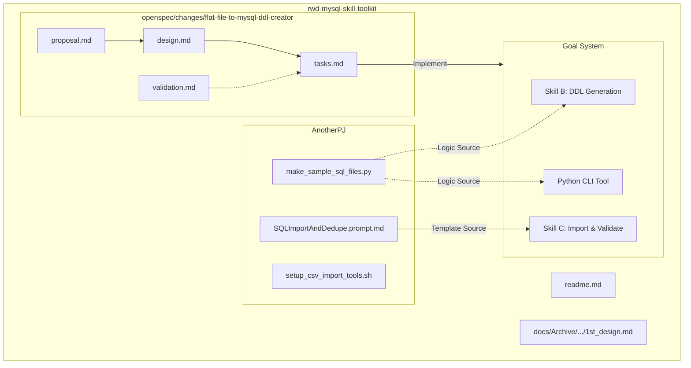
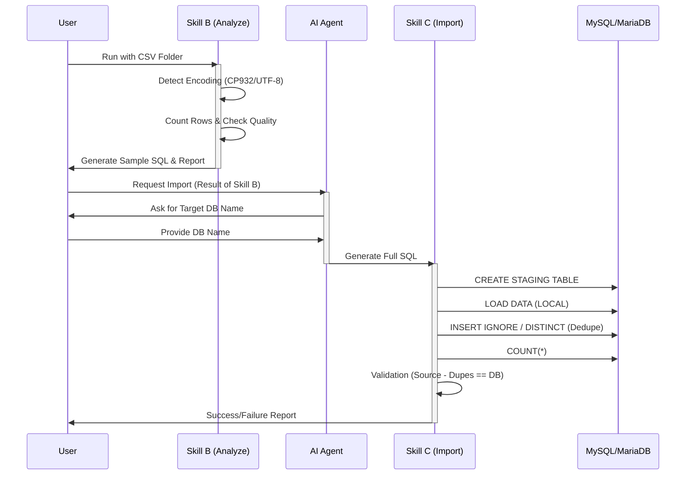

created: 2026-02-17 00:20
author: AI Agent (Gemini 2.0 Pro)

# Walkthrough: Repository Exploration & Analysis

## 1. Overview
本ドキュメントは、`openspec-explore` スキルに基づき、`rwd-mysql-skill-toolkit` リポジトリの現状調査と分析を行った結果です。現状の定義（`openspec`）と参考実装（`AnotherPJ`）の整合性を確認し、実装に向けた見通しを立てました。

## 2. Repository Map
現在のリポジトリ構成と、各コンポーネントの関係性は以下の通りです。

## 3. Current State Analysis

### 3.1. OpenSpec Definitions
`openspec/changes/flat-file-to-mysql-ddl-creator` 配下の定義は非常に明確で、`AnotherPJ` の資産を活用する方針が一貫しています。

| Artifact | Status | Description |
|:---|:---|:---|
| `proposal.md` | Clear | 3ステップ構成（サンプル作成→SQL生成→投入）が定義済。 |
| `design.md` | Clear | 技術スタック（Python, MySQL 8.0）、決定事項、トレードオフが網羅されている。 |
| `tasks.md` | Ready | 実装タスクが詳細にリスト化されており、そのまま実行可能。 |
| `validation.md` | Clear | 成功条件（`Source - Dupes = DB`）が数式的に定義されており曖昧さがない。 |

### 3.2. Reference Assets (AnotherPJ)
`AnotherPJ` のコードは、必要なロジックの大部分を既に実装しており、高い再利用性があります。

* **`make_sample_sql_files.py`**:
  * **エンコーディング判定**: `chardet` 的なロジックに加え、`lines_for_sql` 生成部分で MySQL 用の文字セットマッピング（`cp932` -> `cp932`, `utf-8` -> `utf8mb4`）まで考慮されています。
  * **品質チェック**: TRIM の必要性や NULL 表現の揺らぎ検知など、今回求められる「バリデーションレポート」の基礎となる機能が含まれています。
  * **DDL 生成**: `LOAD DATA INFILE` の構文生成ロジックがあり、そのまま活用可能です。

* **`SQLImportAndDedupe.prompt.md`**:
  * Import (Staging) -> Dedupe -> Production の流れが確立されています。
  * `design.md` の要件にある「DB名指定」を変数化（`{{database_name}}`）するだけで、Skill C のコアとして使用できます。

## 4. Logic Flow (Target Architecture)
実装されるシステム（Skill + CLI）のデータフローは以下のようになります。

## 5. Key Considerations & Risks

| Category | Issue | Mitigation Strategy |
|:---|:---|:---|
| **Performance** | 大容量 CSV の全件カウント/重複チェック時のメモリ不足 | `pandas` の `chunksize` を利用したストリーミング処理を実装する。 |
| **Compatibility** | MySQL 8.4 (Mac) vs MariaDB (QNAP) | `LOAD DATA LOCAL INFILE` のデフォルト設定（ON/OFF）が異なる可能性があるため、接続時のパラメータ設定や `local_infile=1` の確認を CLI に組み込む。 |
| **Encoding** | Mac 上のファイルパス (NFD/NFC) 問題 | 日本語ファイル名を扱う際、Mac 特有の正規化問題が発生しうる。Python の `unicodedata.normalize` で統一する。 |
| **Validation** | 重複定義の曖昧さ | `design.md` にある通り、デフォルトは「全カラム一致」、オプションで「キー指定」とするが、UI 上での指定方法を明確にする必要がある。 |

## 6. Conclusion & Next Steps
リポジトリの状態は非常に良好です。「洗う」作業により、既存定義と参考コードが高いレベルで整合していることが確認できました。不明瞭な点はほぼ解消されています。

**推奨される次のアクション:**
1. **実装フェーズへの移行**: 調査は完了したため、`openspec` のプロセスに従い実装を開始する準備が整いました。
2. **`flat-file-to-mysql-ddl-creator` の実装**:
    * Step 1: Python CLI ツールの実装（`AnotherPJ` ロジックの移植・拡張）。
    * Step 2: Skill MD ファイルの作成。
    * Step 3: `validation.md` に基づいたテスト実施。

以上報告いたします。
