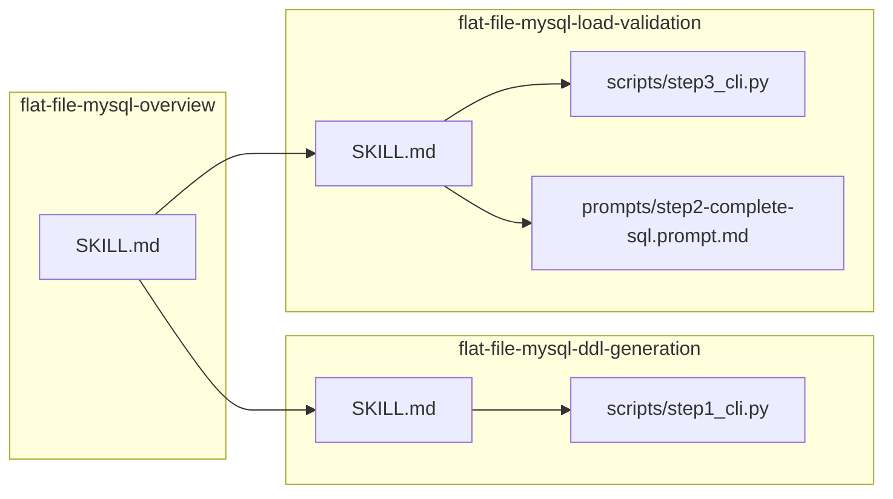

created: 2025-02-21 12:00 JST
author: AI Agent (LLM Model)

# Skill 整理とスクリプトのスキル配下設置（標準ライブラリ・仮想環境なし）

OpenSpec の新しいテーマ用に添付するプランテキスト。

---

## 現状

- **Skills**: `.cursor/skills/` に SKILL.md のみ。flat-file-mysql 系は 3 本（overview / ddl-generation / load-validation）。
- **スクリプト**: ルートの `flat_file_mysql/` パッケージ（`cli.py`, `encoding.py`, `sample_sql.py`, `execute_sql.py`）。ステップ 3 の `flat_file_mysql/execute_sql.py` が **mysql.connector** に依存（`requirements.txt`）。
- **参照**: ddl-generation の SKILL が「AnotherPJ/make_sample_sql_files.py」を参照。プロンプトは `openspec/changes/archive/2026-02-17-flat-file-to-mysql-ddl-creator/prompts/step2-complete-sql.prompt.md` を overview が絶対パスで参照。

## 方針

1. **標準機能のみ**: Python は標準ライブラリのみ使用。**仮想環境・pip 不要**とする。
2. **ステップ 3 の DB 実行**: `mysql.connector` を廃止し、**subprocess で `mysql` クライアント**を呼ぶ実装に変更（`mysql` が PATH にある前提）。
3. **スクリプトのスキル配下設置**: 各スキルが単体で動くよう、必要なスクリプト（および必要ならプロンプト）をスキルディレクトリ内に置く。
4. **スキル整理**: flat-file-mysql の 3 スキルを対象に、参照先を「スキル配下」に統一する。

---

## 1. 標準ライブラリ化（ステップ 3）

- `flat_file_mysql/execute_sql.py` の `mysql.connector` をやめ、`subprocess` で `mysql` コマンドを実行する実装に変更する。
  - `run_sql_file`: `mysql -h ... -P ... -u ... -p... db_name < sql_file`
  - `get_table_count`: `mysql ... -e "SELECT COUNT(*) FROM \`table\`"` の stdout をパース。
- これにより `requirements.txt` から `mysql-connector-python` を削除可能（他に依存がなければファイル削除または「# stdlib only」のみ残す）。

---

## 2. スクリプトをスキル配下に設置

### 2.1 flat-file-mysql-ddl-generation（ステップ 1）

- 配置先: `.cursor/skills/flat-file-mysql-ddl-generation/scripts/`
- 内容: ステップ 1 用の**スタンドアロン 1 本**の Python スクリプト（例: `step1_cli.py`）。
  - 現在の `flat_file_mysql/encoding.py` と `flat_file_mysql/sample_sql.py` のロジックを組み込み、**標準ライブラリのみ**で動作させる。
  - 起動例: `python3 scripts/step1_cli.py csv1.csv csv2.csv -o ./out`
- SKILL.md の「参照」を、`AnotherPJ/make_sample_sql_files.py` から **当スキル配下の `scripts/step1_cli.py`** に変更。

### 2.2 flat-file-mysql-load-validation（ステップ 2・3）

- 配置先: `.cursor/skills/flat-file-mysql-load-validation/scripts/`
- 内容:
  - **ステップ 3 用**のスタンドアロン CLI（例: `step3_cli.py`）。上記「標準ライブラリのみ」の SQL 実行・件数取得（`mysql` subprocess）を 1 本にまとめる。
  - 起動例: `python3 scripts/step3_cli.py complete.sql -d mydb --table mytbl --expected-count 2`
- オプションで **プロンプト**をスキル配下にコピーしてポータビリティを揃える:
  - 例: `prompts/step2-complete-sql.prompt.md` を archive の step2 プロンプトからコピーし、SKILL 内では「当スキル配下の `prompts/step2-complete-sql.prompt.md`」を参照する。

---

## 3. スキルドキュメントの更新

- **flat-file-mysql-ddl-generation/SKILL.md**: 手順の「CLI 呼び出し」を、スキル配下の `scripts/step1_cli.py` を呼ぶ形に明記。参照をスキル内スクリプトに変更。
- **flat-file-mysql-load-validation/SKILL.md**: ステップ 3 の CLI をスキル配下の `scripts/step3_cli.py` に統一。ステップ 2 のプロンプトパスを「当 change 配下」から「当スキル配下 `prompts/`」に変更（プロンプトをコピーした場合）。
- **flat-file-mysql-overview/SKILL.md**: プロンプトの参照を、archive 絶対パスから「flat-file-mysql-load-validation スキル配下の `prompts/step2-complete-sql.prompt.md`」に変更。ステップ 1/3 の CLI は各スキル配下スクリプトを参照する旨を記載。

---

## 4. 既存パッケージとの関係

- **flat_file_mysql/** は、既存の `python3 -m flat_file_mysql.cli` 利用を続ける場合は残す。その場合、execute_sql を stdlib 化したうえで、スキル配下スクリプトは「同じ挙動のスタンドアロン版」として維持する。
- あるいは、スキル配下スクリプトを正とし、`flat_file_mysql` は thin ラッパー（スキル配下の script を subprocess で呼ぶ）にしてもよい。整理の一貫性では「スキル配下が正」とし、ルートパッケージは互換用に残すか削除するかは別判断とする。

---

## 5. オープンスペック系スキルについて

- openspec-* は SKILL.md のみでスクリプト依存がなく、今回の「スクリプトをスキル配下に設置」の対象外とする。
- 必要なら別タスクで「使っていないスキルの整理」やリネームを行う。

---

## 成果物イメージ（ディレクトリ）

- 各スクリプトは **import は stdlib のみ**。実行は `python3 scripts/xxx.py` で、仮想環境不要。
- スキルディレクトリを他環境にコピーすれば、そのスキル単体で手順が再現可能になる。

---

## 実装時の注意

- **BSD vs GNU**: SKILL 内やスクリプトで shell を叩く場合は、macOS/Ubuntu 両方で動くよう、できるだけ Python 内で完結（pathlib, subprocess）する。
- **エンコーディング**: 既存どおり UTF-8 / LF。スクリプトは UTF-8 で保存。
- **日付**: 作成する Artifact があれば、ルールに従い `./docs/Artifacts` に `filename_MMDD_HHMM.ext` で保存し、先頭に created/author を記載する。
