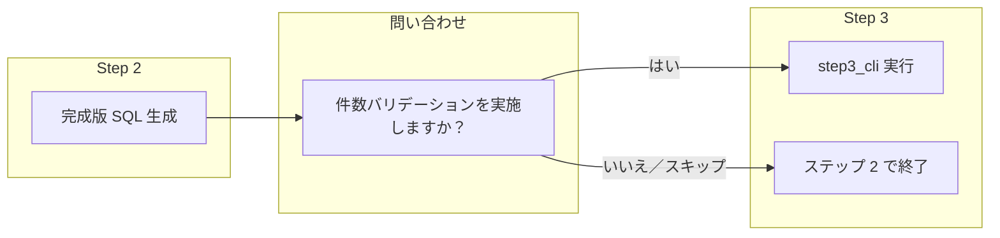

created: 2026-02-24 12:00 (JST)
author: AI Agent (LLM Model)

# 問い合わせる自律性を持たせる Skill 改造プラン

## 背景（会話の整理）

- **課題**: 6GB 級など巨大 CSV では、ステップ 3（件数カウントバリデーション）が時間を要するため「実施する／しない」を依頼のたびに区別したい。
- **方針**: 新規スキルは作らず、既存の flat-file-mysql-load-validation を拡張する。ステップ 2 完了後、ステップ 3 の**前に**エージェントが「件数バリデーションを実施しますか？」と**必ず尋ねる**ようにし、ユーザーが「はい／いいえ」で選べるようにする。
- **効果**: ユーザーは「CSV→DDL を指定ディレクトリで実施」とだけ言えばよく、エージェントが問い合わせるので巨大ファイルでも「バリはスキップ」をその場で選べる。

## 変更対象

Cursor 用（.cursor/skills/）と Antigravity 用（.agent/skills/）の両方を整合して改良する。

| ファイル | 役割 |
|----------|------|
| .cursor/skills/flat-file-mysql-load-validation/SKILL.md | 問い合わせルールの追加・手順の条件分岐明記 |
| .cursor/skills/flat-file-mysql-overview/SKILL.md | ステップ 3 が任意であること・エージェントが確認する旨を 1 文追加 |
| .agent/skills/flat-file-mysql-load-validation/SKILL.md | 上記と同一の問い合わせルール・手順。パスは .agent/ のまま、description は「Antigravity 用」を維持。 |
| .agent/skills/flat-file-mysql-overview/SKILL.md | 上記 overview と同一の 1 文追加。Antigravity 用として整合。 |

**.agent 用の扱い**: 本文のルール・手順は .cursor と同一とする。.agent 側はプロンプト・CLI 参照パス（.agent/skills/...）と description の「Antigravity 用」表記のみ差をつけ、問い合わせの自律性は両方に同じ内容で入れる。

## 変更内容

### 1. flat-file-mysql-load-validation/SKILL.md

- **description（先頭 YAML）**: 「必要に応じて」を「ステップ 3 実行前にユーザーに確認し、依頼に応じて」に近い旨に変更（任意。現状のままでも可）。
- **新規セクション「ステップ 3 の実行前確認（問い合わせ）」**を「手順（ステップ 2）」と「手順（ステップ 3）」の間に追加する。
  - ルール: ステップ 2 まで完了したら、ステップ 3（件数比較）に進む**前に**、エージェントはユーザーに **「件数バリデーション（投入後の件数比較）を実施しますか？ はい／いいえ（スキップ）」** と必ず尋ねる。
  - 解釈: 「はい」「する」「実施する」等 → ステップ 3 を実行（step3_cli を呼ぶ）。「いいえ」「しない」「スキップ」「不要」等 → ステップ 2 で終了し、step3_cli は呼ばない。
  - 巨大ファイルの補足: 大容量 CSV（例: 数 GB）では件数カウントに時間がかかるため、ユーザーがスキップを選べるようにする、と 1 行記載する。
- **手順（ステップ 3）**の冒頭を修正する。
  - 現状: 「1. エージェントが Python CLI を呼び出す」から始まっている。
  - 変更: 「1. 上記の問い合わせでユーザーが実施すると答えた場合のみ、エージェントが Python CLI（ステップ 3 用）を呼び出す。」とし、以下は既存のまま（CLI の例・レポート確認）。

### 2. flat-file-mysql-overview/SKILL.md

- **フロー概要**のステップ 3 の説明（1. の 3 番目の箇条）に 1 文追加する。
  - 例: 「ステップ 3 は任意。エージェントが件数バリデーションの実施有無をユーザーに確認し、『はい』の場合のみ step3_cli を実行する。」
- 必要なら「実行前提・注意」に、大容量 CSV では件数バリをスキップできる旨を 1 行追記（任意）。

### 3. .agent（Antigravity 用）の整合

- **flat-file-mysql-load-validation**: 上記 1 と同一のセクション・手順を追加。プロンプト・CLI のパスは `.agent/skills/flat-file-mysql-load-validation/...` のまま。description の「Antigravity 用」は維持。
- **flat-file-mysql-overview**: 上記 2 と同一の 1 文を追加。参照する Skill 名は同じ。Antigravity 用として Cursor 用と揃えた振る舞いにする。

## フロー（変更後のイメージ）

## 実施しないこと

- step3_cli.py や既存 CLI の仕様変更は行わない（問い合わせはエージェントの振る舞いのみ）。
- 新規アーティファクトや OpenSpec 変更の作成は本プランに含めない（必要なら別タスクで対応）。

## 成果

- 「CSV→DDL を指定ディレクトリで実施」等と依頼したとき、エージェントがステップ 2 のあとで「件数バリデーションをしますか？しませんか？」と尋ねるようになる。
- 巨大ファイルではユーザーが「しない」を選べ、時間を節約できる。
- Cursor（.cursor）と Antigravity（.agent）の両方で同じ問い合わせルールが効き、どちらの環境でも整合した振る舞いになる。
