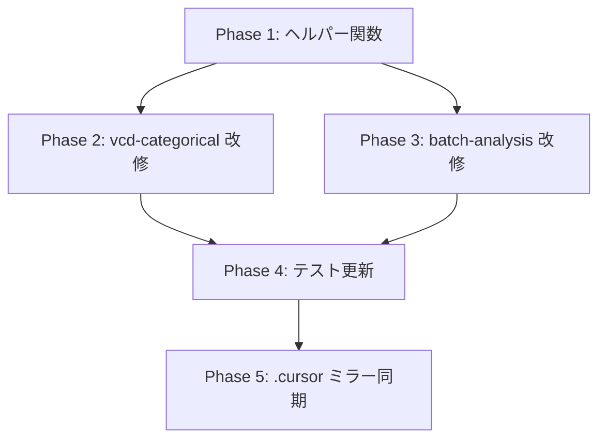

# 実装計画: mosaic/assoc 自動省略スイッチ導入

- **日付**: 2026-03-31
- **対象 Skill**: vcd-categorical-analysis, questionnaire-batch-analysis
- **目的**: 水準数・ラベル長が大きい場合に mosaic plot / assoc plot を自動省略し、GLM残差プロットを主表示にする

---

## 1. 共通仕様

### 1.1 表示モード (`plot_mode`)

| 値 | 動作 |
|---|---|
| `auto` (既定) | しきい値判定で mosaic/assoc 描画を切り替え |
| `always` | 常に mosaic/assoc を描画 |
| `residual_only` | mosaic/assoc を常に省略、残差プロットのみ |

### 1.2 auto 判定しきい値（初期値）

| パラメータ | 既定値 | 説明 |
|---|---|---|
| `max_cells_2way` | 16 | 2-way: nlevels(A) × nlevels(B) > 16 で省略 |
| `max_cells_3way` | 36 | 3-way: nlevels(A) × nlevels(B) × nlevels(C) > 36 で省略 |
| `max_label_chars` | 24 | 最長ラベル文字数がこれを超えたら省略 |

- セル数 **または** ラベル長のいずれかがしきい値超過で省略判定
- しきい値はパラメータ化し、report.Rmd の YAML params で上書き可能にする

### 1.3 省略時の挙動

- チャンク自体は残す（テスト互換性維持）
- 描画の代わりに「高次元のため mosaic/assoc を省略し、残差図を優先表示しています」のメッセージを出力
- summary に `mosaic_rendered` / `assoc_rendered` フラグと `skip_reason` 列を追加

---

## 2. 変更対象ファイル一覧

### Phase 1: 判定ヘルパー関数の作成

| # | ファイル | 変更内容 |
|---|---|---|
| 1-1 | `.agent/skills/vcd-categorical-analysis/templates/report.Rmd` | setup チャンクに `should_render_mosaic()` ヘルパー関数を追加。params に `plot_mode`, `max_cells_2way`, `max_cells_3way`, `max_label_chars` を追加 |

### Phase 2: vcd-categorical-analysis テンプレート改修

| # | ファイル | 変更内容 |
|---|---|---|
| 2-1 | `.agent/skills/vcd-categorical-analysis/templates/report.Rmd` L305付近 | mosaic チャンクに `should_render_mosaic()` 分岐を追加 |
| 2-2 | `.agent/skills/vcd-categorical-analysis/templates/report.Rmd` L315付近 | assoc チャンクに同様の分岐を追加 |
| 2-3 | `.agent/skills/vcd-categorical-analysis/SKILL.md` | auto 省略の仕様説明を追記 |

### Phase 3: questionnaire-batch-analysis テンプレート改修

| # | ファイル | 変更内容 |
|---|---|---|
| 3-1 | `.agent/skills/questionnaire-batch-analysis/templates/report.Rmd` L173付近 | mosaic PNG 出力に `should_render_mosaic()` 分岐を追加 |
| 3-2 | `.agent/skills/questionnaire-batch-analysis/templates/report.Rmd` L231付近 | assoc PNG 出力に同様の分岐を追加 |
| 3-3 | `.agent/skills/questionnaire-batch-analysis/templates/batch_runner.R` L57付近 | summary 列に `mosaic_rendered`, `assoc_rendered`, `skip_reason` を追加 |
| 3-4 | `.agent/skills/questionnaire-batch-analysis/SKILL.md` | auto 省略の仕様説明を追記 |
| 3-5 | `.agent/skills/questionnaire-batch-analysis/references/interpretation.md` | 残差プロット最優先の読み方説明を追記 |

### Phase 4: テスト更新

| # | ファイル | 変更内容 |
|---|---|---|
| 4-1 | `tests/test_vcd_categorical_template_residual_layout.R` | small table で mosaic/assoc が描画されることを確認する assertion 追加 |
| 4-2 | `tests/test_questionnaire_batch_smoke.R` | summary の新列存在チェック追加 |
| 4-3 | `tests/test_questionnaire_batch_ucbadmissions.R` | UCBAdmissions (6×2×2=24 cells) で mosaic が描画されることを確認 |
| 4-4 | (新規) `tests/test_mosaic_auto_skip.R` | 大テーブル (5×5 等) で mosaic/assoc が省略され residual のみ出力されることを確認 |

### Phase 5: .cursor ミラー同期

| # | ファイル | 変更内容 |
|---|---|---|
| 5-1 | `.cursor/skills/vcd-categorical-analysis/` | .agent 側と同一内容をコピー |
| 5-2 | `.cursor/skills/questionnaire-batch-analysis/` | .agent 側と同一内容をコピー |

---

## 3. ヘルパー関数設計（擬似コード）

```r
should_render_mosaic <- function(tbl, plot_mode, max_cells_2way, max_cells_3way, max_label_chars) {
  if (plot_mode == "always") return(TRUE)
  if (plot_mode == "residual_only") return(FALSE)

  # auto 判定
  dims <- dim(tbl)
  n_way <- length(dims)
  total_cells <- prod(dims)

  cell_limit <- if (n_way <= 2) max_cells_2way else max_cells_3way
  if (total_cells > cell_limit) return(FALSE)

  # ラベル長チェック
  all_labels <- unlist(dimnames(tbl))
  if (max(nchar(all_labels)) > max_label_chars) return(FALSE)

  TRUE
}
```

---

## 4. 実行順序と依存関係



- Phase 2 と Phase 3 は独立して並列実行可能
- Phase 4 は Phase 2・3 の完了後
- Phase 5 は全フェーズ完了後に一括コピー

---

## 5. リスク・注意点

| リスク | 対策 |
|---|---|
| 既存テストが mosaic チャンク出力を前提 | チャンク自体は残し内部分岐で対応。テスト側も条件付きに更新 |
| UCBAdmissions (24 cells, 3-way) がしきい値ギリギリ | 3-way しきい値 36 なら 24 < 36 で描画される。テストで確認 |
| batch_runner.R の summary 列追加で下流パーサが壊れる | 新列は末尾追加。既存列の位置は変えない |
| .agent / .cursor の同期漏れ | Phase 5 で rsync -a --delete で一括同期。diff で検証 |

---

## 6. 完了基準

- [x] `plot_mode = "auto"` 既定で、4×4超の 2-way テーブルで mosaic/assoc が省略される
- [x] 3-way テーブルで総セル数 36 超の場合に省略される
- [x] ラベル長 24 文字超で省略される
- [x] 省略時にレポートに理由メッセージが表示される
- [x] summary に rendered フラグと skip_reason が記録される
- [x] small table (3×2 等) では従来どおり mosaic/assoc が描画される
- [x] 全既存テストが pass
- [x] 新規テスト (test_mosaic_auto_skip.R) が pass
- [x] .agent と .cursor が同一内容
