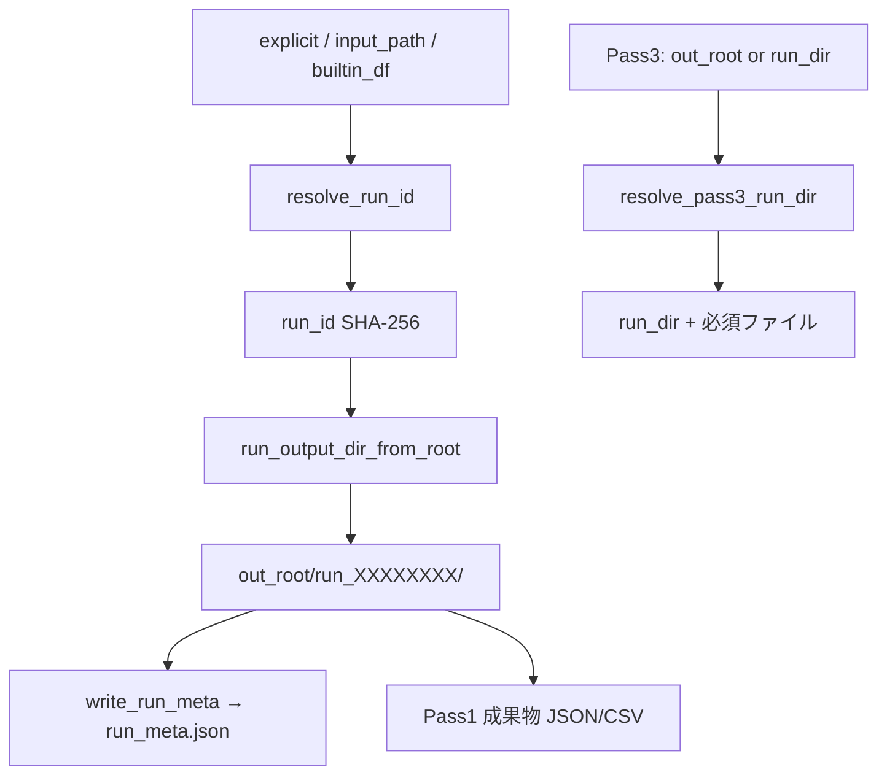

# コード理解レポート: `.agent/shared/run_scope.R`

- **Skill**: code-understanding-pro（Full Mode + Documentation）
- **対象**: `.agent/shared/run_scope.R`
- **作成日時**: 2026-07-23 JST
- **根拠ソース**: 対象ファイル本体、VCD / questionnaire テンプレートの呼び出し、`tests/test_vcd_bayesian_run_id.R`、`AGENTS.md`

---

## Step 0: 文脈把握

- **対象**: `.agent/shared/run_scope.R`（約 184 行）
- **見かけ上の役割**: スキル実行ごとの **出力隔離**（skill-output-run-isolation）。`run_id` 決定 → `run_<prefix>/` 配下への成果物配置 → `run_meta.json` 記録 → Pass 3 でのディレクトリ解決。
- **入力**: 明示 `run_id`、入力ファイルパス、組み込み data.frame、`out_root`、必須成果物ファイル名
- **出力**: SHA-256 系 `run_id`、隔離ディレクトリパス、`run_meta.json`、Pass 3 用 `run_dir`
- **関連ファイル**:
  - `.agent/skills/vcd-bayesian-evidence-analysis/templates/{analysis.R,dashboard.Rmd,render_dashboard.R}`
  - `.agent/skills/vcd-categorical-analysis/templates/{analysis.R,dashboard.Rmd}`
  - `.agent/skills/questionnaire-batch-analysis/templates/dashboard.Rmd`
  - 同ディレクトリの `inspect_data.R` は検分用で、本ファイルとは独立
- **テスト / ドキュメント**: `tests/test_vcd_bayesian_run_id.R`、各 VCD `SKILL.md`、`AGENTS.md` / `README.md`（shared 言及）
- **外部依存**: `digest`（source 時に確保）、`jsonlite`（`write_run_meta` / Pass 3 読込）
- **不明点**: `resolve_run_id(explicit=)`（文字列ハッシュ）経路を、現行テンプレートがどこまで使っているか（Bayesian 明示 ID は別分岐）

---

## Step 1: 概要理解

### 一文要約

VCD 系スキルの成果物を、入力（または明示 ID）由来の決定的 `run_id` でサブディレクトリに隔離し、後段 Pass が同じ run を辿れるようにする共通 R ユーティリティ。

### 主要処理

1. （任意）リポジトリルート探索・`digest` パッケージ確保
2. 入力から `run_id`（SHA-256）を決定
3. `out_root/run_<先頭16文字>/` を組み立て、`run_meta.json` を書く
4. Pass 3 で必須ファイルを直下または最新 `run_*` から探す
5. アンケート用に `questionnaire_results.json` を再帰探索

### 主要な登場要素

| 名前 | 種類 | 役割 |
|---|---|---|
| `RUN_META_INTERFACE_VERSION` | 定数 | `run_meta.json` 契約版 `"1.0"` |
| `run_scope_source_repo_root` | 関数 | cwd から上へ辿り repo ルート推定（現状呼び出しなし） |
| `sha256_file` / `sha256_df` | 関数 | ファイル / data.frame の SHA-256 |
| `timed_sha256_file` | 関数 | 大ファイル警告付きハッシュ |
| `resolve_run_id` | 関数 | run_id 決定（explicit → file → builtin） |
| `run_id_short16` | 関数 | ディレクトリ名用に先頭 16 文字 |
| `run_output_dir_from_root` | 関数 | `run_<16桁>/` パス生成 |
| `write_run_meta` | 関数 | メタ JSON 書き出し |
| `resolve_pass3_run_dir` | 関数 | Pass 1 成果物の場所解決 |
| `find_questionnaire_json_under_run` | 関数 | アンケート JSON 探索 |

### データフロー



---

## Step 2: 詳細追跡

### インターフェース

| 項目 | 意味 | 型/構造 | 例 |
|---|---|---|---|
| `resolve_run_id(...)$run_id` | 実行識別子 | 文字（通常 hex SHA-256） | ファイル全体ハッシュ |
| `$source` | 決定経路 | `"explicit"` / `"file"` / `"builtin"` | `"file"` |
| `run_output_dir_from_root` | 隔離ディレクトリ | path | `.../out/run_a1b2c3d4e5f67890` |
| `write_run_meta` 戻り | 書いたメタ | named list（invisible） | `interface_version`, `skill`, … |
| `resolve_pass3_run_dir` | Pass 3 解決結果 | `list(run_dir, run_meta, resolved_from)` | `resolved_from="run_subdir"` |

### 制御フロー（`resolve_run_id`）

1. `explicit` が非空 → `digest(explicit)` を `run_id` にして即 return
2. それ以外で `input_path` あり → 存在確認 → `timed_sha256_file` → ファイルハッシュ
3. それ以外で `builtin_df` あり → `sha256_df(df)`
4. どれも無し → `stop`（非決定的フォールバックなし）

**事実**: 大きなファイルでも全バイトをハッシュする。所要時間が閾値超過なら WARN するが、非決定的 ID への退避はしない（`.agent/shared/run_scope.R` L48–51）。

### データフロー追跡（典型: ファイル入力）

| ステップ | 変数 | 値の例 | 説明 |
|---|---|---|---|
| 1 | `input_path` | `data/cohort.csv` | CLI `--input` 等 |
| 2 | `tr$hash` | 64 hex | ファイル SHA-256 |
| 3 | `run_id_short16` | 先頭 16 hex | ディレクトリ名用 |
| 4 | `artifact_dir` | `out/run_<16>/` | Pass 1 出力先 |
| 5 | `run_meta.json` | JSON | 後段が参照 |

### 副作用

| 副作用 | 場所 | 意味 / リスク |
|---|---|---|
| `install.packages("digest")` | トップレベル source 時 | ネットワーク・権限・非対話環境で失敗しうる |
| `install.packages("jsonlite")` | `write_run_meta` 内 | 同上（遅延） |
| `message` / `stop` | 各所 | ログと強制終了 |
| ファイル書込 | `run_meta.json` | ディスク I/O |
| 最新 mtime 選択 | `resolve_pass3_run_dir` / `find_questionnaire_json_*` | 複数 run 時に意図と違う run を拾う可能性 |

### 例外・境界条件

- 入力ファイル不存在 → 即 `stop`
- Pass 3 で `out_root` 不存在 → `stop`
- 必須ファイルも `run_*` も無し → `stop`
- `run_*` はあるが必須ファイル無し → `stop`
- `run_meta.json` 読込失敗 → `run_meta = NULL`（致命ではない）

---

## Step 3: 深い設計理解

### コードから確認できる事実

- コメントどおり **skill-output-run-isolation** 用（L1–2）
- `run_id` は決定的（入力または明示文字列のハッシュ）。乱数は使わない（`created_at` のみ時刻）
- Pass 3 は「直下が成果物」または「`/run_[0-9a-f]{16}` の最新 mtime」の二段解決（L135–164）
- Bayesian テンプレは明示 `--run-id` 時に `resolve_run_id` を使わず、`sanitize_run_slug` 結果をそのまま使う
- Categorical は `runs/<slug>/` という別規約で `write_run_meta` のみ共有している箇所がある
- `run_scope_source_repo_root` は定義のみでリポジトリ内呼び出し無し
- `resolve_pass3_run_dir` の `skill_label` は未使用

### 根拠に基づく推論

- 同じ入力なら同じ `run_*` に収束し、再現実験・エージェント再実行でパスが安定しやすい意図
- Pass 3 に `out_root` だけ渡せば最新 run を拾える利便性と、「複数実験の最新取り違え」のトレードオフ
- `explicit` をハッシュする設計は任意文字列をそのままパスに載せないためだが、現行 Bayesian は別経路で slug をパスに載せている

### 不確実性

- `interface_version` を消費側が厳密検証しているかは未確認
- Categorical の `runs/` と Bayesian の `run_` の二重規約が意図的並存か、移行途中かはドキュメント不足

### トレードオフ

| 選択 | 利点 | コスト | 代替案 |
|---|---|---|---|
| ファイル全体ハッシュ | 入力と run が厳密対応 | 大ファイルで遅い | 前処理済み小ファイルを渡す（WARN の推奨どおり） |
| 先頭 16 文字ディレクトリ | パスが短い | 衝突は理論上あり（2^64） | フルハッシュ / 明示 slug のみ |
| 最新 mtime 自動選択 | Pass 3 が楽 | 取り違え | `run_id` または `run_output_dir` 必須指定 |
| source 時に digest install | 依存解決が楽 | CI / オフラインで脆い | 事前インストール前提 |

### リスク

| リスク | 重要度 | 根拠 | 確認方法 |
|---|---|---|---|
| 複数 `run_*` の取り違え | Major | `which.max(mtime)` | 連続 2 run 後に Pass 3 |
| スキル間パス規約不一致 | Major | categorical `runs/` vs `run_` | 両テンプレ比較 |
| `explicit` API と実装乖離 | Consider | Bayesian が `resolve_run_id(explicit)` 未使用 | grep |
| 自動 `install.packages` | Consider | トップレベル副作用 | オフライン `Rscript` |
| 未使用関数 / 引数 | Nit | `run_scope_source_repo_root`, `skill_label` | 静的確認 |

---

## Step 4: 活用

### 使用例

```r
source(".agent/shared/run_scope.R")

rid <- resolve_run_id(input_path = "data.csv")
# または resolve_run_id(builtin_df = df)
# または resolve_run_id(explicit = "my-label")  # → ラベル文字列の SHA-256

dir <- run_output_dir_from_root("skill_out/foo", rid$run_id)
dir.create(dir, recursive = TRUE, showWarnings = FALSE)
write_run_meta("skill_out/foo", dir, "my-skill", rid$run_id, "data.csv")

# Pass 3
rs <- resolve_pass3_run_dir("skill_out/foo", "evidence_results.json")
# rs$run_dir に成果物がある
```

### `run_meta.json` 主要フィールド

| フィールド | 意味 |
|---|---|
| `interface_version` | 契約版（現在 `"1.0"`） |
| `skill` | 呼び出しスキル名 |
| `run_id` / `run_id_short` | フル ID とディレクトリ用短縮 |
| `out_root` / `run_output_dir` | ルートと実際の隔離ディレクトリ |
| `input_data` | 入力パス（正規化失敗時は生文字列） |
| `created_at` | 作成時刻（タイムゾーン付き） |

### 呼び出し側の注意（事実）

| スキル / 経路 | run ディレクトリ規約 | `resolve_run_id` |
|---|---|---|
| vcd-bayesian（入力なし / builtin） | `run_<16>/` via `run_output_dir_from_root` | `builtin_df` を使用 |
| vcd-bayesian（`--run-id` 明示） | 同上だが ID は slug 系 | **使わず** `sanitize_run_slug` |
| vcd-categorical | `runs/<slug>/` など別経路あり | 主に `write_run_meta` |
| Pass 3 dashboard / render | `resolve_pass3_run_dir` | — |
| questionnaire dashboard | 上記 + `find_questionnaire_json_under_run` | — |

### テスト案

- 同一ファイル入力で `run_id` / ディレクトリ名が一致すること
- 欠損パス / 空 explicit で期待どおり `stop` すること
- `out_root` に複数 `run_*` があるとき、最新以外を明示指定できる経路があること（現状は自動最新のみ）
- オフライン環境で `install.packages` が走らない前提のスモーク

### リファクタリング案（未実施・提案のみ）

1. スキル横断で `run_<16>/` と `runs/<slug>/` の規約を一本化
2. 明示 `--run-id` を `resolve_run_id(explicit=)` に寄せるか、関数契約を「ハッシュしない slug モード」として文書化
3. 未使用の `run_scope_source_repo_root` / `skill_label` の削除または利用開始
4. 自動 `install.packages` をオプション化（エージェント / CI 向け）

---

## 提案

- 本ファイルを shared 契約の正本候補として扱い、各 VCD `SKILL.md` からパス規約をリンクする
- Pass 3 は本番運用では `out_root` 自動最新より、`run_output_dir` 明示を推奨する

## 批判的立場

共通化の核（`run_id`・メタ・Pass 3 解決）は明確だが、呼び出し側が規約を部分実装しているため、「このファイルを読めば全スキルの出力レイアウトが分かる」状態にはなっていない。説明対象としては **契約の正本候補**だが、現状は **正本の一部**。

---

## 参照パス

- 対象: `.agent/shared/run_scope.R`
- テスト: `tests/test_vcd_bayesian_run_id.R`
- 本成果物: `docs/Artifacts/code_understanding_run_scope_001_0723_1402.md`
