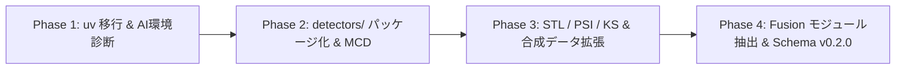

# EDC/RWD Python/R 異常検知スキルの強化・共通化実装計画 (改訂第3版・最終案)

created: 2026-07-24 23:20 (JST)
author: AI Agent (Antigravity Gemini 3.6 Flash)

## 1. 概要・背景 (Goal Description)

本計画は、ローカル Python スキル `anomaly-detection` ([.agent/skills/anomaly-detection/](.agent/skills/anomaly-detection/)) に R スキル `r-anomary-detection` ([~/.agents/skills/r-anomary-detection/](file:///Users/myamaguchi/.agents/skills/r-anomary-detection/)) の高度な検知手法（MCD, STL, PSI, KS）を取り込んで強化するとともに、**Python環境構築を `uv` に全面移行**し、**初学者がセットアップで迷わない AI ガッチリ支援（自動診断・ワンコマンド構築・自動復旧）** を統合することを目的とします。

レビュー文書 ([review_implementation_plan_008_0724.md](review_implementation_plan_008_0724.md)) の追加指摘（§12）をすべて反映し、PSI/STL の設定契約、合成データ拡張、Spearman相関検証、および後方互換戦略を完全網羅しました。

> [!IMPORTANT]
> **実行ゲート方針 (Approval First)**:
> ユーザーの明示的な承認（「承認します」「実行して」など）を得るまで、コード変更および実行フェーズへの移行は一切行いません。R Skill 正本 (`~/.agents/skills/r-anomary-detection/`) は参照専用であり、一切改変しません。

---

## 2. ギャップ分析と相互運用方針 (Gap Analysis & Interoperability)

| 項目               | Python版 `anomaly-detection` (現状) | R版 `r-anomary-detection`       | **改訂・強化方針 (Target)**                                                         |
| :----------------- | :---------------------------------- | :------------------------------ | :---------------------------------------------------------------------------------- |
| **環境構築**       | `pip` / `venv` (Makefile記載)       | `pacman::p_load()`              | **`uv` 完全移行 (`uv.lock`コミット) + `setup_env.py` / `check_health.py` 自動診断** |
| **モジュール構造** | `detectors.py` (単一ファイル)       | `utils.R`                       | **`src/anomaly_detection/detectors/` パッケージ化** (既存機能 + 新検出器)           |
| **多変量検知**     | Isolation Forest, LOF               | Isolation Forest, LOF, MCD      | Python版に **MCD (Minimum Covariance Determinant / Robust Mahalanobis)** を追加     |
| **時系列検知**     | 簡易日付チェック                    | **STL分解 (STL Decomposition)** | Python版に **`statsmodels` ベースの STL 異常検知** を追加                           |
| **分布シフト**     | 未実装                              | **PSI, KS検定**                 | Python版に **PSI (Population Stability Index) & KS検定モジュール** を追加           |
| **Score Fusion**   | `pipeline.py` 内で線形結合          | `calculate_fused_anomaly_score` | **独立 `fusion.py` 抽出 + 0-1正規化スコア統合のアルゴリズム互換**                   |
| **出力スキーマ**   | `output.schema.json` (無版)         | JSONL + HTML                    | **`output.schema.json` (v0.2.0) へ拡張互換** (破壊的変更を回避)                     |

> [!NOTE]
> **相互運用性の定義と成功条件**: 「完全互換」とは同一0-1正規化・重み付けロジックの適用、および共通合成データにおける Python / R 間のスコア順位の **Spearman ランク相関 $\ge 0.70$** をもって相互運用成功と判定します。

---

## 3. 段階的実装フェーズ (Phase Breakdown)



- **Phase 1 (インフラ・環境)**: `pyproject.toml`, `uv.lock`, `Makefile`, `CI`, `setup_env.py`, `check_health.py` の `uv` 移行。
- **Phase 2 (基盤リファクタリング & MCD)**: `detectors.py` を `detectors/` パッケージへ安全に移行し、MCD 検出器を追加。
- **Phase 3 (時系列・分布シフト & データ拡張)**: STL / PSI / KS モジュール実装、および `generate_synth.py` に時系列・グループ列を追加。
- **Phase 4 (Fusion & スキーマ強化)**: `fusion.py` モジュール分離、`configs/*.yaml` 重み・パラメータ追加、`output.schema.json` v0.2.0 化、および解釈ガイド更新。

---

## 4. コンポーネント別詳細変更計画 (Proposed Changes)

### [Component 1] `uv` 環境移行 & 初学者向け AI ガッチリ支援 (Phase 1)

#### [NEW] [.agent/skills/anomaly-detection/scripts/setup_env.py](.agent/skills/anomaly-detection/scripts/setup_env.py)

- OS自動判定、`uv` 存在チェック、`uv venv` 構築、`uv sync` 依存同期、動作テストを1コマンドで実行する全自動セットアップ。

#### [NEW] [.agent/skills/anomaly-detection/scripts/check_health.py](.agent/skills/anomaly-detection/scripts/check_health.py)

- 環境セルフヘルスチェック。依存ライブラリのロード検証と、エラー発生時の日本語復旧アドバイス（L1: 案内表示, L2: 安全な `uv sync` 自動再試行）を出力。

#### [MODIFY] [.agent/skills/anomaly-detection/Makefile](.agent/skills/anomaly-detection/Makefile)

- `setup` (`uv run python scripts/setup_env.py`), `test` (`uv run pytest`), `demo` (`uv run python scripts/infer.py`) へ刷新。

#### [MODIFY] [.agent/skills/anomaly-detection/pyproject.toml](.agent/skills/anomaly-detection/pyproject.toml)

- `statsmodels>=0.14.0`, `scipy>=1.10.0` を依存関係に追加し、`uv.lock` を作成してリポジトリにコミット。

#### [MODIFY] [.agent/skills/anomaly-detection/.github/workflows/ci.yml](.agent/skills/anomaly-detection/.github/workflows/ci.yml)

- CI ワークフローを `astral-sh/setup-uv` を用いた `uv` 実行へ更新。

---

### [Component 2] モジュール構造刷新 & 検出器の追加 (Phase 2 & Phase 3)

#### [NEW] [.agent/skills/anomaly-detection/src/anomaly_detection/detectors/](.agent/skills/anomaly-detection/src/anomaly_detection/detectors/) [パッケージ作成]

- `__init__.py`: 既存の `EnsembleDetector` を後方互換を保ってエクスポート。
- `ensemble.py`: 既存 `detectors.py` から Isolation Forest / LOF を移動。
- `mcd.py` [NEW]: `scikit-learn` の `MinCovDet` を用いたロバストマハラノビス距離検出器。
- `stl.py` [NEW]: `statsmodels.tsa.seasonal.STL` を用いた時系列分解異常検出器（`time_col`, `value_col`, `period` を使用。データ長不足や不規則系列時は安全にスキップ）。
- `psi.py` [NEW]: ポピュレーション安定性指標 (PSI) および KS検定による分布シフト検出モジュール。
  - **出力設計**: 行レベルのスコア融合 (`score_fusion`) には入れず、データバッチ全体の集計指標として `summary.psi_metrics` および `summary.ks_metrics` に格納。

#### [MODIFY] [.agent/skills/anomaly-detection/scripts/generate_synth.py](.agent/skills/anomaly-detection/scripts/generate_synth.py)

- STL用の等間隔日付列 (`visit_date`) および PSI検証用のグループ列 (`cohort_group`: baseline vs current) を生成できるよう拡張。

---

### [Component 3] Score Fusion & 設定・スキーマ強化 (Phase 4)

#### [NEW] [.agent/skills/anomaly-detection/src/anomaly_detection/fusion.py](.agent/skills/anomaly-detection/src/anomaly_detection/fusion.py)

- `pipeline.py` からスコア統合ロジックを独立抽出し、R版と互換性のある 0-1 min-max 正規化および重み再配分アルゴリズムを実装。

#### [MODIFY] [.agent/skills/anomaly-detection/src/anomaly_detection/pipeline.py](.agent/skills/anomaly-detection/src/anomaly_detection/pipeline.py)

- `fusion.py` および新検出器 (`mcd`, `stl`, `psi`) の呼び出し配線。

#### [MODIFY] [.agent/skills/anomaly-detection/configs/default.yaml](.agent/skills/anomaly-detection/configs/default.yaml) (他 `small-scale.yaml`, `large-scale.yaml` も追随)

- 新手法の設定を追加：
  ```yaml
  mcd:
    enabled: true
    support_fraction: null
  stl:
    enabled: false # デフォルトは無効、時系列分析指定時にON
    time_col: "visit_date"
    value_col: "lab_val"
    period: 7
  psi:
    enabled: true
    group_col: "cohort_group"
    baseline_group: "baseline"
    current_group: "current"
    n_bins: 10
  score_fusion:
    rule_weight: 0.30
    robust_weight: 0.10
    iforest_weight: 0.20
    lof_weight: 0.15
    mcd_weight: 0.15
    stl_weight: 0.10
  ```

#### [MODIFY] [.agent/skills/anomaly-detection/docs/schemas/output.schema.json](.agent/skills/anomaly-detection/docs/schemas/output.schema.json)

- `schema_version: "v0.2.0"` プロパティを新設し、`summary.psi_metrics` の追加、および `model_contributions` への `mcd`, `stl` のオプショナル追加を定義。

#### [MODIFY] [.agent/skills/anomaly-detection/SKILL.md](.agent/skills/anomaly-detection/SKILL.md), [README.md](.agent/skills/anomaly-detection/README.md), [docs/Reference/...](docs/Reference/anomaly-detection/anomaly_results_interpretation.md)

- `uv` ガイド、新検出器の説明、解釈ガイド更新、および成果物出力パス (`skill_out/anomaly_detection/run_<id>/`) への記載統一。

---

## 5. 検証計画 (Verification Plan)

### 1. `uv` 環境構築と AI ガッチリ支援の検証

- **温間/冷間キャッシュ検証**:
  ```bash
  cd .agent/skills/anomaly-detection
  python3 scripts/setup_env.py
  python3 scripts/check_health.py
  ```
- **SLA条件**: `uv` による正常な依存解決および `check_health.py` で `[SUCCESS]` が表示されること。

### 2. 単体テスト & 回帰テスト

- **単体テストの追加**:
  - `tests/test_detectors_mcd.py`
  - `tests/test_detectors_stl.py`
  - `tests/test_detectors_psi.py`
  - `tests/test_fusion.py`
- **回帰テスト**:
  ```bash
  uv run pytest tests/
  ```

### 3. パイプライン手動検証 & 相互運用性（Spearman相関）検証

- 推奨パス (`skill_out/anomaly_detection/run_<id>/`) への出力確認：
  ```bash
  uv run python scripts/generate_synth.py --output data/synthetic_edc.csv
  uv run python scripts/infer.py --input data/synthetic_edc.csv
  ```
- **相互運用検証**:
  - 共通合成データに対する Python 版 `fused_score` と R 版 `fused_anomaly_score` の **Spearman 順位相関が 0.70 以上** であることを検証スクリプトでテスト。
  - 出力 `anomaly_results.jsonl` が `output.schema.json` (v0.2.0) に準拠していることを `tests/test_schemas.py` で自動検証。

---
