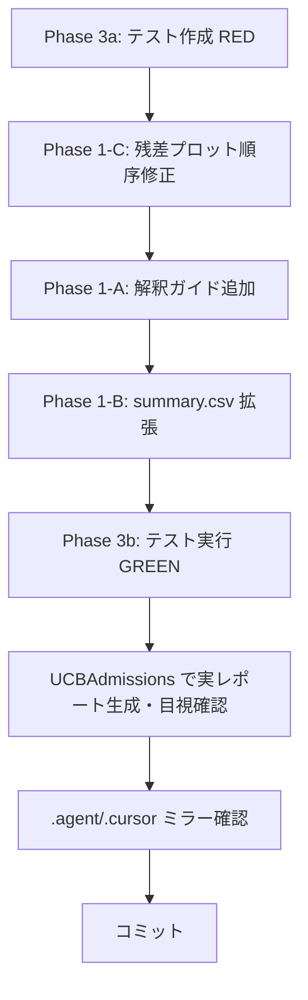

# 実装計画: vcd-categorical-analysis & security-vulnerability-check 改善

**日時**: 2026-03-31
**ブランチ**: `feature/vcd-security-skill-improve`
**ベースコミット**: `73457b6`

## 概要

Skill_impove.md に基づき、2 つのスキルを改善する。

## Phase 1: vcd-categorical-analysis 改善

### 1-A: report.html の内容改善

**対象ファイル**: `templates/report.Rmd` (.agent / .cursor 両方)

| # | 変更内容 | 理由 |
|---|---------|------|
| A1 | **残差解釈ガイド**セクションを追加 | Pearson 残差の意味、±1.96/±2.58 の閾値、正負の解釈を明記 |
| A2 | **分析サマリー**を拡充 | 有意セル数(|res|>1.96)、効果量の解釈基準、期待度数注意を追記 |
| A3 | **モデル比較解釈**を追加 | 3-way の場合のモデル間 ANOVA 結果の読み方ガイド |

### 1-B: summary.csv の項目追加

**対象ファイル**: `batch_runner.R`, `report.Rmd` (questionnaire-batch-analysis)

| 新規カラム | 説明 |
|-----------|------|
| `n_significant_cells` | \|Pearson残差\| > 1.96 のセル数 |
| `n_total_cells` | クロス表のセル総数 |
| `top3_residual_cells` | 絶対値上位3セルのラベル（パイプ区切り） |
| `interpretation_flag` | "strong_association" / "weak_association" / "no_association" |

### 1-C: 残差プロットの順序修正

**対象ファイル**: `templates/report.Rmd`, `questionnaire-batch-analysis/templates/report.Rmd`

**現状の問題**:
- 残差**表**: `abs_res` 降順ソート → 正しい（乖離が大きいセルを上位に表示）
- ggplot2 **図**: 同じく `abs_res` 降順ソートを使用 → **修正が必要**

**修正方針**:
- ggplot2 図は**元データのカテゴリ順**を保持する（factor level 順）
- 表は従来通り `abs_res` 降順ソートを維持
- 両者を比較しやすくする

## Phase 2: security-vulnerability-check 改善

Skill_impove.md のメイン指示は vcd に集中しているため、security スキルは Phase 1 完了後に着手範囲を確認する。

## Phase 3: テスト（TDD: テスト先行）

### テストファイル

| テスト | 検証内容 |
|--------|---------|
| `tests/test_vcd_interpretation_guide.R` | report.Rmd に解釈ガイドチャンクが存在すること |
| `tests/test_vcd_residual_plot_order.R` | ggplot2 図が factor level 順（ソートなし）であること確認 |
| `tests/test_summary_csv_new_columns.R` | summary.csv に新規カラムが存在し、値が妥当であること |
| 既存テスト再実行 | 全テスト回帰なし確認 |

### テストデータ

UCBAdmissions データセットを使用。3-way (Admit × Gender × Dept) で残差が明確に出る。

## 実行順序

## 制約

- `.agent/` と `.cursor/` に**同一内容**を配置
- 既存テスト（smoke, assoc_shade, residual_layout）を壊さない
