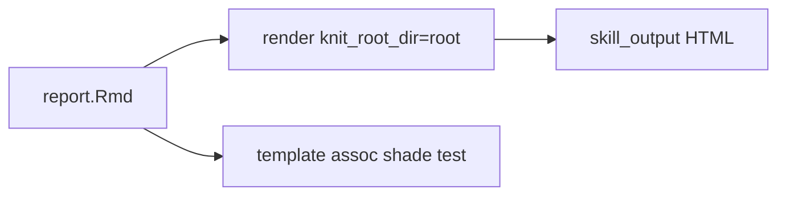

# VCD Association Plot 着色と成果物検証

作成: 2026-03-21 / Cursor Agent

## 原因（証拠）

- 成果物 `skill_output/vcd_categorical/vcd_cat_smoke.html` のエコーに、`assoc` 呼び出しに `shade` が無い旧版が残っていた。
- 同一 HTML 内の `mosaic` には `shade = TRUE` があり、assoc チャンクだけ古い Rmd からのレンダーと判断できる。
- 現行テンプレート（`.cursor` / `.agent` の `templates/report.Rmd`）は `assoc(..., shade = TRUE, ...)` を指定済み。

## 実施内容

1. `rmarkdown::render` で `knit_root_dir` をリポジトリルートに固定し、`vcd_cat_smoke.html` を再生成する。
2. 生成 HTML に `shade = TRUE` が含まれることを確認する。
3. `tests/test_vcd_categorical_template_assoc_shade.R` で両スキルパスの `report.Rmd` に `assoc` の `shade = TRUE` が残ることを検証する。

## 実施結果（2026-03-21）

- `vcd_cat_smoke.html` を再レンダー済み。エコーに `assoc(..., shade = TRUE, main = \"Association plot (Pearson, shaded)\")` を確認。
- `Rscript tests/test_vcd_categorical_template_assoc_shade.R` と `test_vcd_categorical_smoke.R` は成功。

再レンダー例（リポジトリルート）:

```r
repo <- normalizePath(getwd())
rmarkdown::render(
  file.path(repo, ".cursor/skills/vcd-categorical-analysis/templates/report.Rmd"),
  output_file = "vcd_cat_smoke.html",
  output_dir = file.path(repo, "skill_output/vcd_categorical"),
  knit_root_dir = repo,
  params = list(
    data_path = "",
    builtin_dataset = "Titanic",
    vars = c("Class", "Survived"),
    output_dir = "./skill_output/vcd_categorical/",
    residual_table_pkg = "gt"
  )
)
```

## その他確認メモ

| 観点 | 内容 |
|------|------|
| テンプレ同期 | `.cursor` と `.agent` の `report.Rmd` を同一に保つ |
| 純 R | `templates/analysis.R` の `assoc` は既に `shade = TRUE` |
| スモーク | `tests/test_vcd_categorical_smoke.R` は vcd 非依存のまま |


