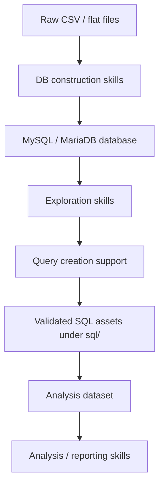

# Integrated DB Build And Analysis Skills Implementation Plan

> **For agentic workers:** REQUIRED SUB-SKILL: Use superpowers:subagent-driven-development (recommended) or superpowers:executing-plans to implement this plan task-by-task. Steps use checkbox (`- [ ]`) syntax for tracking.

**Goal:** Convert this repository into the parent skill repository for building an RDBMS from local CSV/data sources, exploring it with SQL, and handing validated datasets to analysis skills for junior engineers.

**Architecture:** Keep the current `.agent/skills` and `.cursor/skills` mirror model. Reorganize the skill roles into three workflow families: DB construction, DB exploration/query creation, and analysis/reporting. Add a new query-support skill that teaches users how to turn analysis intent into SQL, validation queries, and reusable SQL assets under a root-level `sql/` directory.

**Tech Stack:** Markdown skill specs, Python CLI helpers, R/R Markdown templates, MySQL/MariaDB CLI, repository-root `sql/` assets, lightweight Python/R smoke tests.

---

## Current Context And Decisions

This repository is the parent target:

- `/Users/myamaguchi/Programing/rwd-mysql-skill-toolkit`

The following directories are read-only references. Do not edit, format, move, delete, or sync files back into them:

- `/Users/myamaguchi/Programing/OSX_IDE_Skill_management_VSCODE/`
- `/Users/myamaguchi/Programing/OSX_IDE_Skill_management_RAW/`
- `/Users/myamaguchi/Programing/OSX_IDE_Skill_management_Gemini/`

The agreed direction is:

- Keep the existing three broad skill families instead of collapsing everything into one entrypoint.
- Make this repository the canonical body of work.
- Pull forward only reference-directory deltas that are ahead of this repository.
- Treat exploration broadly: schema inspection, table profiling, ID tracing, query design, validation queries, and analysis-dataset extraction.
- Add young-engineer support for query creation. The target user can ask in natural language, and the skill should produce a main SQL query, validation SQL, and a short reasoning note.
- Store reusable SQL assets at repository root under `sql/`, not inside a skill directory.

Current repository state observed before plan writing:

- Branch state: `main...origin/main [ahead 1, behind 1]`
- Existing skill mirrors: `.agent/skills` and `.cursor/skills`
- Existing skills: `flat-file-mysql-overview`, `flat-file-mysql-ddl-generation`, `flat-file-mysql-load-validation`, `mysql-er-diagram`, `mysql-table-cardinality`, `mysql-entity-matrix`, `questionnaire-batch-analysis`, `vcd-categorical-analysis`, `security-vulnerability-check`
- Reference ahead items in Gemini: `vcd-bayesian-evidence-analysis`, `vcd-categorical-reporting`, and stricter 3-Pass reporting workflow language

## Target Workflow



## Target Skill Families

| Family | Skills | Role |
|---|---|---|
| DB construction | `flat-file-mysql-overview`, `flat-file-mysql-ddl-generation`, `flat-file-mysql-load-validation` | Build a database from local files with sample DDL, completed load SQL, and count validation. |
| DB exploration and query creation | `mysql-er-diagram`, `mysql-table-cardinality`, `mysql-entity-matrix`, new `mysql-create-query-support` | Understand schema, profile tables, trace entities, and help a junior engineer create a desired query. |
| Analysis and reporting | `questionnaire-batch-analysis`, `vcd-categorical-analysis`, `vcd-categorical-reporting`, `vcd-bayesian-evidence-analysis` | Turn validated query outputs into statistical reports and AI-readable summaries. |
| Safety and maintenance | `security-vulnerability-check` | Keep generated scripts and SQL helpers safe from injection and path risks. |

## File Structure

Create:

- `.agent/skills/mysql-create-query-support/SKILL.md`
  Defines the natural-language-to-SQL workflow for Antigravity/Codex-style use.

- `.agent/skills/mysql-create-query-support/templates/query_note.md`
  Standard note format for intent, grain, joins, assumptions, and residual risk.

- `.agent/skills/mysql-create-query-support/templates/main_query.sql`
  Starter SQL template with comments showing how to structure cohort/event/exposure queries.

- `.agent/skills/mysql-create-query-support/templates/validation_query.sql`
  Starter validation SQL template for counts, nulls, duplicates, date ranges, and category checks.

- `.agent/skills/mysql-create-query-support/references/query_design_checklist.md`
  Best-practice checklist for junior engineers.

- Matching files under `.cursor/skills/mysql-create-query-support/`
  Must be content-identical unless a path difference is explicitly required.

- `sql/README.md`
  Repository-level rules for storing reusable SQL assets.

- `sql/drafts/.gitkeep`
  Keeps the draft SQL directory visible.

- `sql/validated/.gitkeep`
  Keeps the validated SQL directory visible.

- `sql/examples/.gitkeep`
  Keeps the teaching examples directory visible.

- `tests/test_mysql_create_query_support_assets.py`
  Lightweight test that checks required files exist and that the `.agent` / `.cursor` copies are aligned.

Modify:

- `README.md`
  Reframe this repository as an integrated DB build, exploration, and analysis skill toolkit.

- `AGENTS.md`
  Add explicit constraints for read-only reference directories, root-level SQL asset handling, and the new query-support workflow.

- `.agent/skills/flat-file-mysql-overview/SKILL.md`
- `.cursor/skills/flat-file-mysql-overview/SKILL.md`
  Add the downstream path from DB creation to exploration and query support.

- `.agent/skills/mysql-er-diagram/SKILL.md`
- `.cursor/skills/mysql-er-diagram/SKILL.md`
- `.agent/skills/mysql-table-cardinality/SKILL.md`
- `.cursor/skills/mysql-table-cardinality/SKILL.md`
- `.agent/skills/mysql-entity-matrix/SKILL.md`
- `.cursor/skills/mysql-entity-matrix/SKILL.md`
  Add short cross-links to `mysql-create-query-support` as the next step after mechanical exploration.

- `.agent/skills/questionnaire-batch-analysis/SKILL.md`
- `.cursor/skills/questionnaire-batch-analysis/SKILL.md`
- `.agent/skills/vcd-categorical-analysis/SKILL.md`
- `.cursor/skills/vcd-categorical-analysis/SKILL.md`
  Add the upstream contract that analysis should consume validated SQL outputs or clearly documented extracted datasets.

Bring forward from read-only references only into this repository:

- `vcd-categorical-reporting` from the reference directories if its interface can be made compatible with this repository's existing `vcd-categorical-analysis` outputs.
- `vcd-bayesian-evidence-analysis` from the Gemini reference if its templates and tests are present enough to run minimal smoke checks.
- 3-Pass thinking from Gemini as guidance, but do not blindly copy tool-specific instructions such as `run_shell_command` or `write_file` if they do not fit this environment.

## Task 1: Repository Sync And Worktree Safety

**Files:**
- Inspect only: `.git`, `README.md`, `AGENTS.md`
- No content files modified in this task.

- [ ] **Step 1: Check current branch divergence**

Run:

```bash
git status --short --branch
git remote -v
```

Expected:

```text
## main...origin/main [ahead 1, behind 1]
```

If the branch is still ahead and behind, do not pull or push automatically. Stop and choose a sync policy before implementation. The safest default is to create an implementation branch from the current local state and postpone remote reconciliation until after review.

- [ ] **Step 2: Confirm reference directories are read-only for this work**

Run:

```bash
find /Users/myamaguchi/Programing/OSX_IDE_Skill_management_VSCODE/.agent/skills -maxdepth 2 -name SKILL.md -print
find /Users/myamaguchi/Programing/OSX_IDE_Skill_management_RAW/.agent/skills -maxdepth 2 -name SKILL.md -print
find /Users/myamaguchi/Programing/OSX_IDE_Skill_management_Gemini/.agent/skills -maxdepth 2 -name SKILL.md -print
```

Expected: output lists reference `SKILL.md` files. No files are changed.

- [ ] **Step 3: Create an isolated implementation branch or worktree**

Preferred branch name:

```bash
git switch -c feature/integrated-db-analysis-skills-20260513
```

If a worktree is preferred at execution time, use a repository-local `.worktrees/` location only after checking whether `.worktrees/` is ignored.

- [ ] **Step 4: Commit boundary**

Do not commit here if the branch contains unrelated local work. If the tree is clean after branch creation, continue to Task 2.

## Task 2: Add Query Support Skill Assets With Minimal TDD

**Files:**
- Create: `.agent/skills/mysql-create-query-support/SKILL.md`
- Create: `.agent/skills/mysql-create-query-support/templates/query_note.md`
- Create: `.agent/skills/mysql-create-query-support/templates/main_query.sql`
- Create: `.agent/skills/mysql-create-query-support/templates/validation_query.sql`
- Create: `.agent/skills/mysql-create-query-support/references/query_design_checklist.md`
- Create matching files under `.cursor/skills/mysql-create-query-support/`
- Create: `tests/test_mysql_create_query_support_assets.py`

- [ ] **Step 1: Write the failing asset-alignment test**

Create `tests/test_mysql_create_query_support_assets.py`:

```python
from pathlib import Path


ROOT = Path(__file__).resolve().parents[1]
SKILL = "mysql-create-query-support"
REQUIRED_RELATIVE_FILES = [
    "SKILL.md",
    "templates/query_note.md",
    "templates/main_query.sql",
    "templates/validation_query.sql",
    "references/query_design_checklist.md",
]


def test_query_support_skill_exists_in_agent_and_cursor():
    for base in [".agent/skills", ".cursor/skills"]:
        for rel in REQUIRED_RELATIVE_FILES:
            path = ROOT / base / SKILL / rel
            assert path.exists(), f"missing {path}"


def test_agent_and_cursor_query_support_files_match():
    for rel in REQUIRED_RELATIVE_FILES:
        agent_file = ROOT / ".agent/skills" / SKILL / rel
        cursor_file = ROOT / ".cursor/skills" / SKILL / rel
        assert agent_file.read_text(encoding="utf-8") == cursor_file.read_text(encoding="utf-8")


def test_query_support_skill_requires_validation_sql_and_note():
    skill_md = (ROOT / ".agent/skills" / SKILL / "SKILL.md").read_text(encoding="utf-8")
    assert "main_query.sql" in skill_md
    assert "validation_query.sql" in skill_md
    assert "query_note.md" in skill_md
    assert "粒度" in skill_md
    assert "COUNT(DISTINCT" in skill_md
```

- [ ] **Step 2: Run test to verify it fails**

Run:

```bash
python3 -m pytest tests/test_mysql_create_query_support_assets.py -q
```

Expected: FAIL because the skill files do not exist yet.

- [ ] **Step 3: Create `.agent` skill files**

Create `.agent/skills/mysql-create-query-support/SKILL.md`:

```markdown
---
name: mysql-create-query-support
description: 若手エンジニアが自然文の分析目的から MySQL/MariaDB の探索 SQL、本 SQL、検証 SQL、分析用データセット抽出 SQL を作れるよう支援する。ER図、cardinality、entity matrix の結果を使い、粒度・JOIN・期間・NULL・重複・カテゴリ値を確認する。出力は repo root の sql/ 配下に保存する。
license: MIT
metadata:
  author: rwd-mysql-skill-toolkit
  version: "1.0"
---

# MySQL Create Query Support

自然文の分析目的を、実行可能で検証可能な SQL に分解するためのスキル。

## 目的

若手エンジニアが「望む Query」を作れるように、いきなり完成 SQL を出すのではなく、問いを分解し、探索 SQL、検証 SQL、本 SQL、分析用抽出 SQL の順に進める。

## 入力

- 分析目的または自然文の問い
- 対象 DB 名
- 主要 ID 列。既定は `PATIENTNO`
- 期間条件。未指定なら「期間未指定」と明記する
- アウトカム、曝露、イベント、属性、除外条件
- 既存成果物。利用できる場合は ER 図、dictionary CSV、cardinality 結果、entity matrix 結果

## スキーマ確認方針

- AI は SQL または利用可能な MCP で Table Schema を確認し、テーブル・カラム一覧を把握してから SQL を設計する。
- ER 図、dictionary CSV、cardinality 結果、entity matrix 結果がある場合は、それらを優先的に参照し、SQL に必要なテーブル・カラム・JOIN キー候補を特定する。
- 既存成果物がない場合は、`SHOW TABLES`、`DESCRIBE <table>`、または `INFORMATION_SCHEMA.COLUMNS` を使って、テーブルとカラムを確認する方法を提示する。
- テーブル数が多い、JOIN キーが不明、カテゴリ値や日付カラムが不明な場合は、先に `mysql-er-diagram`、`mysql-table-cardinality`、`mysql-entity-matrix` の利用を勧める。
- スキーマ確認なしに本 SQL を作らない。最初に探索 SQL と検証 SQL を作る。

## 出力

原則として repo root の `sql/` 配下に保存する。

| 出力 | 保存先 | 目的 |
|---|---|---|
| 本 SQL | `sql/drafts/<topic>/main_query.sql` | 目的に対する主クエリ |
| 検証 SQL | `sql/drafts/<topic>/validation_query.sql` | 件数、NULL、重複、期間、カテゴリ値を確認 |
| ノート | `sql/drafts/<topic>/query_note.md` | 目的、粒度、JOIN 根拠、未確認リスクを記録 |

検証済みになった SQL は、ユーザー確認後に `sql/validated/<topic>/` へ移す。

## 必須ワークフロー

1. 目的を分解する: 誰を、何を、いつからいつまで、何で判定するかを明文化する。
2. 粒度を決める: 患者単位、受診単位、処方単位、検査単位、イベント単位のどれかを明記する。
3. スキーマを確認する: 既存成果物、MCP、SQL の順に利用可能な情報を確認し、テーブル・カラム一覧を把握する。
4. 候補テーブルを挙げる: ER 図、dictionary、cardinality、entity matrix を参照する。
5. JOIN 方針を説明する: ID、日付、コード、施設、イベント番号など、結合根拠を明記する。
6. 探索 SQL を作る: テーブル件数、カラム値、日付範囲、コード値を確認する。
7. 本 SQL を作る: 抽出条件にはコメントを付ける。
8. 検証 SQL を作る: `COUNT(*)`、`COUNT(DISTINCT id)`、NULL、重複、期間範囲、カテゴリ値を確認する。
9. 分析系へ渡す: 出力データセットの単位と制約を `query_note.md` に残す。

## SQL 作成原則

- `SELECT *` は探索初期以外では使わない。
- JOIN 前後で `COUNT(*)` と `COUNT(DISTINCT PATIENTNO)` を比較する。
- WHERE 条件は意図が分かるコメントを付ける。
- 日付条件は閉区間・半開区間を明記する。
- コード値は直接固定せず、候補値確認 SQL を先に作る。
- 分析用データセットは一行の単位を先頭コメントに書く。

## テンプレート

- `templates/main_query.sql`
- `templates/validation_query.sql`
- `templates/query_note.md`
- `references/query_design_checklist.md`
```

Create `.agent/skills/mysql-create-query-support/templates/query_note.md`:

```markdown
# Query Note

## 分析目的

- 自然文の問い:
- 目的:
- 対象 DB:

## データセットの粒度

- 一行の単位:
- 主 ID:
- 期間:

## テーブル候補

| テーブル | 役割 | 採用理由 | 確認状況 |
|---|---|---|---|
|  |  |  |  |

## JOIN 方針

- 結合キー:
- 日付条件:
- コード条件:
- 粒度が増える箇所:

## 検証結果

| 観点 | SQL | 結果 | 判断 |
|---|---|---|---|
| 総件数 | validation_query.sql |  |  |
| ユニーク ID | validation_query.sql |  |  |
| NULL | validation_query.sql |  |  |
| 重複 | validation_query.sql |  |  |
| 期間 | validation_query.sql |  |  |
| カテゴリ値 | validation_query.sql |  |  |

## 未確認リスク

-

## 分析系への引き渡し

- 出力先:
- 推奨する次スキル:
- 注意点:
```

Create `.agent/skills/mysql-create-query-support/templates/main_query.sql`:

```sql
-- Purpose: replace with the natural-language analysis goal.
-- Grain: one row per patient/event/visit/prescription/lab result.
-- Main ID: PATIENTNO.
-- Date policy: state whether the range is inclusive or half-open.

WITH base_entity AS (
    SELECT DISTINCT
        PATIENTNO
    FROM target_table
    WHERE PATIENTNO IS NOT NULL
),
event_candidates AS (
    SELECT
        PATIENTNO,
        event_date,
        event_code
    FROM event_table
    WHERE event_date >= DATE('2020-01-01')
      AND event_date < DATE('2021-01-01')
)
SELECT
    b.PATIENTNO,
    e.event_date,
    e.event_code
FROM base_entity AS b
LEFT JOIN event_candidates AS e
    ON b.PATIENTNO = e.PATIENTNO;
```

Create `.agent/skills/mysql-create-query-support/templates/validation_query.sql`:

```sql
-- Validation SQL for main_query.sql.
-- Run these checks before moving SQL from sql/drafts/ to sql/validated/.

WITH result AS (
    SELECT *
    FROM analysis_dataset_view_or_subquery
)
SELECT
    COUNT(*) AS n_rows,
    COUNT(DISTINCT PATIENTNO) AS n_patients,
    SUM(CASE WHEN PATIENTNO IS NULL THEN 1 ELSE 0 END) AS n_missing_patient_id,
    MIN(event_date) AS min_event_date,
    MAX(event_date) AS max_event_date
FROM result;

-- Duplicate check. Adjust columns to match the intended grain.
WITH result AS (
    SELECT *
    FROM analysis_dataset_view_or_subquery
)
SELECT
    PATIENTNO,
    event_date,
    event_code,
    COUNT(*) AS n
FROM result
GROUP BY
    PATIENTNO,
    event_date,
    event_code
HAVING COUNT(*) > 1
ORDER BY n DESC
LIMIT 50;

-- Category value check. Replace event_code with the target categorical column.
WITH result AS (
    SELECT *
    FROM analysis_dataset_view_or_subquery
)
SELECT
    event_code,
    COUNT(*) AS n
FROM result
GROUP BY event_code
ORDER BY n DESC
LIMIT 100;
```

Create `.agent/skills/mysql-create-query-support/references/query_design_checklist.md`:

```markdown
# Query Design Checklist

## 問いの分解

- 誰を対象にするか
- 何をイベント、曝露、アウトカム、属性として扱うか
- いつからいつまでを見るか
- 何をもって該当と判定するか
- 除外条件は何か

## 粒度

- 患者単位
- 受診単位
- 処方単位
- 検査単位
- イベント単位

粒度が異なるテーブルを JOIN すると行数が増える。JOIN 前後で `COUNT(*)` と `COUNT(DISTINCT PATIENTNO)` を確認する。

## 検証

- 総行数
- ユニーク ID 数
- NULL
- 重複
- 日付範囲
- カテゴリ値
- JOIN 前後の増減
- 解析対象外コードの混入

## 分析への引き渡し

- 一行の単位を書く
- 抽出条件を書く
- 未確認リスクを書く
- 推奨する次スキルを書く
```

- [ ] **Step 4: Mirror `.agent` files into `.cursor`**

Run:

```bash
mkdir -p .cursor/skills/mysql-create-query-support/templates
mkdir -p .cursor/skills/mysql-create-query-support/references
cp .agent/skills/mysql-create-query-support/SKILL.md .cursor/skills/mysql-create-query-support/SKILL.md
cp .agent/skills/mysql-create-query-support/templates/query_note.md .cursor/skills/mysql-create-query-support/templates/query_note.md
cp .agent/skills/mysql-create-query-support/templates/main_query.sql .cursor/skills/mysql-create-query-support/templates/main_query.sql
cp .agent/skills/mysql-create-query-support/templates/validation_query.sql .cursor/skills/mysql-create-query-support/templates/validation_query.sql
cp .agent/skills/mysql-create-query-support/references/query_design_checklist.md .cursor/skills/mysql-create-query-support/references/query_design_checklist.md
```

- [ ] **Step 5: Run test to verify it passes**

Run:

```bash
python3 -m pytest tests/test_mysql_create_query_support_assets.py -q
```

Expected:

```text
3 passed
```

- [ ] **Step 6: Commit**

Run:

```bash
git add .agent/skills/mysql-create-query-support .cursor/skills/mysql-create-query-support tests/test_mysql_create_query_support_assets.py
git commit -m "feat: add mysql query support skill"
```

## Task 3: Add Root SQL Asset Structure

**Files:**
- Create: `sql/README.md`
- Create: `sql/drafts/.gitkeep`
- Create: `sql/validated/.gitkeep`
- Create: `sql/examples/.gitkeep`
- Modify: `tests/test_mysql_create_query_support_assets.py`

- [ ] **Step 1: Extend the test for SQL directories**

Append this test to `tests/test_mysql_create_query_support_assets.py`:

```python
def test_root_sql_asset_directories_exist():
    for rel in ["sql/README.md", "sql/drafts/.gitkeep", "sql/validated/.gitkeep", "sql/examples/.gitkeep"]:
        path = ROOT / rel
        assert path.exists(), f"missing {path}"


def test_sql_readme_defines_drafts_and_validated_policy():
    readme = (ROOT / "sql" / "README.md").read_text(encoding="utf-8")
    assert "drafts" in readme
    assert "validated" in readme
    assert "examples" in readme
    assert "main_query.sql" in readme
    assert "validation_query.sql" in readme
    assert "query_note.md" in readme
```

- [ ] **Step 2: Run test to verify it fails**

Run:

```bash
python3 -m pytest tests/test_mysql_create_query_support_assets.py -q
```

Expected: FAIL because `sql/README.md` and `.gitkeep` files do not exist yet.

- [ ] **Step 3: Create SQL asset directories and README**

Create `sql/README.md`:

````markdown
# SQL Assets

This directory stores reusable SQL created while using the DB exploration and query-support skills.

## Directory Policy

| Directory | Use |
|---|---|
| `drafts/` | Work-in-progress SQL. Queries here may be incomplete or unvalidated. |
| `validated/` | SQL that has passed count, NULL, duplicate, date-range, and category checks. |
| `examples/` | Teaching examples and reusable patterns for junior engineers. |

## Standard Files Per Topic

Each topic should use this structure:

```text
sql/drafts/<topic>/
  main_query.sql
  validation_query.sql
  query_note.md
````

Move a topic from `drafts/` to `validated/` only after the user confirms that the validation results match the intended grain and analysis purpose.

## Required Notes

`query_note.md` records:

- Natural-language goal
- Dataset grain
- Main ID
- Date policy
- JOIN rationale
- Validation results
- Remaining risks
- Recommended next analysis skill
```

Create empty files:

```bash
mkdir -p sql/drafts sql/validated sql/examples
touch sql/drafts/.gitkeep sql/validated/.gitkeep sql/examples/.gitkeep
```

- [ ] **Step 4: Run test to verify it passes**

Run:

```bash
python3 -m pytest tests/test_mysql_create_query_support_assets.py -q
```

Expected:

```text
5 passed
```

- [ ] **Step 5: Commit**

Run:

```bash
git add sql tests/test_mysql_create_query_support_assets.py
git commit -m "docs: add root sql asset policy"
```

## Task 4: Reframe Repository Documentation Around The Three Families

**Files:**
- Modify: `README.md`
- Modify: `AGENTS.md`
- Test: `tests/test_mysql_create_query_support_assets.py`

- [ ] **Step 1: Add documentation assertions**

Append this test to `tests/test_mysql_create_query_support_assets.py`:

```python
def test_readme_describes_integrated_db_analysis_goal():
    readme = (ROOT / "README.md").read_text(encoding="utf-8")
    assert "統合DB構築・分析スキル" in readme
    assert "構築系" in readme
    assert "探索系" in readme
    assert "分析系" in readme
    assert "mysql-create-query-support" in readme


def test_agents_mentions_read_only_reference_dirs_and_sql_policy():
    agents = (ROOT / "AGENTS.md").read_text(encoding="utf-8")
    assert "参照専用" in agents
    assert "OSX_IDE_Skill_management_Gemini" in agents
    assert "sql/" in agents
    assert "mysql-create-query-support" in agents
```

- [ ] **Step 2: Run test to verify it fails**

Run:

```bash
python3 -m pytest tests/test_mysql_create_query_support_assets.py -q
```

Expected: FAIL because README and AGENTS do not yet contain the new goal and policy.

- [ ] **Step 3: Update `README.md`**

Modify the opening section to state:

```markdown
# 統合DB構築・分析スキル管理リポジトリ

このリポジトリは、ローカル CSV やフラットファイルから RDBMS を構築し、MySQL/MariaDB 上で探索・Query作成・分析用データセット抽出を行い、R/R Markdown による分析へつなぐための **統合DB構築・分析スキル** を管理します。
```

Add a workflow section:

````markdown
## ワークフロー

```mermaid
flowchart LR
  A[CSV / flat files] --> B[構築系]
  B --> C[MySQL / MariaDB]
  C --> D[探索系]
  D --> E[Query作成支援]
  E --> F[sql/]
  F --> G[分析系]
````

| 系統 | スキル | 役割 |
|---|---|---|
| 構築系 | `flat-file-mysql-overview`, `flat-file-mysql-ddl-generation`, `flat-file-mysql-load-validation` | DBを作る |
| 探索系 | `mysql-er-diagram`, `mysql-table-cardinality`, `mysql-entity-matrix`, `mysql-create-query-support` | 構造・分布・ID所在を確認し、望むQueryを作る |
| 分析系 | `questionnaire-batch-analysis`, `vcd-categorical-analysis` | 抽出結果を分析・レポート化する |
| 保守系 | `security-vulnerability-check` | スクリプトとSQL支援の安全性を確認する |
```

Add `mysql-create-query-support` to the managed skill table.

- [ ] **Step 4: Update `AGENTS.md`**

Add this section:

```markdown
## 統合方針

- このリポジトリを、統合DB構築・分析スキルの本体として扱う。
- 以下のディレクトリは参照専用。読み取りは可、変更は禁止。
  - `/Users/myamaguchi/Programing/OSX_IDE_Skill_management_VSCODE/`
  - `/Users/myamaguchi/Programing/OSX_IDE_Skill_management_RAW/`
  - `/Users/myamaguchi/Programing/OSX_IDE_Skill_management_Gemini/`
- 参照ディレクトリが進んでいる場合のみ、このリポジトリへ差分を取り込む。

## Query 作成支援

- 若手向けに、自然文の分析目的から SQL を作る `mysql-create-query-support` を探索系に置く。
- SQL成果物は Skill 配下ではなく repo root の `sql/` に保存する。
- 標準成果物は `main_query.sql`, `validation_query.sql`, `query_note.md` とする。
- 検証前は `sql/drafts/`、検証後は `sql/validated/` に置く。
```

- [ ] **Step 5: Run test to verify it passes**

Run:

```bash
python3 -m pytest tests/test_mysql_create_query_support_assets.py -q
```

Expected:

```text
7 passed
```

- [ ] **Step 6: Commit**

Run:

```bash
git add README.md AGENTS.md tests/test_mysql_create_query_support_assets.py
git commit -m "docs: define integrated db analysis workflow"
```

## Task 5: Cross-Link Existing Construction And Exploration Skills

**Files:**
- Modify: `.agent/skills/flat-file-mysql-overview/SKILL.md`
- Modify: `.cursor/skills/flat-file-mysql-overview/SKILL.md`
- Modify: `.agent/skills/mysql-er-diagram/SKILL.md`
- Modify: `.cursor/skills/mysql-er-diagram/SKILL.md`
- Modify: `.agent/skills/mysql-table-cardinality/SKILL.md`
- Modify: `.cursor/skills/mysql-table-cardinality/SKILL.md`
- Modify: `.agent/skills/mysql-entity-matrix/SKILL.md`
- Modify: `.cursor/skills/mysql-entity-matrix/SKILL.md`
- Modify: `tests/test_mysql_create_query_support_assets.py`

- [ ] **Step 1: Add cross-link test**

Append this test:

```python
def test_existing_db_skills_link_to_query_support():
    skill_paths = [
        ".agent/skills/flat-file-mysql-overview/SKILL.md",
        ".agent/skills/mysql-er-diagram/SKILL.md",
        ".agent/skills/mysql-table-cardinality/SKILL.md",
        ".agent/skills/mysql-entity-matrix/SKILL.md",
        ".cursor/skills/flat-file-mysql-overview/SKILL.md",
        ".cursor/skills/mysql-er-diagram/SKILL.md",
        ".cursor/skills/mysql-table-cardinality/SKILL.md",
        ".cursor/skills/mysql-entity-matrix/SKILL.md",
    ]
    for rel in skill_paths:
        content = (ROOT / rel).read_text(encoding="utf-8")
        assert "mysql-create-query-support" in content, rel
```

- [ ] **Step 2: Run test to verify it fails**

Run:

```bash
python3 -m pytest tests/test_mysql_create_query_support_assets.py -q
```

Expected: FAIL because existing skills do not yet mention `mysql-create-query-support`.

- [ ] **Step 3: Add a downstream section to each listed skill**

Add this section to each listed `SKILL.md`, with wording adjusted only where necessary:

```markdown
## 次のステップ: Query 作成支援

DB構造、テーブル分布、ID所在を確認した後、分析目的に応じた SQL を作る場合は `mysql-create-query-support` を使う。
この支援では、自然文の問いを粒度・JOIN・期間・検証観点に分解し、`sql/drafts/<topic>/main_query.sql`、`validation_query.sql`、`query_note.md` を作成する。
```

- [ ] **Step 4: Run test to verify it passes**

Run:

```bash
python3 -m pytest tests/test_mysql_create_query_support_assets.py -q
```

Expected:

```text
8 passed
```

- [ ] **Step 5: Commit**

Run:

```bash
git add .agent/skills .cursor/skills tests/test_mysql_create_query_support_assets.py
git commit -m "docs: link db exploration skills to query support"
```

## Task 6: Bring Forward Compatible Analysis Reference Deltas

**Files:**
- Create if compatible: `.agent/skills/vcd-categorical-reporting/`
- Create if compatible: `.cursor/skills/vcd-categorical-reporting/`
- Create if compatible: `.agent/skills/vcd-bayesian-evidence-analysis/`
- Create if compatible: `.cursor/skills/vcd-bayesian-evidence-analysis/`
- Modify: `README.md`
- Modify: `tests/test_mysql_create_query_support_assets.py`

- [ ] **Step 1: Inspect reference skill assets without modifying references**

Run:

```bash
rg --files /Users/myamaguchi/Programing/OSX_IDE_Skill_management_Gemini/.agent/skills/vcd-categorical-reporting
rg --files /Users/myamaguchi/Programing/OSX_IDE_Skill_management_Gemini/.agent/skills/vcd-bayesian-evidence-analysis
```

Expected: list all files that would need to be copied into this repository.

- [ ] **Step 2: Decide compatibility**

Compatibility rules:

- Bring `vcd-categorical-reporting` forward if its required input files are produced by this repository's `vcd-categorical-analysis`, or if the missing interface can be documented without changing analysis behavior.
- Bring `vcd-bayesian-evidence-analysis` forward if it includes enough templates and scripts to run a minimal file-presence test and a basic R parse check.
- Do not copy environment-specific tool wording such as `run_shell_command` or `write_file` into this repository unchanged. Convert it to neutral agent wording.

- [ ] **Step 3: Add file-presence tests for any brought-forward analysis skills**

If both analysis skills are copied, append:

```python
def test_reference_analysis_skills_are_mirrored_when_present():
    optional_skills = [
        "vcd-categorical-reporting",
        "vcd-bayesian-evidence-analysis",
    ]
    for skill in optional_skills:
        agent_dir = ROOT / ".agent/skills" / skill
        cursor_dir = ROOT / ".cursor/skills" / skill
        assert agent_dir.exists(), f"missing {agent_dir}"
        assert cursor_dir.exists(), f"missing {cursor_dir}"
        assert (agent_dir / "SKILL.md").exists(), f"missing {agent_dir / 'SKILL.md'}"
        assert (cursor_dir / "SKILL.md").exists(), f"missing {cursor_dir / 'SKILL.md'}"
```

- [ ] **Step 4: Copy compatible reference assets into this repository only**

Run copy commands only from the Gemini reference into this repository. Example for `vcd-categorical-reporting`:

```bash
mkdir -p .agent/skills/vcd-categorical-reporting
cp -R /Users/myamaguchi/Programing/OSX_IDE_Skill_management_Gemini/.agent/skills/vcd-categorical-reporting/. .agent/skills/vcd-categorical-reporting/
mkdir -p .cursor/skills/vcd-categorical-reporting
cp -R .agent/skills/vcd-categorical-reporting/. .cursor/skills/vcd-categorical-reporting/
```

Example for `vcd-bayesian-evidence-analysis`:

```bash
mkdir -p .agent/skills/vcd-bayesian-evidence-analysis
cp -R /Users/myamaguchi/Programing/OSX_IDE_Skill_management_Gemini/.agent/skills/vcd-bayesian-evidence-analysis/. .agent/skills/vcd-bayesian-evidence-analysis/
mkdir -p .cursor/skills/vcd-bayesian-evidence-analysis
cp -R .agent/skills/vcd-bayesian-evidence-analysis/. .cursor/skills/vcd-bayesian-evidence-analysis/
```

- [ ] **Step 5: Normalize copied `SKILL.md` wording**

Edit copied `SKILL.md` files to:

- Remove environment-specific tool names that are not available in this repository.
- Keep the 3-Pass concept as workflow guidance.
- Add upstream note: SQL-derived datasets should come from `sql/validated/` when possible.
- Add output note: analysis outputs remain under `skill_out/`.

- [ ] **Step 6: Update README skill table**

Add rows for brought-forward skills:

```markdown
| `vcd-categorical-reporting` | `vcd-categorical-analysis` の出力を読み、判断ファーストのAI評価レポートを作成 |
| `vcd-bayesian-evidence-analysis` | 大標本で P値と実質的意義が乖離する場合に、効果量・BIC近似・BF視点で評価 |
```

- [ ] **Step 7: Run tests**

Run:

```bash
python3 -m pytest tests/test_mysql_create_query_support_assets.py -q
```

Expected: all tests pass.

- [ ] **Step 8: Commit**

Run:

```bash
git add .agent/skills .cursor/skills README.md tests/test_mysql_create_query_support_assets.py
git commit -m "feat: add analysis reporting reference skills"
```

## Task 7: Verification

**Files:**
- Inspect: all modified files
- No planned file changes unless verification finds a specific issue.

- [ ] **Step 1: Check working tree**

Run:

```bash
git status --short
```

Expected: only intentional files are modified before final commit, or clean after commits.

- [ ] **Step 2: Check Markdown formatting for obvious breakage**

Run:

```bash
git diff --check
```

Expected:

```text
```

No trailing whitespace or conflict markers.

- [ ] **Step 3: Run focused Python tests**

Run:

```bash
python3 -m pytest tests/test_mysql_create_query_support_assets.py -q
```

Expected: all tests pass.

- [ ] **Step 4: Run existing smoke tests that do not require live DB access**

Run these when local R packages are available:

```bash
Rscript tests/test_vcd_categorical_smoke.R
Rscript tests/test_questionnaire_batch_smoke.R
```

Expected: both complete successfully. If packages are missing, record the exact missing package and do not claim R smoke tests passed.

- [ ] **Step 5: Confirm reference directories remain untouched**

Run:

```bash
git -C /Users/myamaguchi/Programing/OSX_IDE_Skill_management_VSCODE status --short
git -C /Users/myamaguchi/Programing/OSX_IDE_Skill_management_RAW status --short
git -C /Users/myamaguchi/Programing/OSX_IDE_Skill_management_Gemini status --short
```

Expected: no new changes caused by this implementation. Existing pre-existing dirt may remain, but no files in those repositories should have been modified by this work.

## Self-Review

- Spec coverage: The plan covers the parent repository goal, read-only reference rule, three-family structure, query creation support, root `sql/` storage, Gemini analysis deltas, documentation updates, mirror placement, and verification.
- Placeholder scan: No open implementation placeholders are intentionally left. Compatibility checks in Task 6 are explicit gates because copying incompatible analysis skills would be unsafe.
- Type and path consistency: The new skill name is consistently `mysql-create-query-support`. The standard SQL asset names are consistently `main_query.sql`, `validation_query.sql`, and `query_note.md`.
- Scope check: This plan is intentionally limited to skill integration and documentation. It does not implement a SQL parser, live DB execution wrapper, or new statistical method beyond copying compatible existing reference skills.

## Execution Options

Plan complete and saved to `docs/superpowers/plans/2026-05-13-integrated-db-analysis-skills.md`.

1. **Subagent-Driven**: dispatch a fresh subagent per task, review between tasks, faster for independent file groups.
2. **Inline Execution**: execute tasks in this session using checkpoints, simpler because the repo has mirror-placement rules and strict read-only references.

Recommended for this repository: **Inline Execution**, because preserving `.agent` / `.cursor` mirroring and reference-directory boundaries is more important than parallel speed.
