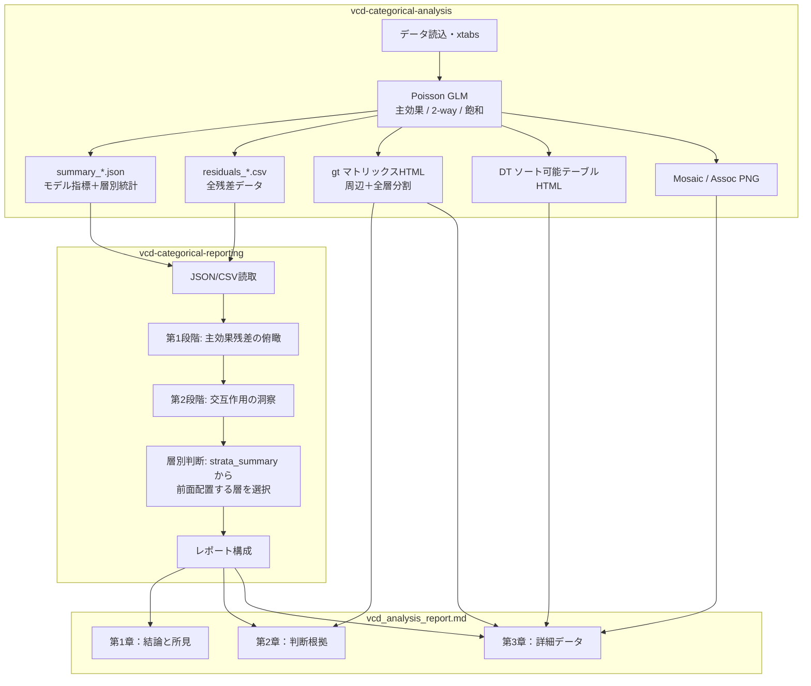

# VCD カテゴリカル分析スキル改善設計書

- **日付**: 2026-04-04
- **ステータス**: レビュー中
- **対象スキル**: `.agent/skills/vcd-categorical-analysis/`

## 背景

現行の `vcd-categorical-analysis` スキルは、R による統計分析（2段階ポアソンモデル）と AI によるレポート解釈を一つのスキルに同梱している。以下の課題がある：

1. **レポート構成**: 「データ → 出力 → 判断」の順序は読み手に負荷が高い
2. **残差の可視化**: ggplot2 ヒートマップは水準が多いと判読困難
3. **インタラクティブ性**: 残差テーブルのソートやフィルタが不可能
4. **スキルの凝集度**: 分析とレポーティングが密結合で、独立した改善が困難

## 設計方針

### 2分割アーキテクチャ

スキルを2つに分割し、ファイル出力をインターフェースとして協調させる。

```
.agent/skills/
├── vcd-categorical-analysis/     ← R側（データ・図表生成）
│   ├── SKILL.md
│   ├── templates/
│   │   └── analysis.R            ← 4関数構成
│   └── references/
│       ├── interface.md          ← 共有契約
│       ├── dependencies.md
│       ├── glm-gnm-goodness.md
│       └── ordinal-likert-advanced.md
│
└── vcd-categorical-reporting/    ← AI側（解釈・レポート構成）
    ├── SKILL.md
    └── references/
        ├── interface.md          ← 共有契約（同一内容）
        ├── workflow.md
        ├── report-template.md
        └── evaluation-criteria.md
```

### データフロー



## 詳細設計

### 1. analysis.R の関数構成

```r
generate_data(df, vars, output_dir)
generate_gt_matrix(tab, vars, output_dir)
generate_dt_table(res_df, output_dir)
generate_plots(tab, vars, output_dir)
```

- `generate_data`: Poisson GLM フィッティング、残差計算、JSON/CSV 出力
- `generate_gt_matrix`: ピボット形式の残差マトリックスを `gt` で生成（周辺表＋全層分割表）
- `generate_dt_table`: `DT::datatable` によるソート可能テーブルを self-contained HTML で生成
- `generate_plots`: Mosaic / Association プロットを PNG で生成

### 2. gt 残差マトリックス仕様

| 項目 | 仕様 |
| :--- | :--- |
| 形式 | ピボット表（行=変数A, 列=変数B, セル=Pearson残差値） |
| 配色 | ＋側=青グラデーション、−側=赤グラデーション（中央=白） |
| 数値表示 | セル内に残差値を小数3桁で表示 |
| 有意セル強調 | \|res\| ≥ 1.96 のセルに太枠 or ★マーク |
| 3-way対応 | 周辺表（1枚）＋ 第3変数の各水準ごとの分割表（N枚） |
| 出力ファイル | `matrix_marginal_{data}.html`, `matrix_{data}_{layer_value}.html` |

### 3. DT ソート可能テーブル仕様

| 項目 | 仕様 |
| :--- | :--- |
| 列構成 | 変数A, 変数B, [変数C], Freq, pearson_res, abs_res, model_type |
| 配色 | `pearson_res` 列：＋は青背景、−は赤背景（グラデーション） |
| 既定ソート | `abs_res` 降順 |
| フィルタ | model_type（Main / 2-Way）で絞り込み可能 |
| 出力形式 | self-contained HTML（`htmlwidgets::saveWidget`） |
| 出力ファイル | `dt_residuals_{data}.html` |

### 4. JSON スキーマ（summary_*.json）

```json
{
  "interface_version": "2.0",
  "test_used": "stats::anova (Poisson GLM)",
  "models_tested": ["Main Effects (A+B+C)", "2-way ((A+B+C)^2)"],
  "deviance_main": 786.41,
  "df_main": 576,
  "deviance_2way": 299.63,
  "df_2way": 405,
  "p_value_main_vs_2way": 4.34e-32,
  "cramers_v_marginal": 0.182,
  "top_residuals_main": [
    {"cell": "上記以外の痛み:リングルアイビー:その他", "res": 5.47}
  ],
  "top_residuals_2way": [
    {"cell": "...", "res": 4.88}
  ],
  "strata_summary": {
    "strata_var": "timing",
    "n_strata": 7,
    "max_abs_res_per_stratum": {
      "その他": 5.47,
      "痛くなりそうなとき": 4.77
    },
    "cramers_v_per_stratum": {
      "その他": 0.28,
      "痛くなりそうなとき": 0.31
    },
    "n_significant_cells_5pct": 12,
    "n_significant_cells_1pct": 5,
    "total_cells": 80
  }
}
```

R側は `recommended_focus_stratum` を出力しない（判断はAIに委ねる）。

### 5. レポート構成（判断ファースト）

```
第1章：結論と所見
  ├── サマリー文（1-2文）
  ├── 箇条書き所見（主要な発見）
  └── 推奨アクション（1-2文）

第2章：判断根拠
  ├── モデル比較表（Deviance, df, p値）
  ├── AIが選択した gt 残差マトリックス
  ├── 有意セル数（5%水準 / 1%水準）
  └── 層別選択の理由

第3章：詳細データ
  ├── DT ソート可能テーブル（HTMLリンク）
  ├── 全層別 gt マトリックス
  └── Mosaic / Association プロット
```

記述スタイル：ハイブリッド（サマリー文 → 箇条書き → アクション提案）。

### 6. インターフェース契約（interface.md）

両スキルの `references/` に同一内容の `interface.md` を配置する。

内容：
- `interface_version`（セマンティックバージョニング）
- 出力ファイル規約（命名・形式・生成元・消費先）
- JSON スキーマ定義
- CSV カラム定義
- 変更ルール（バージョンインクリメント義務）

### 7. 依存パッケージ追加

| パッケージ | 用途 | 状態 |
| :--- | :--- | :--- |
| `DT` | ソート可能インタラクティブテーブル | 新規追加 |
| `htmlwidgets` | DT の self-contained 出力 | 新規追加 |
| `gt` | 残差マトリックス | 既存 |
| `jsonlite` | JSON 出力 | 既存 |
| `vcd` | Mosaic / Association プロット | 既存 |
| `ggplot2` | 補助的プロット | 既存 |

### 8. SKILL.md 相互参照

`vcd-categorical-analysis/SKILL.md`:
```markdown
## 連携スキル
- 後続: `vcd-categorical-reporting` が本スキルの出力を読み取り、
  AI判断レポートを生成する。
- 契約: `references/interface.md` を参照。
```

`vcd-categorical-reporting/SKILL.md`:
```markdown
## 前提スキル
- 先行: `vcd-categorical-analysis` を先に実行し、
  `./skill_out/vcd_categorical/` に成果物が存在すること。
- 契約: `references/interface.md` を参照。
```

## 設計判断の記録

| 判断項目 | 選択 | 理由 |
| :--- | :--- | :--- |
| 残差マトリックス実装 | `gt` | 印刷/PDF互換性が高く、1枚目のスクリーンショットに最も近い |
| ソート可能テーブル | `DT::datatable` | ソート・検索・フィルタが標準装備、セル着色も容易 |
| レポート構成 | 判断ファースト（結論→根拠→詳細） | CSR形式。読者がまず結論を把握し、必要に応じて詳細に潜れる |
| 記述スタイル | ハイブリッド | サマリー＋箇条書き＋アクション。簡潔かつ網羅的 |
| 3-way マトリックス | 全層生成＋AI選択 | R は判断せず素材を網羅生成。AIが統計指標に基づき前面配置を決定 |
| 注釈閾値 | 固定値ではなく5%/1%の件数表示 | AIが文脈に応じて判断する方が合理的 |
| `recommended_focus_stratum` | 削除 | 「Rは判断しない」原則との一貫性 |
| スキル分割 | 2分割（analysis + reporting） | 独立進化可能。3分割はオーバーヘッド過多 |
| DT HTML サイズ | self-contained 維持 | 可搬性を優先。PC性能上問題なし |
| 協調メカニズム | interface.md（共有契約） | バージョニングで互換性を管理 |

## スコープ外

- 4-way 以上のクロス表対応（従来通り対象外）
- 序数リッカートの高度な分析（`ordinal-likert-advanced.md` に誘導）
- `report.Rmd` の大規模改修（一気通貫は非推奨方向）
