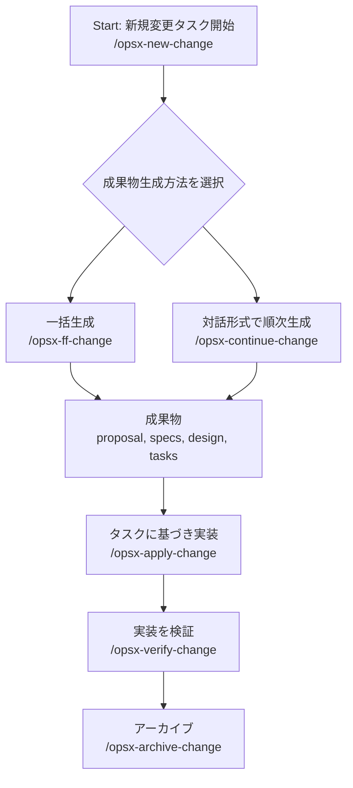

# IDE用スキル管理リポジトリ

このリポジトリは、各種IDE（Cursor, Antigravity）で使用するスキルを管理します。

## 管理スキル一覧

### データ連携・操作スキル

- **フラットファイルMySQL DDL生成 (`flat-file-mysql-ddl-generation`)**: フラットファイルからMySQLのDDLを生成します。
- **フラットファイルMySQLロード検証 (`flat-file-mysql-load-validation`)**: MySQLへのデータロード結果を検証します。
- **フラットファイルMySQL概要 (`flat-file-mysql-overview`)**: MySQLにロードされたフラットファイルの概要を把握します。
- **MySQL ER図生成 (`mysql-er-diagram`)**: 指定されたデータベースのテーブル（BASE TABLE のみ）から辞書CSVをフル再生成し、Draw.io XML と PlantUML の両方のER図を生成します。
- **MySQLテーブルカーディナリティ分析 (`mysql-table-cardinality`)**: 指定されたテーブルのカラム一覧、総行数、カーディナリティを分析し、CSV/JSON形式で出力します。
- **MySQLエンティティマトリックス生成 (`mysql-entity-matrix`)**: 指定したデータベース内の全テーブルを横断検索し、特定のIDの存在フラグ(0, 1)マトリックスをCSV出力します。

### セキュリティ

- **セキュリティ脆弱性チェック (`security-vulnerability-check`)**: コードの脆弱性をチェックします。

## 同期ルール

スキル定義の正本は `.cursor/skills` ディレクトリに配置します。`.agent/skills`（Antigravity用）への同期ルールについては、[docs/Reference/Artifact_012_cursor_agent_skills_sync_rule_0301_1200.md](docs/Reference/Artifact_012_cursor_agent_skills_sync_rule_0301_1200.md) を参照してください。

`mysql-er-diagram` スキルは `.cursor/skills/mysql-er-diagram/` と `.agent/skills/mysql-er-diagram/` の両方に `scripts/generate_er.py` と `SKILL.md` を同一内容で配置している。改修時は両ディレクトリの `scripts/generate_er.py` を同内容に更新すること。

## OpenSpecによるSDD（Specification Driven Development）支援スキル

（注：これは一般的な概念としてのOpenSpecに関する説明であり、本リポジトリでは現在、関連するスキルは利用できません。）OpenSpecの詳細については、以下のリポジトリをご参照ください: https://github.com/Fission-AI/OpenSpec

OpenSpecは、仕様書に基づいた開発を支援する一連のスキル群です。

- **`openspec-onboard`**: プロジェクトの初期設定を行います。
- **`openspec-new-change`**: 新しい変更を開始します。
- **`openspec-ff-change`**: 設計書、提案書、タスクリストを一括で生成します。
- **`openspec-continue-change`**: 設計書、提案書、タスクリストを対話形式で順次作成します。
- **`openspec-apply-change`**: 生成されたタスクに基づき、AIがコードを実装します。
- **`openspec-verify-change`**: 実装された変更を検証します。
- **`openspec-sync-specs`**: 仕様書を同期します。
- **`openspec-explore`**: 仕様書を探索します。
- **`openspec-archive-change`**: 完了した仕様書やタスクをアーカイブします。
- **`openspec-bulk-archive-change`**: 複数の仕様書やタスクを一括でアーカイブします。

（例：OpenSpecの一般的なワークフロー）

