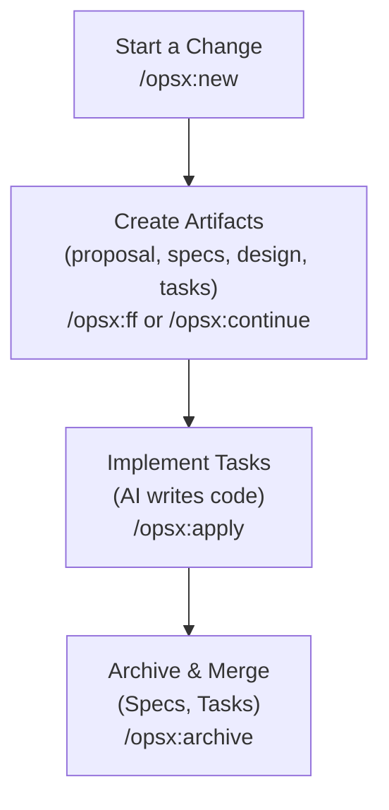

# スキルをIDE用に用意する

- MySQLデータインポートSkill
  - MySQLデータエンコーディング検証Skill
  - MySQLデータ重複除去Skill
  - MySQLデータバリデーションSkill
  - MySQLデータ件数比較Skill
- MySQL ER 図生成スキル（mysql-er-diagram: MCP MySQL で指定 DB のテーブル・カラムを取得し、PlantUML ER 図を出力）
- MySQL テーブル濃度数スキル（mysql-table-cardinality: 指定 DB・テーブルのカラム一覧・総行数・濃度数を CSV/JSON 出力。MCP または CLI）

スキル正本は `.cursor/skills`。`.agent/skills`（Antigravity 用）との同期ルールは [docs/Reference/Artifact_012_cursor_agent_skills_sync_rule_0301_1200.md](docs/Reference/Artifact_012_cursor_agent_skills_sync_rule_0301_1200.md) を参照。

## 参考にすべきコード

- AnotherPJ/sample-template/CH_t05_covid_vaccine.txtImport.sql
- AnotherPJ/sample-template/SQLDistinct.prompt.md
- AnotherPJ/sample-template/SQLInsert.prompt.md

## Openspec によるSDD開発手順について

### 最初の作業

`openspec init` でターミナルからProjectフォルダに初期設定を行う。IDEを複数えらべる。

## Project start workflow

1. /opsx-new
2. /opsx:ff（2.1）
3. /opsx:continue（2.2）

/opsx:new
/opsx:ff        design.md, proposal.md, task.mdを一括生成する
/opsx:continue  design.md, proposal.md, task.mdを順序立てて作成する

