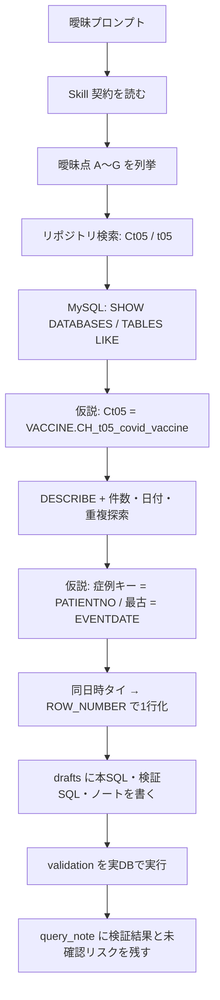

# Ambiguity Resolution Trace

> 本ファイルは、曖昧な自然文プロンプトから `query_note.md` / `main_query.sql` / `validation_query.sql` に到達するまでの**思考経過と自律的な曖昧性 FIX**を記録する。
> 目的: 「生成AI（答えを書く）」から「Agentic AI（調べて決め、検証し、成果物を残す）」への差を、同一タスクの実ログとして示す。

- 作成日: 2026-07-10（JST）
- 対象チャット成果物: 本ディレクトリ一式
- 到達物: [query_note.md](./query_note.md)

---

## 0. 入力プロンプト（原文に近い形）

```text
@.agent/skills/mysql-create-query-support のスキルをつかって、
Ct05のテーブルを利用し、各症例の一番古いレコードを抽出したい
```

一見すると短い依頼だが、実行可能な SQL にするには未指定が多い。

---

## 1. 曖昧さの棚卸し（プロンプト時点で未確定だったこと）

| # | 曖昧点 | なぜ問題か | 生成AIがやりがちな失敗 |
|---|---|---|---|
| A | `Ct05` の実体 | テーブル名が略称。実DBに同名が無い可能性 | 存在しない `Ct05` をそのまま FROM に書く |
| B | 対象 DB | ローカル MySQL / QNAP MariaDB / 複数スキーマ | 適当な DB 名を仮定して終わる |
| C | 「症例」のキー | `PATIENTNO` か別 ID か | 列名を推測で固定し検証しない |
| D | 「一番古い」の定義 | イベント日か更新日時か、同値時の扱い | `MIN(date)` だけ返し、同日時の複数行を残す |
| E | 期間・除外 | 全期間か、欠損除外か | WHERE を書かない／過剰に書く |
| F | 出力粒度 | 症例1行か、最古イベントの全列か | `SELECT *` のまま、ノート無し |
| G | 成果物の形 | 本SQLのみか、検証・ノートまでか | チャット内コードブロックで終わり、再現不能 |

**Agentic 側の方針**: スキル手順に従い、推測で完成 SQL を出さず、**スキーマ確認 → 探索 → 仮説固定 → 本SQL → 検証 → ノート**の順で曖昧さを潰す。

---

## 2. スキル契約の読み込み（手順の固定）

最初に `.agent/skills/mysql-create-query-support/SKILL.md` を読み、次を契約として固定した。

1. 目的を分解する（誰・何・いつ・何で判定）
2. 粒度を決める
3. **スキーマ確認なしに本 SQL を作らない**
4. 探索 SQL → 本 SQL → 検証 SQL
5. 成果物は `sql/drafts/<topic>/` に `main_query.sql` / `validation_query.sql` / `query_note.md`

この時点で「チャットで SQL を返す」ではなく「リポジトリに検証可能な成果物を残す」がゴールになった。

---

## 3. 思考ループ: 曖昧さ → 観測 → 仮説 → FIX



### Step 1 — リポジトリ内の手がかり（曖昧点 A）

- ファイル名・辞書に `Ct05` は無い。
- 既存成果物・プロンプト例に `CH_t05_covid_vaccine`（VACCINE DB）が繰り返し登場。
- サンプル import SQL のプレビュー列に `PATIENTNO`, `EVENTDATE`, `更新日時` がある。

**暫定仮説**: ユーザーの「Ct05」は命名略称で、実体は `CH_t05_covid_vaccine`。

### Step 2 — 実DBでの存在確認（曖昧点 A, B）

ローカル MySQL で確認:

- `TABLE_NAME LIKE '%t05%' / '%Ct05%' / '%ct05%'` → `VACCINE.CH_t05_covid_vaccine` と staging のみ。
- `COVID`, `RWD`, `DWH` 等に `Ct05` は無し。

**FIX A/B**: 対象を `VACCINE.CH_t05_covid_vaccine` に固定。  
**残リスクとしてノートに明記**: 別名・QNAP 側は未検証。

### Step 3 — スキーマと「症例」「古い」の候補（曖昧点 C, D）

`DESCRIBE` により:

- 症例キー候補: `PATIENTNO`（スキル既定 ID とも一致）
- 時刻候補: `EVENTDATE`（イベント発生）、`更新日時`（記録更新）

**FIX C**: 主 ID = `PATIENTNO`。  
**FIX D（第1案）**: 「一番古い」= 臨床イベントとしての `EVENTDATE` 最小。`更新日時` はタイブレーク用。

### Step 4 — 探索で粒度とリスクを数値化（曖昧点 D, E, F）

| 観測 | 値 | 解釈 |
|---|---|---|
| 総行数 | 26,492 | イベント粒度のテーブル |
| 症例数 | 18,154 | 1症例複数行あり |
| PATIENTNO NULL | 0 | 除外条件はほぼ不要 |
| EVENTDATE 範囲 | 2021-04-02 〜 2023-12-12 | 期間未指定でも実行可能 |
| 同一 PATIENTNO+EVENTDATE の重複 | 1 症例 | `MIN(EVENTDATE)` だけでは1行にならない |

**FIX D（第2案・確定）**: `ROW_NUMBER() OVER (PARTITION BY PATIENTNO ORDER BY EVENTDATE, 更新日時, DEPARTMENTCODE)` で `rn = 1`。  
**FIX E**: 期間条件なし（全期間）。`PATIENTNO IS NOT NULL` のみ。  
**FIX F**: 出力粒度 = 1 症例 1 行（全業務列を保持）。

### Step 5 — 成果物化と検証実行（曖昧点 G）

ディレクトリ `sql/drafts/ct05_oldest_per_case/` に:

| ファイル | 役割 |
|---|---|
| `main_query.sql` | 本抽出 |
| `validation_query.sql` | 件数・一意性・タイ確認 |
| `query_note.md` | 目的・粒度・仮説・検証・未確認リスク |

検証 SQL を実DBで実行し、本 SQL 結果が **18,154 行 = 症例数**、症例 ID 重複 0 を確認。ここまでで「動くはず」ではなく「動いた証拠」が揃った。

---

## 4. 曖昧さ FIX 一覧（最終状態）

| # | 曖昧点 | 最終決定 | 根拠 | 未確認として残したもの |
|---|---|---|---|---|
| A | Ct05 | `CH_t05_covid_vaccine` | information_schema + 既存成果物 | ユーザーが別テーブルを指す可能性 |
| B | DB | `VACCINE`（ローカル） | SHOW DATABASES / TABLES | QNAP MariaDB |
| C | 症例キー | `PATIENTNO` | スキーマ + スキル既定 | — |
| D | 最古 | `EVENTDATE` 昇順 + タイブレーク | 探索で同日時重複を検出 | `更新日時` 基準の別定義 |
| E | 期間 | 未指定（全期間） | プロンプトに期間なし | — |
| F | 粒度 | 1 症例 1 行 | 問いの「各症例の…」 | 列の絞り込みは分析側 |
| G | 成果物 | drafts 3点セット | スキル契約 | validated への昇格はユーザー確認後 |

到達ノート: [query_note.md](./query_note.md)

---

## 5. 生成AIと Agentic AI の差（このチャットで起きたこと）

| 観点 | 以前: 生成AI | 今回: Agentic AI |
|---|---|---|
| 入力の扱い | 曖昧なまま SQL を作文 | 曖昧点を列挙し、観測で潰す |
| ツール | 主に記憶・推測 | Skill 読込、ファイル検索、実DBクエリ |
| 仮説 | 暗黙のまま | テーブル名・キー・最古定義を明示しノートに残す |
| 正しさ | 「それっぽい SQL」 | 検証 SQL を実行し件数一致を確認 |
| 再現性 | チャット履歴依存 | `sql/drafts/...` に成果物として残る |
| 失敗の扱い | 気づかない／ユーザー指摘待ち | 同日時タイを先に検出し設計に反映 |
| リスク | 隠すか省略 | `query_note.md` の「未確認リスク」に残す |

要点は「賢い文章」ではなく、**スキルに従った自律ループ（観測→仮説→実装→検証→記録）**である。

---

## 6. 紹介・デモ用の一言

> プロンプトは「Ct05 の各症例の一番古いレコード」だけだった。  
> Agent はスキルを読み、存在しないテーブル名を実DBとリポジトリから同定し、「最古」の定義とタイブレークを探索で決め、検証済みの SQL とノートをリポジトリに残した。  
> これが、生成AIの「回答」と Agentic AI の「仕事の完遂」の差である。

---

## 7. 関連ファイル

- [main_query.sql](./main_query.sql)
- [validation_query.sql](./validation_query.sql)
- [query_note.md](./query_note.md)
- スキル正本: `.agent/skills/mysql-create-query-support/SKILL.md`
